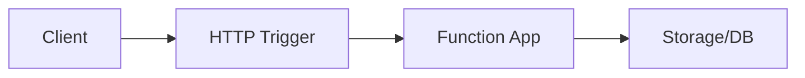

# AGENTS.md

> Knowledge base for AI agents working on this repository.

## Project Overview

**Azure Functions Hub** — A practical hub for learning, designing, operating, and troubleshooting Azure Functions across hosting models, languages, and trigger patterns.

### Repository Structure

```
├── docs/
│   ├── index.md                # Hub landing page
│   ├── start-here/             # Onboarding content
│   │   ├── overview.md         # What is Azure Functions
│   │   ├── learning-paths.md   # Guided learning paths
│   │   ├── hosting-options.md  # Plan comparison and selection
│   │   └── repository-map.md   # Hub navigation + DX toolkit links
│   ├── platform/               # Design decisions (architecture, hosting, scaling)
│   │   ├── architecture.md     # Runtime architecture, host/worker model
│   │   ├── hosting.md          # Plan deep-dive (Y1, FC1, EP, Dedicated)
│   │   ├── triggers-and-bindings.md
│   │   ├── scaling.md          # Scaling behavior per plan
│   │   ├── networking.md       # VNet, private endpoints, hybrid
│   │   ├── reliability.md      # Retry policies, poison handling, availability zones
│   │   └── security.md         # Auth, managed identity, network security
│   ├── language-guides/        # Language-specific content
│   │   ├── python/             # Python (reference implementation)
│   │   │   ├── tutorial/       # 4 plans × 7 tutorials
│   │   │   ├── recipes/        # Integration guides
│   │   │   ├── v2-programming-model.md
│   │   │   ├── python-runtime.md
│   │   │   ├── cli-cheatsheet.md
│   │   │   ├── host-json.md
│   │   │   ├── environment-variables.md
│   │   │   ├── platform-limits.md
│   │   │   └── troubleshooting.md
│   │   ├── nodejs/             # Node.js (stub)
│   │   ├── dotnet/             # .NET (stub)
│   │   └── java/               # Java (stub)
│   ├── operations/             # Operational execution
│   │   ├── deployment.md       # Deploy methods, slots, rollback
│   │   ├── configuration.md    # App settings, host.json, secrets
│   │   ├── monitoring.md       # App Insights, metrics, dashboards
│   │   ├── alerts.md           # Alert rules, action groups
│   │   ├── cold-start.md       # Mitigation strategies per plan
│   │   ├── retries-and-poison-handling.md
│   │   └── recovery.md         # Disaster recovery, backup
│   └── troubleshooting/        # Incident response
│       ├── first-10-minutes.md # Triage guide
│       ├── playbooks.md        # Scenario-based playbooks
│       ├── methodology.md      # Systematic troubleshooting
│       ├── kql.md              # KQL query library
│       └── lab-guides.md       # Links to hands-on labs
├── apps/                       # Reference function apps
│   ├── python/                 # Python reference app
│   ├── nodejs/                 # Node.js (stub)
│   ├── dotnet/                 # .NET (stub)
│   └── java/                   # Java (stub)
├── labs/                       # Hands-on reproducible scenarios
│   ├── cold-start/
│   ├── storage-access-failure/
│   ├── queue-backlog-scaling/
│   ├── dns-vnet-resolution/
│   └── managed-identity-auth/
├── .github/workflows/          # CI/CD
└── mkdocs.yml                  # Documentation configuration
```

### Design Principles

1. **Platform = Design Decisions** — Architecture, hosting, scaling, networking choices
2. **Operations = Execution** — Day-2 tasks: deploy, monitor, alert, recover
3. **Language Guides = Language-Specific** — Tutorials, recipes, runtime specifics per language
4. **Troubleshooting = Incident Response** — When things break, start here
5. **Apps = Reference Implementations** — Not samples, but capability-driven reference apps

### DX Toolkit Repos (linked, not merged)

| Repository | Description |
|------------|-------------|
| [azure-functions-openapi](https://github.com/yeongseon/azure-functions-openapi) | OpenAPI integration |
| [azure-functions-validation](https://github.com/yeongseon/azure-functions-validation) | Input validation |
| [azure-functions-doctor](https://github.com/yeongseon/azure-functions-doctor) | Diagnostics tool |
| [azure-functions-scaffold](https://github.com/yeongseon/azure-functions-scaffold) | Project scaffolding |
| [azure-functions-logging](https://github.com/yeongseon/azure-functions-logging) | Structured logging |
| [azure-functions-python-cookbook](https://github.com/yeongseon/azure-functions-python-cookbook) | Python recipes |

## Azure Functions Specifics

### Key Concepts

1. **Hosting Plan** — Consumption (Y1), Flex Consumption (FC1), Premium (EP), Dedicated (App Service Plan)
2. **Trigger** — Event source that invokes a function (HTTP, Timer, Queue, Blob, etc.)
3. **Binding** — Declarative connection to input/output data sources
4. **Function App** — The deployment unit containing one or more functions
5. **Host Process** — .NET runtime managing triggers, bindings, and scaling
6. **Language Worker** — Separate process executing your code (Python, Node.js, Java, .NET in-process/isolated)

### Supported Languages

| Language | Worker Model | Programming Model |
|----------|-------------|-------------------|
| Python | Out-of-process (gRPC) | v2 decorator-based |
| Node.js | Out-of-process (gRPC) | v4 `app.http()` |
| Java | Out-of-process (gRPC) | Annotation-based |
| .NET | In-process or Isolated | Attribute-based |

### Common Gotchas

1. **Blob trigger on Flex Consumption** — Standard polling NOT supported; use Event Grid-based blob trigger
2. **Cold start** — Flex Consumption has always-ready instances; Premium has permanently warm instances
3. **Deployment on Flex Consumption** — No Kudu/SCM; use `func azure functionapp publish` or One Deploy
4. **Identity-based storage** — `AzureWebJobsStorage__accountName` required on Flex Consumption
5. **Timeout** — Flex Consumption defaults to 30 min (unbounded max); classic Consumption defaults to 5 min

## Documentation Conventions

### File Naming

- Start Here / Platform / Operations / Troubleshooting: `topic-name.md` (kebab-case)
- Tutorials: `XX-topic-name.md` (numbered for sequence), in per-plan subdirectories
- Language guides: nested under `language-guides/{language}/`

### Document Structure (ALL documents follow this pattern)

```markdown
# Title

Brief introduction (1-2 sentences)

## Prerequisites (if applicable)

## Main Content

### Subsections with code examples

## Advanced Topics

Further reading for deeper understanding.

## See Also

- [Related Doc 1](../category/related-doc.md)
- [Related Doc 2](../category/another-doc.md)
```

### Cross-Reference Pattern

Use admonitions to link between sections:

```markdown
!!! tip "Platform Guide"
    For the architecture behind this feature, see [Architecture](../platform/architecture.md).

!!! tip "Language Guide"
    For Python-specific implementation, see [v2 Programming Model](../language-guides/python/v2-programming-model.md).
```

### CLI Command Style

```bash
# ALWAYS use long flags for readability
az functionapp create --resource-group $RG --name $APP_NAME --plan $PLAN_NAME --runtime python

# NEVER use short flags in documentation
az functionapp create -g $RG -n $APP_NAME  # DON'T do this
```

### Variable Naming Convention

| Variable | Description | Example |
|----------|-------------|---------|
| `$RG` | Resource Group | `rg-myapp` |
| `$APP_NAME` | Function App Name | `func-myapp-abc123` |
| `$PLAN_NAME` | Hosting Plan | `plan-myapp` |
| `$STORAGE_NAME` | Storage Account | `stmyapp` |
| `$LOCATION` | Azure Region | `koreacentral` |
| `$SUBSCRIPTION_ID` | Azure Subscription ID | `<subscription-id>` |

### PII Removal (Quality Gate)

**CRITICAL**: All CLI output examples MUST have PII removed.

Patterns to mask:
- UUIDs: `xxxxxxxx-xxxx-xxxx-xxxx-xxxxxxxxxxxx`
- Subscription IDs: `<subscription-id>`
- Tenant IDs: `<tenant-id>`
- Object IDs: `<object-id>`
- Emails: Remove or mask
- Secrets/Tokens: NEVER include

```bash
# Example of properly masked output
{
  "id": "/subscriptions/<subscription-id>/resourceGroups/rg-myapp/providers/...",
  "principalId": "xxxxxxxx-xxxx-xxxx-xxxx-xxxxxxxxxxxx",
  "tenantId": "<tenant-id>"
}
```

### Mermaid Diagrams

All architectural diagrams use Mermaid. Test with `mkdocs build --strict`.

````markdown

````

## Documentation Format Quality Gate

Before committing any documentation changes, verify these format rules:

### 1. Admonition Body Indentation (CRITICAL)

All content inside `!!!` or `???` admonition blocks **must be indented with 4 spaces**. Content without indentation renders as plain text outside the admonition box.

```markdown
# CORRECT — body indented 4 spaces
!!! warning "Title"
    This content is inside the admonition box.

    - List item also inside
    - Another item inside

# WRONG — body not indented
!!! warning "Title"
This content renders OUTSIDE the box.
- This list is also outside
```

### 2. Code Fence Balance

Every opening ` ``` ` must have a matching closing ` ``` `. An odd number of fences breaks all subsequent rendering.

### 3. Final Validation

```bash
# Must pass with zero warnings/errors
mkdocs build --strict
```

## Build & Validate

```bash
# Install MkDocs dependencies
pip install mkdocs-material pymdown-extensions mkdocs-minify-plugin

# Build documentation (strict mode catches broken links)
mkdocs build --strict

# Local preview
mkdocs serve
```

## Git Commit Conventions

```
type: short description

- feat: New feature
- fix: Bug fix
- docs: Documentation changes
- chore: Maintenance tasks
- refactor: Code restructuring
```

### Logical Commit Units

When making large changes, split into logical commits:
1. Add scaffold structure
2. Add content by section (start-here, platform, operations, etc.)
3. Update configuration last

## Related Resources

- [Azure Functions Documentation](https://learn.microsoft.com/azure/azure-functions/)
- [Flex Consumption Plan](https://learn.microsoft.com/azure/azure-functions/flex-consumption-plan)
- [Flex Consumption How-To](https://learn.microsoft.com/azure/azure-functions/flex-consumption-how-to)
- [Python on Azure Functions](https://learn.microsoft.com/azure/azure-functions/functions-reference-python)
- [Node.js on Azure Functions](https://learn.microsoft.com/azure/azure-functions/functions-reference-node)
- [Java on Azure Functions](https://learn.microsoft.com/azure/azure-functions/functions-reference-java)
- [.NET on Azure Functions](https://learn.microsoft.com/azure/azure-functions/functions-dotnet-class-library)
- [Event Grid Blob Trigger](https://learn.microsoft.com/azure/azure-functions/functions-event-grid-blob-trigger)
- [Bicep Documentation](https://learn.microsoft.com/azure/azure-resource-manager/bicep/)
