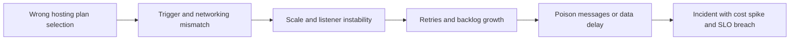
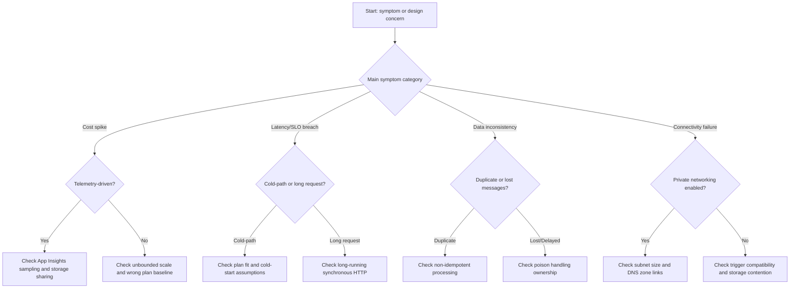

# Common Azure Functions Anti-Patterns

This reference consolidates high-impact anti-patterns that repeatedly cause Azure Functions incidents across hosting, triggers, security, deployment, and operations. Use it during design review, pre-production checks, and incident retrospectives.

!!! tip "Use with operational runbooks"
    Pair this page with [Troubleshooting Playbooks](../troubleshooting/playbooks.md) to translate each anti-pattern into detection and recovery actions.

## Summary table

| Anti-pattern | Category | Severity | Fix link |
|---|---|---|---|
| Choosing plan by name, not workload | Hosting | High | [Fix](#ap-plan-by-name) |
| Stateful functions | Runtime model | High | [Fix](#ap-stateful-functions) |
| Non-idempotent message processing | Triggers/Reliability | High | [Fix](#ap-non-idempotent) |
| Unbounded scale | Scaling/Cost | High | [Fix](#ap-unbounded-scale) |
| Connection string secrets in app settings | Security | High | [Fix](#ap-connection-strings) |
| Function keys as primary security | Security/API | High | [Fix](#ap-function-keys) |
| Blob trigger on Flex without Event Grid | Trigger compatibility | High | [Fix](#ap-blob-flex) |
| Long-running synchronous HTTP | Execution model | Medium | [Fix](#ap-long-http) |
| Subnet too small for scale-out | Networking | High | [Fix](#ap-subnet-size) |
| Missing DNS zone link for private endpoints | Networking | High | [Fix](#ap-dns-zone-link) |
| App Insights without sampling | Monitoring/Cost | Medium | [Fix](#ap-ai-no-sampling) |
| Ignoring poison/dead-letter messages | Reliability | High | [Fix](#ap-poison-ignore) |
| Shared storage account for many apps | Storage/Scale | Medium | [Fix](#ap-shared-storage) |
| Cold start surprise on Consumption | Hosting/SLO | Medium | [Fix](#ap-cold-start-surprise) |
| Mutable deployment | Deployment safety | High | [Fix](#ap-mutable-deployment) |

### Anti-pattern: Choosing plan by name, not workload

**What**: Selecting Premium or Dedicated because it appears "enterprise" without validating trigger profile, networking, and latency needs.

**Why it hurts**: Teams pay baseline cost or inherit constraints that do not match runtime behavior, then re-platform under pressure.

**Fix**: Choose plan from workload characteristics: trigger volume, private access requirement, cold-start tolerance, and timeout profile.

| Field | Detail |
|---|---|
| What | Plan is chosen by perceived tier label instead of measured workload needs |
| Impact | Baseline overspend, latency surprises, and forced re-platforming |
| Fix | Select plan by trigger profile, networking constraints, and SLO |
| Severity | High |

!!! tip "Best practice"
    Use [Platform: Hosting](../platform/hosting.md) and [Operations: Cost Optimization](../operations/cost-optimization.md) together before approving plan choice.

### Anti-pattern: Stateful functions

**What**: Storing cross-invocation state in memory or local disk and assuming it survives scale events.

**Why it hurts**: Instance recycling and scale-out create inconsistent behavior and data loss risks.

**Fix**: Keep handlers stateless; externalize state to durable stores and pass correlation IDs explicitly.

| Field | Detail |
|---|---|
| What | Invocation state is stored in memory or local disk |
| Impact | Data loss risk and inconsistent behavior across scale/restart events |
| Fix | Persist state externally and treat each invocation as independent |
| Severity | High |

!!! tip "Best practice"
    Treat each invocation as independent and recoverable; use external persistence for checkpoints and progress.

### Anti-pattern: Non-idempotent message processing

**What**: Queue/Event Hub/Service Bus handlers apply side effects without duplicate protection.

**Why it hurts**: At-least-once delivery and retries can create duplicate writes, duplicate notifications, or double charges.

**Fix**: Implement idempotency keys, deduplication checks, and safe retry semantics.

| Field | Detail |
|---|---|
| What | Message handlers execute side effects without duplicate protection |
| Impact | Duplicate writes, repeated notifications, and billing errors |
| Fix | Add idempotency keys and deduplication-safe retries |
| Severity | High |

!!! tip "Best practice"
    Align retry policy with idempotent handler logic and poison workflow ownership in [Troubleshooting Playbooks](../troubleshooting/playbooks.md).

### Anti-pattern: Unbounded scale

**What**: Leaving scale limits unconstrained for high-throughput triggers.

**Why it hurts**: Sudden fan-out can throttle dependencies, increase retries, and amplify spend.

**Fix**: Set `functionAppScaleLimit` or plan-equivalent maximum instance count from downstream capacity.

| Field | Detail |
|---|---|
| What | Scale-out is unconstrained for queue/event workloads |
| Impact | Runaway spend and downstream throttling cascades |
| Fix | Define max instances and trigger concurrency from dependency budgets |
| Severity | High |

!!! tip "Best practice"
    Define scale limit and trigger concurrency together; see [Platform: Scaling](../platform/scaling.md) and [Best Practices: Cost Optimization](./cost-optimization.md).

### Anti-pattern: Connection string secrets in app settings

**What**: Embedding credentials directly in application settings for runtime dependencies.

**Why it hurts**: Secret sprawl increases rotation failures and leak surface.

**Fix**: Prefer managed identity and Key Vault references; minimize plaintext secrets.

| Field | Detail |
|---|---|
| What | Credentials are embedded directly in app settings |
| Impact | Secret sprawl, weak rotation hygiene, and expanded leak surface |
| Fix | Use managed identity and Key Vault references |
| Severity | High |

!!! tip "Best practice"
    Use identity-first access paths and restrict remaining secret exposure to least privilege scopes.

### Anti-pattern: Function keys as primary security

**What**: Relying on function or host keys as full API security boundary.

**Why it hurts**: Keys are coarse-grained shared secrets and do not provide robust user/service identity controls.

**Fix**: Place proper authentication and authorization in front (Easy Auth, APIM, JWT validation).

| Field | Detail |
|---|---|
| What | Function keys are treated as full identity and authorization model |
| Impact | Coarse shared-secret model and weak access governance |
| Fix | Enforce identity-aware authn/authz at platform or API layer |
| Severity | High |

!!! tip "Best practice"
    Keep function keys for operational access control, not end-user identity enforcement.

### Anti-pattern: Blob trigger on Flex Consumption without Event Grid

**What**: Using polling-based Blob trigger assumptions on FC1.

**Why it hurts**: Blob trigger does not fire as expected on Flex unless Event Grid-based integration is used.

**Fix**: Configure Event Grid sourced blob triggering for FC1 workloads.

| Field | Detail |
|---|---|
| What | Polling blob trigger assumptions are used on Flex Consumption |
| Impact | Events are missed or delayed because trigger model is incompatible |
| Fix | Use Event Grid-based blob triggering on FC1 |
| Severity | High |

!!! tip "Best practice"
    Validate trigger compatibility before migration and confirm event subscription health after deployment.

### Anti-pattern: Long-running synchronous HTTP

**What**: Holding HTTP requests open for minutes while doing heavy processing.

**Why it hurts**: Client timeouts, gateway limits, and poor user experience increase failures.

**Fix**: Use async HTTP pattern (accept + status endpoint), queue handoff, or Durable Functions orchestration.

| Field | Detail |
|---|---|
| What | HTTP request stays open while long compute executes |
| Impact | Timeout failures and poor user/client reliability |
| Fix | Shift to async request pattern with queue/orchestration back-end |
| Severity | Medium |

!!! tip "Best practice"
    Keep HTTP triggers thin and move long-running work to queue or orchestration pipelines.

### Anti-pattern: Subnet too small for scale-out

**What**: Premium/Flex networking configured on tiny subnets (for example /28 or /29) with no growth headroom.

**Why it hurts**: Scale-out stalls due to IP exhaustion and private connectivity failures under load.

**Fix**: Reserve subnet capacity for target peak instances and platform overhead before production.

| Field | Detail |
|---|---|
| What | Networking subnets are undersized for expected scale-out |
| Impact | IP exhaustion blocks scale and breaks private connectivity |
| Fix | Allocate subnet with headroom for peak scale and platform needs |
| Severity | High |

!!! tip "Best practice"
    Include subnet capacity checks in pre-production load test gates.

### Anti-pattern: Missing DNS zone link for private endpoints

**What**: Creating private endpoints without correct private DNS zone links to the app VNet.

**Why it hurts**: Name resolution fails intermittently or permanently, appearing as random connection errors.

**Fix**: Link required private DNS zones and validate resolution from function runtime subnet.

| Field | Detail |
|---|---|
| What | Private endpoints exist without correct private DNS zone links |
| Impact | Intermittent or persistent name-resolution failures |
| Fix | Link DNS zones and validate name resolution from runtime subnet |
| Severity | High |

!!! tip "Best practice"
    Add DNS validation to deployment smoke tests for every private dependency.

### Anti-pattern: App Insights without sampling

**What**: Collecting all telemetry items at production traffic volumes.

**Why it hurts**: Ingestion costs grow rapidly and can exceed compute spend.

**Fix**: Enable sampling and preserve critical telemetry types (especially exceptions).

| Field | Detail |
|---|---|
| What | All telemetry is ingested at production volume without sampling |
| Impact | Observability ingestion cost grows faster than compute |
| Fix | Enable sampling and keep high-value telemetry unsampled |
| Severity | Medium |

!!! tip "Best practice"
    Configure sampling from day one and revisit after major traffic changes using [Best Practices: Cost Optimization](./cost-optimization.md).

### Anti-pattern: Ignoring poison messages

**What**: No alerting or operational ownership for poison/dead-letter queues.

**Why it hurts**: Failed messages accumulate silently and create delayed data loss incidents.

**Fix**: Alert on poison queue depth/age, define replay workflow, and assign owner.

| Field | Detail |
|---|---|
| What | Poison/dead-letter messages have no alerting or owner |
| Impact | Silent backlog and delayed data-loss incidents |
| Fix | Add alerts, replay runbook, and explicit operational ownership |
| Severity | High |

!!! tip "Best practice"
    Track poison handling as an SLO with explicit response time targets in [Troubleshooting Playbooks](../troubleshooting/playbooks.md).

### Anti-pattern: Shared storage account across many function apps

**What**: Multiple unrelated apps use one `AzureWebJobsStorage` account.

**Why it hurts**: Transaction contention, throttling, and noisy-neighbor failure coupling increase.

**Fix**: Isolate host storage accounts by workload criticality and throughput profile.

| Field | Detail |
|---|---|
| What | Many unrelated function apps share one host storage account |
| Impact | Transaction contention and noisy-neighbor failures |
| Fix | Split host storage by criticality and throughput characteristics |
| Severity | Medium |

!!! tip "Best practice"
    Treat host storage as control-plane critical infrastructure, not a general shared utility account.

### Anti-pattern: Cold start surprise

**What**: Production launch on Consumption without validating scale-to-zero startup latency impact.

**Why it hurts**: First-request latency breaches SLO and can cascade into retries/timeouts upstream.

**Fix**: Set stakeholder expectations, choose Flex/Premium where needed, and design async entry patterns.

| Field | Detail |
|---|---|
| What | Consumption cold-start latency is not validated before launch |
| Impact | First-hit latency breaches and upstream retry amplification |
| Fix | Validate cold path, adjust plan, and use async entry where needed |
| Severity | Medium |

!!! tip "Best practice"
    Include cold-start behavior in load and user-journey tests before go-live.

### Anti-pattern: Mutable deployment

**What**: Deploying by modifying files in-place rather than mounting immutable artifacts.

**Why it hurts**: Version drift and partial file states create hard-to-reproduce production failures.

**Fix**: Use run-from-package (where supported), artifact versioning, and controlled rollback.

| Field | Detail |
|---|---|
| What | Production code is modified in-place during deployment |
| Impact | Version drift and partial-state rollout failures |
| Fix | Deploy immutable artifacts with versioned rollback strategy |
| Severity | High |

!!! tip "Best practice"
    Apply [Best Practices: Deployment](./deployment.md) for plan-specific immutable release and rollback design.

## Review cadence

Use this anti-pattern checklist at three control points:

1. Architecture/design review.
2. Pre-production readiness gate.
3. Post-incident corrective action review.

??? info "Why this page is cross-cutting"
    Most Azure Functions incidents are multi-factor: hosting mismatch + trigger semantics + missing operational controls. Reviewing anti-patterns across domains catches these chained failures early.

## See Also

- [Best Practices Index](./index.md)
- [Best Practices: Deployment](./deployment.md)
- [Best Practices: Cost Optimization](./cost-optimization.md)
- [Platform: Hosting](../platform/hosting.md)
- [Platform: Scaling](../platform/scaling.md)
- [Troubleshooting Playbooks](../troubleshooting/playbooks.md)

## Sources

- [Improve performance and reliability of Azure Functions (Microsoft Learn)](https://learn.microsoft.com/azure/azure-functions/performance-reliability)
- [Azure Functions best practices (Microsoft Learn)](https://learn.microsoft.com/azure/azure-functions/functions-best-practices)
