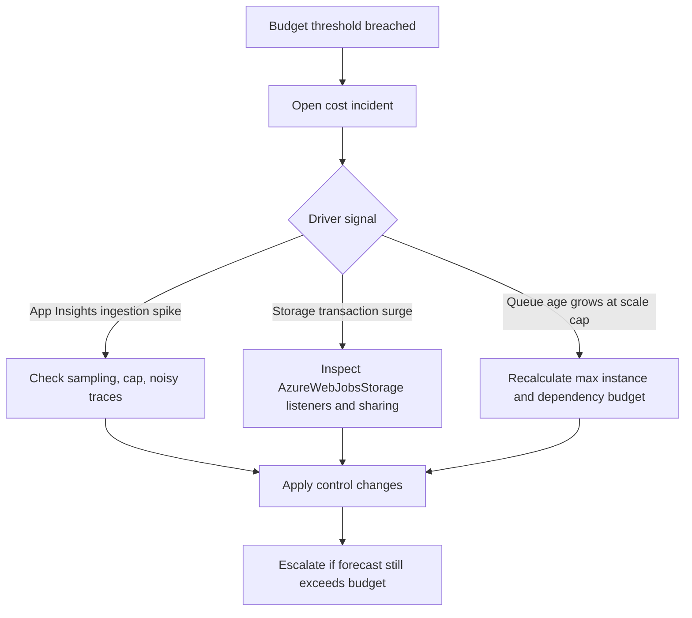
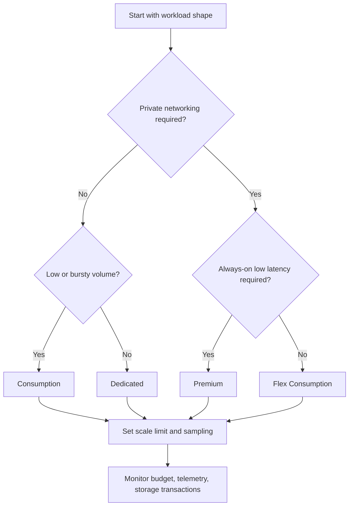

---
content_sources:
  - type: mslearn-adapted
    url: https://learn.microsoft.com/azure/azure-functions/functions-consumption-costs
  - type: mslearn-adapted
    url: https://learn.microsoft.com/azure/azure-functions/pricing
---

# Cost Optimization Best Practices

Azure Functions cost control is primarily an execution-model problem: trigger volume, scale behavior, telemetry ingestion, and storage transaction patterns determine spend more than code size. This guide provides practical controls to keep cost predictable without reducing reliability.

!!! tip "Operations baseline"
    For day-2 cost operations and metrics workflow, start with [Operations: Cost Optimization](../operations/cost-optimization.md) and apply the safeguards below.

## Why This Matters

Pick plan economics that match workload shape, not assumptions.

| Plan | Billing model | Typical risk | Best-fit workload |
|---|---|---|---|
| Consumption (Y1) | Pay per execution + GB-seconds | Cold-start and unbounded burst cost if unmanaged triggers | Low-volume or bursty HTTP/event workloads |
| Flex Consumption (FC1) | Baseline (always-ready optional) + burst execution billing | Paying baseline for unused always-ready instances | Bursty workloads needing VNet/private networking |
| Premium (EP) | Pre-warmed baseline + scale-out capacity | Paying always-on baseline for low traffic | Always-on low-latency with private integration |
| Dedicated | Fixed App Service plan monthly cost | Overprovisioned compute for low utilization | Predictable sustained throughput, shared App Service estate |

??? info "Workload-first rule"
    Do not select Premium by default. First validate trigger volume, latency SLO, networking constraints, and runtime duration. Cost surprises usually come from plan mismatch, not per-invocation pricing math.

## Recommended Practices

### Use the Consumption free grant intentionally

For Consumption, each subscription receives monthly free usage:

- 1,000,000 executions
- 400,000 GB-seconds

Design low-volume workloads to stay inside this envelope when possible.

### Practical design implications

- Consolidate low-throughput timer and queue functions into one app where operationally appropriate.
- Minimize unnecessary retries by making handlers idempotent and dependency-aware.
- Avoid chatty trigger patterns that produce high invocation count with tiny business value.

!!! note "Free grant scope"
    The free grant applies to Functions compute only. Storage, Application Insights, networking egress, and other dependent services are billed separately.

### Application Insights cost traps and controls

Telemetry is frequently the largest cost line item in otherwise cheap serverless workloads.

### Common trap

- Collecting all traces and dependencies at production volume with no sampling.

### Recommended control pattern

1. Enable sampling.
2. Keep exceptions and critical requests unsampled.
3. Reduce noisy custom traces.
4. Set retention and daily cap intentionally.

| Control | Setting or implementation point | Cost impact | When to use |
|---|---|---|---|
| Adaptive/fixed-rate sampling | `logging.applicationInsights.samplingSettings.isEnabled=true` with bounded telemetry rate | Reduces ingestion volume while preserving trend visibility | Default for all production workloads with non-trivial traffic |
| Preserve critical telemetry | `excludedTypes` for `Exception` and other must-keep signals | Avoids false savings that hide incidents | Always when applying sampling |
| Reduce verbose custom traces | Lower high-cardinality info/debug trace emission in hot paths | Cuts noisy, low-value log volume | Queue/event workloads with high invocation rates |
| Daily cap | Application Insights daily cap and alert threshold | Hard-limits surprise spend spikes | Teams needing strict monthly budget enforcement |
| Retention right-sizing | Retain short for bulk logs; longer for curated high-value datasets | Lowers long-tail storage and analytics cost | Environments with compliance-aware but cost-sensitive logging |
| Basic vs Standard routing | Route bulk low-value logs to Basic, deep diagnostics to Standard | Optimizes analytics spend without losing critical investigations | Mixed observability requirements across teams |

```json
{
  "version": "2.0",
  "logging": {
    "applicationInsights": {
      "samplingSettings": {
        "isEnabled": true,
        "maxTelemetryItemsPerSecond": 5,
        "excludedTypes": "Exception"
      }
    }
  }
}
```

### Basic vs Standard logging workspace choices

- Use **Basic** for high-volume logs where deep analytics is not required.
- Use **Standard (Analytics)** for richer KQL, cross-table joins, and long investigations.
- Split routing when needed: critical production diagnostics in Standard, bulk low-value logs in Basic.

!!! warning "No-sampling production telemetry"
    Unsampled traces across high-scale queue or event triggers can create rapid ingestion spikes that exceed compute cost by a large margin.

### Storage account cost awareness

`AzureWebJobsStorage` can generate transactions even when functions are idle.

Why this occurs:

- Trigger polling and checkpoint checks.
- Lease coordination for listeners.
- Host state updates and heartbeat activities.

### Controls

- Separate host storage from business data storage.
- Avoid sharing one storage account across many function apps.
- Monitor transaction metrics and throttling events.

??? tip "Shared storage anti-pattern"
    Multiple high-activity apps sharing a single `AzureWebJobsStorage` account can increase transaction costs and contention. Isolate by workload criticality.

### Use scale limits as explicit cost guardrails

Set a maximum instance count for event-driven apps to prevent runaway scaling.

For Consumption and Premium:

```bash
az resource update \
    --resource-group "<resource-group>" \
    --name "<app-name>" \
    --resource-type "Microsoft.Web/sites" \
    --set properties.siteConfig.functionAppScaleLimit=20
```

For Flex Consumption, set `scaleAndConcurrency.maximumInstanceCount` (or equivalent portal setting) aligned to dependency capacity.

### Guardrail design rule

- Start from downstream limits (database RU/s, API quota, queue visibility timeout).
- Derive maximum safe concurrent instances.
- Set `functionAppScaleLimit` below the failure threshold.

### Durable Functions cost considerations

Durable orchestration reliability depends on storage-backed history; this has direct cost impact.

### Cost drivers

- Large orchestration histories.
- Frequent checkpoint writes.
- Never-purged completed/failed instances.

| Driver | Cost impact pattern | Control measure |
|---|---|---|
| Large orchestration history growth | Increased storage transactions and history read/write overhead | Split long workflows, use sub-orchestrations, keep event payloads minimal |
| High checkpoint frequency | More storage operations per business unit of work | Reduce unnecessary activity churn and checkpoint-inducing steps |
| Unbounded fan-out | Multiplies activity executions and history footprint rapidly | Set fan-out ceilings based on dependency throughput budgets |
| Long-lived completed/failed instances | Accumulated history storage and query overhead over time | Schedule regular purge by age/status as operational runbook |
| Replay-heavy orchestration logic | Additional compute and storage read amplification during replays | Keep orchestrators deterministic and lightweight |

### Controls

- Keep orchestrations granular and deterministic.
- Use periodic history purge (`durable purge-history`) by age and status.
- Limit fan-out size based on downstream throughput budgets.

!!! note "Durable cost hygiene"
    Treat purge strategy as a production runbook, not a one-time cleanup task.

### Right-size plan selection by workload pattern

| Workload pattern | Preferred plan | Why |
|---|---|---|
| Low-volume HTTP with occasional bursts | Consumption | Lowest idle cost, free grant can cover full compute |
| Predictable steady load | Dedicated | Fixed monthly spend and straightforward capacity planning |
| Bursty with private networking (VNet) | Flex Consumption | Serverless burst + networking support without Premium baseline |
| Always-on low-latency with VNet/private dependencies | Premium | Warm baseline minimizes startup latency |

### Cost monitoring and alerting

Operational cost control requires continuous monitoring, not monthly review.

### Minimum monitoring stack

- Azure Cost Management budget alerts (monthly and forecast).
- Application Insights ingestion and table growth trends.
- Storage transaction and throttling metrics for host accounts.
- Queue depth/age alerts tied to scale limits.

### Alert policy examples

1. Budget threshold at 50%, 80%, and 100% of monthly target.
2. Daily Application Insights ingestion anomaly alert.
3. Storage transaction surge alert for `AzureWebJobsStorage`.
4. Queue age growth while instance count pinned at scale limit.

<!-- diagram-id: alert-policy-examples -->


## Common Mistakes / Anti-Patterns

### Premium for low-volume workloads

- **Impact**: baseline dominates bill.
- **Fix**: move to Consumption or Flex unless strict warm latency is required.

### No scale limit on queue/event triggers

- **Impact**: burst can cause runaway cost and dependency throttling.
- **Fix**: set `functionAppScaleLimit`/maximum instance count and tune trigger concurrency.

### Application Insights without sampling

- **Impact**: telemetry ingestion spikes under load.
- **Fix**: enable sampling and preserve critical telemetry types.

### Unused always-ready instances on Flex/Premium

- **Impact**: paying baseline for idle capacity.
- **Fix**: right-size always-ready/minimum instances from observed traffic percentiles.

## Validation Checklist

### Plan and architecture

- Validate plan choice from real trigger profile and networking needs.
- Confirm cold start expectation is documented for stakeholders.
- Confirm always-ready/minimum instances are justified by latency SLO.

### Runtime and scaling

- Set `functionAppScaleLimit` or Flex maximum instance count.
- Tune trigger batch/concurrency to downstream limits.
- Validate retry policies to avoid cost-amplifying retry storms.

### Observability and storage

- Enable Application Insights sampling in production.
- Set telemetry retention and daily caps deliberately.
- Isolate `AzureWebJobsStorage` for high-throughput apps.
- Define Durable Functions purge schedule.

### Governance

- Configure budgets and anomaly alerts.
- Review cost monthly with deployment and traffic changes.
- Keep rollback option for plan changes and scale settings.

<!-- diagram-id: governance -->


## See Also

- [Operations: Cost Optimization](../operations/cost-optimization.md)
- [Platform: Hosting](../platform/hosting.md)
- [Platform: Scaling](../platform/scaling.md)
- [Operations: Monitoring](../operations/monitoring.md)
- [Operations: Alerts](../operations/alerts.md)

## Sources

- [Azure Functions Consumption plan costs (Microsoft Learn)](https://learn.microsoft.com/azure/azure-functions/functions-consumption-costs)
- [Azure Functions pricing (Microsoft Learn)](https://learn.microsoft.com/azure/azure-functions/pricing)
