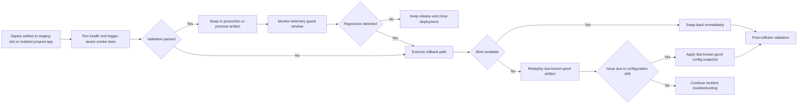
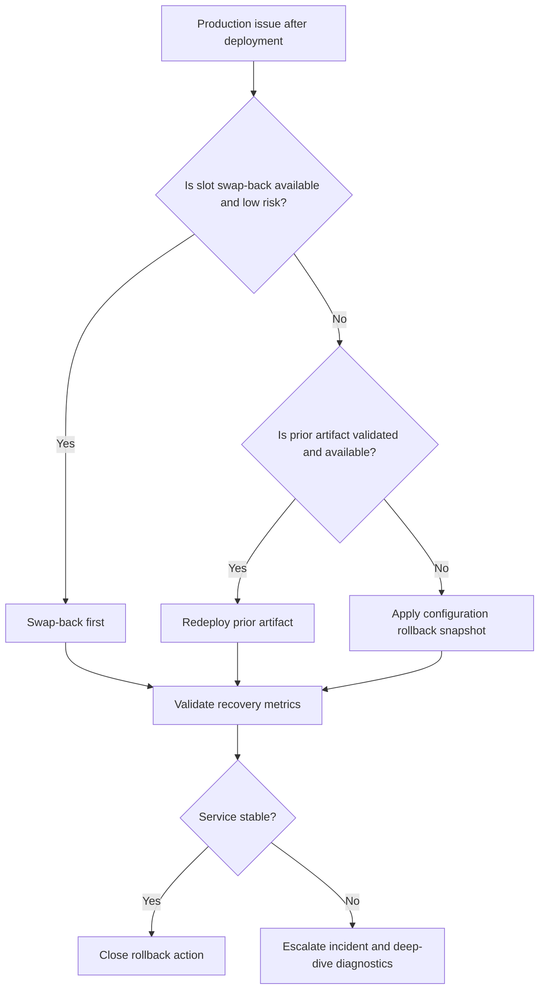
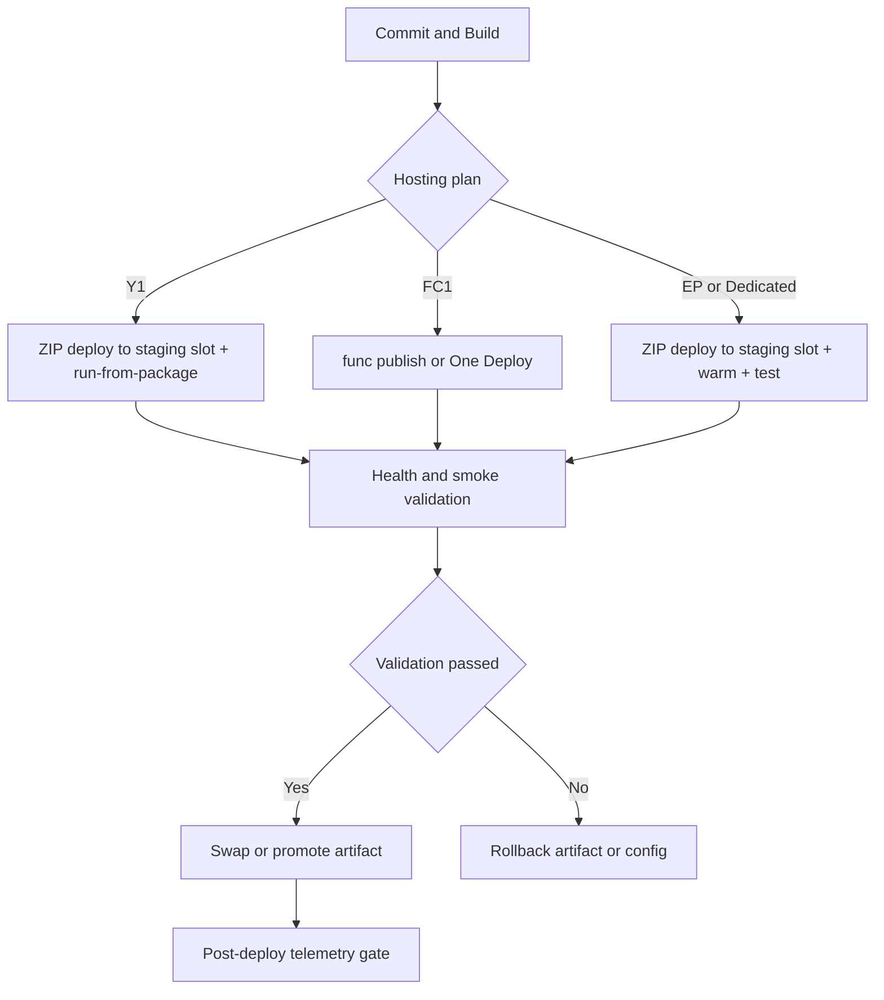

# Deployment Best Practices

This guide describes safe deployment patterns for Azure Functions by hosting plan, trigger model, and rollback requirements. It focuses on immutable artifacts, release validation, and operational guardrails that prevent runtime regressions.

!!! tip "Operations baseline"
    Start with [Operations: Deployment](../operations/deployment.md) for command-level procedures, then apply the controls here to reduce release risk.

## Deployment method selection by hosting plan

Choose the deployment method that matches plan capabilities. Incorrect method selection is a common cause of failed releases.

| Plan | Preferred methods | Avoid | Why this matters |
|---|---|---|---|
| Consumption (Y1) | ZIP deploy, run-from-package | Mutable in-place edits | Instance file systems are ephemeral; immutable package mount is safer |
| Flex Consumption (FC1) | `func azure functionapp publish`, One Deploy | Kudu/SCM-based flows | Flex has no Kudu/SCM endpoint |
| Premium (EP) | ZIP deploy + run-from-package, slots | Direct edits in production slot | Supports staging and swap with warm capacity |
| Dedicated | ZIP deploy + run-from-package, slots, Kudu/SCM, remote build where needed | Ad-hoc server-side edits after release | Drift between instances and slots creates non-reproducible incidents |

??? info "Plan capability checkpoint"
    - Y1 supports deployment slots but only **2 total including production**.
    - FC1 does **not** support deployment slots and does **not** expose Kudu/SCM.
    - EP and Dedicated support full slot workflows.

## Why run-from-package should be default

Run-from-package mounts a built artifact as a read-only package. This removes in-place mutation risk and keeps all instances on the same bits.

### Operational benefits

- Prevents partial file copy states during rollout.
- Keeps deployed code immutable across scale-out events.
- Simplifies rollback to a known artifact version.
- Reduces "works on one instance only" drift.

```bash
az functionapp config appsettings set \
    --resource-group "<resource-group>" \
    --name "<app-name>" \
    --settings WEBSITE_RUN_FROM_PACKAGE=1
```

!!! warning "Mutable deployment anti-pattern"
    Deploying without run-from-package can produce inconsistent behavior when trigger listeners restart while files are changing. For event-driven apps, this can surface as duplicate or missed processing windows.

## Slot strategy by plan

Slot usage must match plan limits and trigger behavior.

### Consumption (Y1)

- Maximum of two slots total (production + one non-production).
- Use a single `staging` slot for smoke test then swap.
- Keep storage and secret source settings slot-sticky when values differ by environment.

### Flex Consumption (FC1)

- No slots; use artifact promotion and config rollback patterns.
- Validate release in an isolated FC1 app before production publish.

### Premium and Dedicated

- Use at least `staging` and optionally `preprod` slots.
- Warm slot before swap and run trigger-aware smoke tests.
- Use swap-back as first rollback path.

| Plan | Slot support | Maximum slots | Swap support | Warm-up strategy support |
|---|---|---|---|---|
| Consumption (Y1) | Yes | 2 total including production | Yes | Limited; validate quickly on single staging slot |
| Flex Consumption (FC1) | No | Not applicable | Not applicable | Use isolated app validation instead of slot warm-up |
| Premium (EP) | Yes | Multiple (SKU-dependent) | Yes | Strong; pre-warm instances and run trigger-aware smoke tests |
| Dedicated | Yes | Multiple (plan capacity-dependent) | Yes | Strong; warm slot and validate before cutover |

### Slot-sticky settings (minimum set)

Mark these as slot settings when values differ between staging and production:

- `AZURE_FUNCTIONS_ENVIRONMENT`
- Connection strings and endpoint URIs
- Key Vault reference targets
- Feature flags controlling trigger enablement
- Any test-only dependency endpoints

```bash
az functionapp config appsettings set \
    --resource-group "<resource-group>" \
    --name "<app-name>" \
    --slot "staging" \
    --slot-settings AZURE_FUNCTIONS_ENVIRONMENT=Staging
```

## CI/CD pipeline design for Functions

Use repository-driven pipelines (GitHub Actions or Azure DevOps) with identity-based auth and immutable artifacts.

### Core design rules

1. Build once, deploy many (same artifact per environment).
2. Use OpenID Connect (OIDC) federation for Azure auth.
3. Cache dependencies for deterministic and faster builds.
4. Block production deploy until smoke checks pass.

### GitHub Actions vs Azure DevOps

| Tool | Strong fit | Notes |
|---|---|---|
| GitHub Actions | Repo-native CI/CD, OIDC federation, marketplace actions | Fast setup, good for app teams |
| Azure DevOps | Enterprise approvals, release gates, centralized governance | Strong policy and approval chains |

| Decision factor | GitHub Actions | Azure DevOps |
|---|---|---|
| Identity model | OIDC federation with Entra app/workload identity | Service connections with approvals and governance controls |
| Pipeline-as-code location | Same repository as app/docs | YAML in repo or centralized templates |
| Approval and gates | Environment protection rules and required reviewers | Rich approvals, checks, and release gates |
| Best organizational fit | Product teams optimizing delivery speed | Central platform teams requiring controlled release process |
| Common risk if misused | Over-permissive workflow tokens across environments | Complex gate chains causing delayed emergency rollback |

!!! tip "Identity-based deployment"
    Prefer workload identity federation or managed identity over publish profiles and long-lived secrets. This reduces credential rotation burden and limits secret sprawl.

## Deployment validation and release safety

Validation must prove runtime readiness, not just deployment success.

### Required validation stages

1. **Health probe**: host is started and bindings initialized.
2. **Smoke tests**: call at least one HTTP path and one trigger path (queue/event) where applicable.
3. **Telemetry guard**: check exceptions, cold start spikes, and queue age after release.
4. **Gate decision**: swap/publish only if checks pass.

| Stage | Primary goal | Example checks | Tooling examples | Pass criteria |
|---|---|---|---|---|
| Health probe | Verify runtime startup readiness | Host status endpoint, binding initialization log | Health endpoint, Azure Monitor live metrics | Host ready and no startup exception burst |
| Smoke tests | Validate functional behavior on critical paths | HTTP invocation, queue/event processing path | Postman/Newman, integration test job, synthetic trigger message |
| Telemetry guard | Detect release-induced degradation | Exception rate, latency percentiles, queue age | Application Insights, Azure Monitor alerts, dashboards | Metrics within agreed release SLO thresholds |
| Gate decision | Control promotion to production | Manual/automated approval based on above checks | GitHub environment protection or Azure DevOps gate | All required checks green and approver sign-off recorded |

### Health endpoint pattern

- Expose a lightweight endpoint that verifies host readiness and critical dependency reachability.
- Do not include PII in health payloads.
- Keep timeout low to avoid masked dependency slowness.

??? note "Trigger-aware smoke testing"
    HTTP-only smoke tests are insufficient for event-driven apps. Include queue/event validation so listener startup, checkpointing, and retry behavior are exercised before cutover.

## Rollback patterns

Choose rollback path based on plan capabilities.

| Pattern | Best for | RTO profile |
|---|---|---|
| Slot swap-back | EP, Dedicated, Y1 with staging slot | Fastest |
| Artifact rollback | All plans including FC1 | Fast if prior artifact is retained |
| Config rollback | Any release with setting drift | Fast when config baseline is versioned |

### Recommended rollback order

1. Slot swap-back (if slots exist).
2. Redeploy last-known-good package.
3. Reapply last-known-good configuration snapshot.





## Common deployment mistakes and fixes

| Mistake | Impact | Fix | Severity |
|---|---|---|---|
| Deploying without run-from-package | Mutable file system drift and inconsistent instances | Enforce package-based immutable deployment in pipeline policy | High |
| Forgetting slot-sticky settings | Swap causes environment drift (wrong endpoints/secrets) | Mark environment-specific settings as slot-sticky and validate before swap | High |
| Skipping staging validation before swap | Production incidents immediately after cutover | Require health + smoke + telemetry gates for slot promotion | High |
| Publishing to FC1 with wrong deployment assumptions | Failed release due to Kudu/SCM dependency or unsupported storage/deploy path | Use FC1-supported deployment methods (`func publish` or One Deploy) and validate deployment storage configuration early | Medium-High |

## Deployment checklist

### Pre-deploy

- Confirm plan-specific deployment method compatibility.
- Confirm artifact built once and signed/versioned.
- Confirm `WEBSITE_RUN_FROM_PACKAGE` strategy for supported plans.
- Confirm slot-sticky settings list is current.
- Confirm rollback artifact/config snapshot exists.

### During deploy

- Deploy to staging slot (or isolated pre-production app on FC1).
- Run health and trigger-aware smoke tests.
- Review telemetry deltas (exceptions, queue age, latency percentiles).
- Approve cutover only after gates pass.

### Post-deploy

- Re-check trigger lag/backlog and failure rate.
- Verify budget and scale guardrails remain intact.
- Capture release metadata for incident correlation.

| Stage | Check | Tool or command | Pass criteria |
|---|---|---|---|
| Pre-deploy | Plan-specific deployment method compatibility confirmed | Architecture checklist and pipeline config review | Method matches hosting plan capabilities |
| Pre-deploy | Artifact built once and versioned/signed | CI artifact metadata and provenance record | Single immutable artifact selected for release |
| Pre-deploy | `WEBSITE_RUN_FROM_PACKAGE` strategy confirmed | `az functionapp config appsettings list --resource-group "<resource-group>" --name "<app-name>"` | Setting present where plan supports package mount |
| Pre-deploy | Slot-sticky settings list validated | `az functionapp config appsettings list --resource-group "<resource-group>" --name "<app-name>" --slot "staging"` | Environment-specific settings marked sticky |
| Pre-deploy | Rollback artifact/config snapshot exists | Release manifest and config snapshot store | Last-known-good artifact and config retrievable |
| During deploy | Deploy to staging slot or isolated FC1 preprod app | Pipeline deploy job | Deployment succeeded without runtime startup errors |
| During deploy | Health and trigger-aware smoke tests passed | Automated smoke test suite and synthetic trigger checks | Critical user and trigger paths pass |
| During deploy | Telemetry delta reviewed | Application Insights dashboard and alerts | Exception/latency/queue-age within threshold |
| During deploy | Cutover approval recorded | Protected environment gate or release approval | Required approvers and checks completed |
| Post-deploy | Trigger lag/backlog and failure rate rechecked | Queue metrics and Function monitoring workbook | No sustained backlog growth or failure spike |
| Post-deploy | Budget and scale guardrails verified | Cost dashboard and autoscale policy review | No unexpected cost/scale regression |
| Post-deploy | Release metadata captured for correlation | Change record and deployment annotations | Incident triage can map telemetry to release |



## See Also

- [Operations: Deployment](../operations/deployment.md)
- [Platform: Hosting](../platform/hosting.md)
- [Platform: Scaling](../platform/scaling.md)
- [Troubleshooting Playbooks](../troubleshooting/playbooks.md)

## Sources

- [Deployment technologies in Azure Functions (Microsoft Learn)](https://learn.microsoft.com/azure/azure-functions/functions-deployment-technologies)
- [Run Azure Functions from a deployment package (Microsoft Learn)](https://learn.microsoft.com/azure/azure-functions/run-functions-from-deployment-package)
