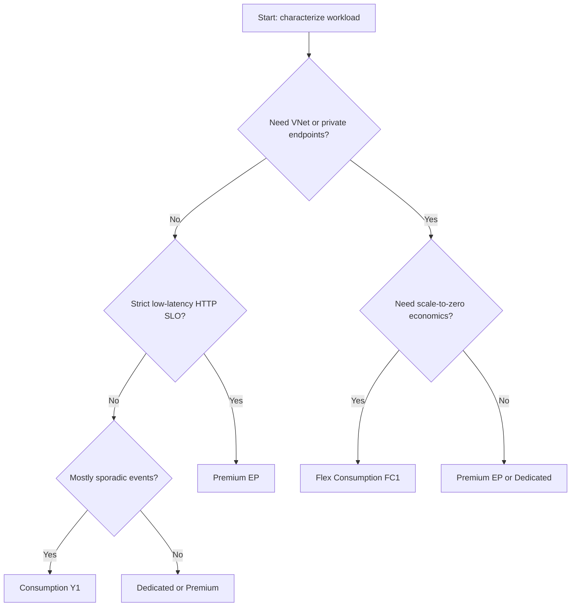

# Hosting Plan Selection Best Practices

Selecting the wrong hosting plan is one of the highest-impact mistakes in Azure Functions. This guide provides a practical decision framework so plan choice matches execution behavior, trigger profile, and operational safety requirements.

This page intentionally avoids re-explaining plan internals. For detailed platform capabilities, start with [Platform: Hosting](../platform/hosting.md).

!!! tip "Use this page with Platform"
    Read [Platform: Hosting](../platform/hosting.md) first for capability facts, then apply this guide for workload-fit decisions and migration safety.

## Decision framework

Evaluate hosting plan choice in this order:

1. **Execution time and timeout risk**: Are handlers long-running or bursty async jobs?
2. **Latency sensitivity**: Is p95 response time strict for HTTP paths?
3. **Network boundaries**: Is private networking or private endpoint required?
4. **Event profile**: Are events sporadic, steady, or highly bursty?
5. **Cost tolerance model**: Is minimizing idle cost or stabilizing latency more important?

## Workload characteristics that should drive plan choice

| Characteristic | Why it matters | Strong default |
|---|---|---|
| Sporadic event traffic with public endpoints | Scale-to-zero minimizes idle cost | Consumption (Y1) or Flex (FC1) |
| Private-only dependency access | Requires VNet/private endpoint support | Flex (FC1) or Premium (EP) |
| Strict p95 latency for HTTP | Warm baseline avoids startup penalties | Premium (EP) |
| Long-running processing | Avoid timeout ceilings and front-end assumptions | Flex (FC1), Premium (EP), or Dedicated |
| Existing App Service estate | Shared governance and fixed capacity model | Dedicated |

!!! warning "Do not optimize for list price only"
    A cheaper plan can become more expensive when retries, backlog growth, or cold-start-driven latency failures increase operational load.

## Decision matrix

Rows are workload types. Columns represent suitability by plan.

| Workload type | Consumption (Y1) | Flex Consumption (FC1) | Premium (EP) | Dedicated |
|---|---|---|---|---|
| Low-volume cron jobs | Recommended | Recommended | Conditional | Conditional |
| Bursty queue processing without private networking | Recommended | Recommended | Conditional | Not preferred |
| Bursty queue processing with private networking | Not supported | Recommended | Recommended | Conditional |
| Public HTTP API with moderate latency tolerance | Recommended | Recommended | Conditional | Conditional |
| Public HTTP API with strict low-latency SLO | Conditional | Conditional (with always-ready) | Recommended | Recommended |
| Enterprise integration with private endpoints + predictable response | Not supported | Recommended | Recommended | Conditional |
| CPU/memory-heavy continuous workloads | Not preferred | Conditional | Recommended | Recommended |
| Multi-app consolidation on shared fixed capacity | Not preferred | Not suitable (one app per plan) | Conditional | Recommended |

## Common selection mistakes and safer alternatives

### Mistake 1: Choosing Consumption for long-running jobs

- **Symptom**: executions hit timeout boundaries or require fragile retries.
- **Safer choice**: move to Flex or Premium, and redesign to async triggers where possible.

### Mistake 2: Choosing Premium for very low-volume HTTP endpoints

- **Symptom**: baseline monthly cost dominates actual execution demand.
- **Safer choice**: start on Flex with always-ready tuned to minimum viable level.

### Mistake 3: Ignoring private networking requirements until late

- **Symptom**: re-architecture required after security review.
- **Safer choice**: if private access is probable, begin with Flex or Premium.

### Mistake 4: Treating plan selection as irreversible

- **Symptom**: teams avoid needed migration due to perceived risk.
- **Safer choice**: define migration triggers up front (latency threshold, backlog growth, security requirement changes).

!!! note "Plan selection should be revisited"
    Reassess hosting plan when trigger mix changes, dependency quotas tighten, or latency SLOs become contractual.

## Migration paths between plans

Plan migration is usually operationally straightforward when done with configuration discipline and staged validation.

| From | To | Typical trigger | Main migration check |
|---|---|---|---|
| Consumption (Y1) | Flex (FC1) | Need VNet, better burst handling, or longer timeouts | Validate Flex deployment model and storage identity configuration |
| Consumption (Y1) | Premium (EP) | Need strict latency and warm baseline | Configure minimum/pre-warmed instances and test cost impact |
| Flex (FC1) | Premium (EP) | Need consistently warm behavior for HTTP | Re-check scale and concurrency settings under warm baseline |
| Premium (EP) | Dedicated | Need fixed capacity governance | Port autoscale strategy to App Service plan rules |

### Migration checklist

1. Export and review app settings, connection settings, and `host.json` scale-related values.
2. Confirm trigger extensions and binding compatibility in target plan.
3. Validate storage access mode (identity-based settings where required).
4. Run staged load test to compare p95, backlog behavior, and dependency saturation.
5. Cut over with rollback path and post-cutover telemetry watch window.

## Cost and reliability guardrails while selecting plans

Use these constraints to avoid unstable designs:

- Apply max scale limits before exposure to internet traffic.
- Separate latency-sensitive HTTP handlers from heavy async processors when possible.
- Map each trigger to explicit retry and poison-message behavior.
- Model dependency throughput budgets (database connections, API rate limits) before raising scale ceilings.

!!! tip "Operations linkage"
    Pair plan decisions with [Cost Optimization](../operations/cost-optimization.md) so baseline cost and burst-cost controls are implemented from day one.

## Quick recommendation patterns

| If your first priority is... | Start with... | Re-evaluate when... |
|---|---|---|
| Lowest idle cost | Consumption (Y1) | You need private networking or long-running execution |
| Serverless + private networking | Flex (FC1) | Strict low-latency SLO remains unstable |
| Lowest latency consistency | Premium (EP) | Spend must be reduced and latency budget loosens |
| Existing fixed App Service capacity | Dedicated | Workload becomes bursty and under-utilizes fixed compute |

## Operational handoff checklist after plan selection

Before finalizing a plan decision, hand off these concrete items to operations:

1. Document expected trigger mix and peak event profile.
2. Define acceptable cold-start behavior and user-facing latency budgets.
3. Set initial scale/concurrency limits and rollback criteria.
4. Record dependency throughput constraints and escalation contacts.
5. Link plan choice to budget alert thresholds and monthly review cadence.

!!! warning "Selection without handoff is incomplete"
    A plan decision is only production-ready when monitoring thresholds, scale limits, and rollback rules are operationalized.

---

## See Also

- [Platform: Hosting](../platform/hosting.md)
- [Platform: Scaling](../platform/scaling.md)
- [Operations: Cost Optimization](../operations/cost-optimization.md)
- [Best Practices: Scaling](./scaling.md)

## References

- [Azure Functions hosting options and scaling (Microsoft Learn)](https://learn.microsoft.com/azure/azure-functions/functions-scale)
- [Azure Functions Flex Consumption plan (Microsoft Learn)](https://learn.microsoft.com/azure/azure-functions/flex-consumption-plan)
- [Azure Functions performance and reliability (Microsoft Learn)](https://learn.microsoft.com/azure/azure-functions/performance-reliability)
