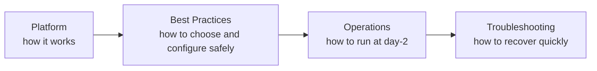
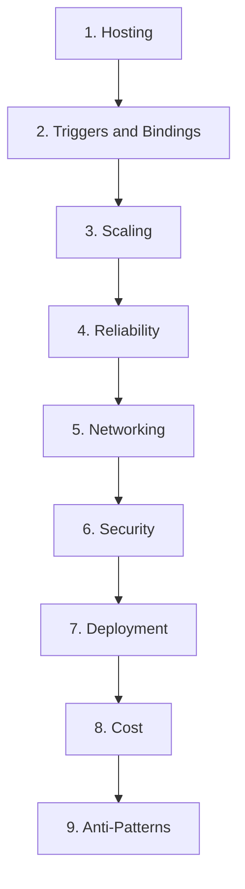

# Best Practices

This section covers operational and design best practices specific to Azure Functions. Unlike Platform (which explains how things work) or Operations (which covers day-to-day execution), Best Practices bridges the gap with actionable guidance to avoid common mistakes.

Best Practices in this hub are intentionally execution-focused: hosting plan choice, trigger behavior, scaling guardrails, and operational safety controls that prevent incidents.

## Why Best Practices matter for Functions

- Functions are event-driven: wrong plan + wrong trigger can produce silent backlog growth or delayed processing.
- Stateless execution model requires explicit idempotency, timeout, and concurrency decisions.
- Storage dependency is often invisible until host startup fails or trigger checkpoints stall.
- Each hosting plan has different operational characteristics for cold start, scale ceilings, and network integration.

!!! warning "Common failure pattern"
    Teams often validate only the happy path with low traffic HTTP tests, then discover production issues when asynchronous triggers, retries, and scale-out happen simultaneously.

## Scope of this section

Use this section to answer practical questions such as:

- Which plan should I choose for this workload pattern?
- Which trigger model is operationally safer for this integration?
- How do I cap scale and concurrency to protect downstream systems?
- What defaults should be changed before production launch?

This section does not replace detailed platform explanations. For core mechanics, read:

- [Platform: Hosting](../platform/hosting.md)
- [Platform: Triggers and Bindings](../platform/triggers-and-bindings.md)
- [Platform: Scaling](../platform/scaling.md)

## Section overview

The Best Practices tab is organized into nine practical sub-pages.

| Sub-page | Focus | Why it matters in production |
|---|---|---|
| `hosting-plan-selection.md` | Plan selection heuristics by workload profile | Prevents expensive migrations and latency regressions |
| `trigger-and-binding.md` | Trigger/binding defaults and safety controls | Reduces duplicate processing and delivery failures |
| `scaling.md` | Scale expectations, limits, and concurrency controls | Prevents runaway scale and dependency saturation |
| `reliability.md` | Idempotency, retry boundaries, poison workflows | Improves recovery from transient and permanent failures |
| `networking.md` | Private networking, DNS, and egress constraints | Avoids hidden connectivity breakage after deploy |
| `security.md` | Identity-first access, secret minimization, auth boundaries | Reduces credential risk and misconfigured exposure |
| `deployment.md` | Safe rollout, rollback, and slot strategy by plan | Lowers release failure blast radius |
| `cost-optimization.md` | Cost guardrails with scale and telemetry controls | Keeps spend predictable during bursts |
| `common-anti-patterns.md` | Frequent Functions-specific mistakes and alternatives | Speeds architecture and code reviews |

!!! note "Current publishing state"
    This landing page includes the full planned map so teams can align review checklists and ownership early.

## Reading order recommendation

Recommended sequence for new production workloads:

1. Hosting
2. Triggers
3. Scaling
4. Reliability
5. Networking
6. Security
7. Deployment
8. Cost
9. Anti-Patterns

Rationale:

- Hosting decisions set hard constraints for timeout, cold start, and networking.
- Trigger and binding behavior defines delivery semantics and retry risk.
- Scaling and reliability turn those choices into predictable runtime behavior.
- Networking/security/deployment/cost then harden and operationalize the design.

## How to use these pages during delivery

### Design review

- Confirm plan choice against workload shape (burst, latency, private access, run duration).
- Validate trigger model against delivery guarantees and poison handling expectations.
- Define scale and concurrency limits before load tests.

### Pre-production checklist

- Explicitly configure storage access mode (identity-based where supported).
- Verify app settings for scale limits and HTTP concurrency boundaries.
- Validate retry strategy and dead-letter/poison route for each async trigger.
- Load-test with realistic payload size, dependency quotas, and regional constraints.

### Incident prevention focus

!!! tip "Bridge to operations"
    Pair each best-practice recommendation with a concrete runbook in [Operations](../operations/index.md) so engineering intent remains enforceable after handoff.

??? info "Why this section avoids abstract architecture"
    Azure Functions incidents are usually operationally triggered: scale-out against constrained dependencies, trigger retries interacting with non-idempotent handlers, or plan mismatches that surface only under load. This section stays grounded in those failure modes.

## Cross-section navigation

Use these sections together:

- **Platform** for behavior definitions and capability constraints.
- **Best Practices** for implementation choices and safety defaults.
- **Operations** for monitoring, deployment, and recovery procedures.
- **Troubleshooting** for incident triage and root-cause workflows.

## What “good” looks like for Functions workloads

Use these criteria as a minimum quality bar before production go-live:

| Area | Minimum expectation |
|---|---|
| Plan fit | Selected plan is justified by latency, network, and timeout requirements |
| Trigger semantics | Each function has documented delivery expectation and retry behavior |
| Scale safety | Maximum instance limits and per-trigger concurrency are explicitly set |
| Dependency protection | Downstream quotas and connection budgets are validated under load |
| Recovery path | Poison/dead-letter workflow and replay ownership are defined |

!!! tip "Review cadence"
    Re-run the Best Practices checklist whenever you add a new trigger type, change hosting plan, or modify concurrency settings. These changes alter runtime behavior more than most code refactors.

---

## See Also

- [Platform Overview](../platform/index.md)
- [Operations Overview](../operations/index.md)
- [Troubleshooting Overview](../troubleshooting/index.md)
- [Hosting Plans](../platform/hosting.md)
- [Triggers and Bindings](../platform/triggers-and-bindings.md)
- [Scaling Behavior](../platform/scaling.md)

## Sources

- [Azure Functions documentation (Microsoft Learn)](https://learn.microsoft.com/azure/azure-functions/)
- [Azure Functions hosting options and scaling (Microsoft Learn)](https://learn.microsoft.com/azure/azure-functions/functions-scale)
- [Azure Functions performance and reliability (Microsoft Learn)](https://learn.microsoft.com/azure/azure-functions/performance-reliability)
