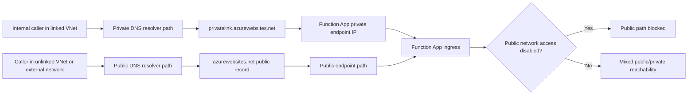
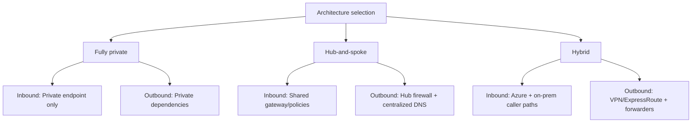
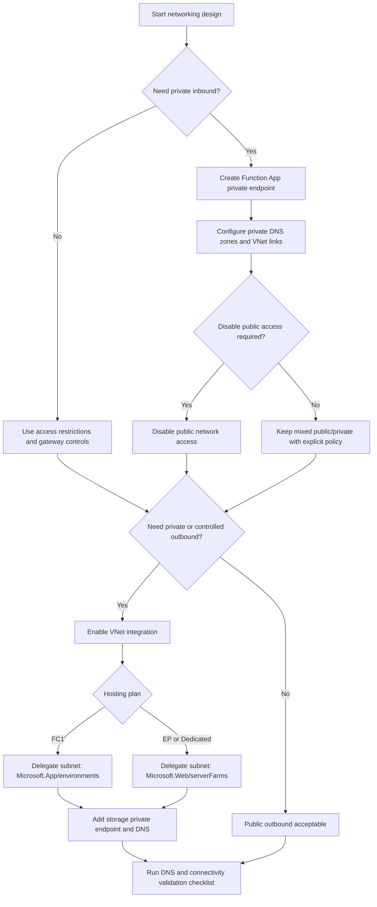

# Networking Best Practices for Azure Functions

Azure Functions networking decisions directly affect runtime safety: trigger reachability, host startup, scale-out behavior, and dependency access. This guide focuses on practical patterns for VNet integration, private endpoints, DNS correctness, and safe outbound control.

!!! tip "Start with platform networking behavior"
    For baseline capabilities by hosting plan, read [Platform Networking](../platform/networking.md) first. Then apply the operational patterns here.

## Why This Matters

Treat networking as two independent controls:

- **Inbound**: who can invoke HTTP endpoints.
- **Outbound**: what dependencies the function worker can reach.

Many production incidents come from configuring one side only.

| Control plane | Primary question | Typical controls | Common failure when omitted | Validation signal |
|---|---|---|---|---|
| Inbound | Who can invoke my function endpoints? | Access restrictions, API gateway, private endpoint, public network access setting | Untrusted callers can still reach HTTP trigger path | Caller path test from trusted/untrusted networks |
| Outbound | What dependencies can function workers reach? | VNet integration, NSG, UDR, firewall/NAT, DNS forwarding | Trigger works but dependencies timeout or startup fails | Dependency reachability and DNS resolution from runtime subnet |
| Combined posture | Are ingress and egress policies aligned to the same trust boundary? | Private ingress + private host storage + controlled egress | Mixed trust boundary (private app, public storage, or vice versa) | End-to-end flow test including storage and trigger operations |

## Recommended Practices

### VNet integration: when you need it

Use VNet integration when function code must call:

- private endpoints in your VNet or peered VNets,
- on-premises services through VPN or ExpressRoute,
- internet dependencies through centralized firewall/NAT policy.

Practical triggers:

- Service Bus-triggered worker writes to private SQL endpoint.
- HTTP API function calls internal line-of-business API over private IP.
- Timer function runs maintenance jobs against private data plane services.

### Plan support and subnet sizing

VNet integration support is plan-dependent. Before deployment, verify:

- selected plan supports required integration mode,
- subnet is dedicated for integration where required,
- subnet has enough IPs for expected scale-out headroom.

!!! warning "Small subnet causes hidden scale failures"
    If the integration subnet is too small, scale-out may stall even when trigger backlog grows. This often appears as queue lag with no obvious app errors.

Subnet sizing guidance for operations:

- reserve headroom for burst scale, platform updates, and warm instances,
- avoid sharing integration subnet with unrelated workloads,
- validate available IP count during load tests, not only at deployment.

| Hosting plan | VNet integration support | Required subnet delegation | Subnet usage guidance | Notes |
|---|---|---|---|---|
| Flex Consumption (FC1) | Supported | `Microsoft.App/environments` | Use a dedicated integration subnet with burst headroom | Delegation mismatch is a common deployment blocker |
| Premium (EP) | Supported | `Microsoft.Web/serverFarms` | Keep integration subnet dedicated where possible | Recommended for predictable private networking workloads |
| Dedicated (App Service Plan) | Supported | `Microsoft.Web/serverFarms` | Plan subnet size for multi-app scale behavior | Shared plan capacity can hide subnet pressure |
| Consumption (Y1) | Not supported for VNet integration or private endpoints | Not applicable | Use public networking patterns only | Do not design private-only inbound or outbound architecture on Y1 |

### Private endpoints for inbound access

Private endpoints make Function App ingress private to your network path.

Safe implementation pattern:

1. Create private endpoint for the Function App site.
2. Configure and link required private DNS zones.
3. Validate DNS resolution from every caller network.
4. Disable public network access when policy requires private-only ingress.

### The DNS confusion trap

A common failure is creating a private endpoint but leaving DNS unresolved or partially linked.

Symptoms:

- some clients reach public endpoint, others private endpoint,
- intermittent `403` or connection timeout depending on resolver path,
- successful portal tests but failed calls from integration runtime.

Root cause is usually split resolution paths without consistent zone linkage.

| Private endpoint readiness check | Requirement | Why it matters | Quick verification |
|---|---|---|---|
| Endpoint provisioning | Private endpoint is `Succeeded` and NIC attached | Prevents assuming DNS is broken when endpoint is not ready | `az network private-endpoint show --query provisioningState` |
| Private DNS zone records | `privatelink.azurewebsites.net` records exist | Ensures private FQDN resolves to private IP | Resolve FQDN from caller/runtime networks |
| VNet links | All caller VNets linked to required private DNS zones | Avoids partial success from only one network | List zone links and compare to caller inventory |
| Public access policy | Public network access disabled when private-only required | Prevents policy bypass over public endpoint | Validate both private and internet paths intentionally |
| Runtime path validation | Function runtime subnet resolves same private records as callers | Prevents "portal works, runtime fails" scenarios | In-app DNS lookup and dependency probe |



### Subnet delegation rules (including FC1 difference)

Delegation differs by hosting model:

- **Premium/Dedicated integration subnet**: `Microsoft.Web/serverFarms`
- **Flex Consumption (FC1) integration subnet**: `Microsoft.App/environments`

!!! note "FC1 delegation mismatch is a frequent deployment blocker"
    Reusing a subnet delegated to `Microsoft.Web/serverFarms` for FC1 integration fails. Plan subnet delegation explicitly per hosting model.

### DNS design for private networking

Use a deterministic DNS architecture before enabling private-only paths.

Core controls:

- private DNS zones for each private endpoint namespace,
- VNet links for all VNets that host callers,
- DNS forwarding rules for hybrid/on-prem resolvers,
- explicit validation from runtime subnets.

| DNS scenario | Required zone and linkage pattern | Failure symptom when missing | Validation approach |
|---|---|---|---|
| Single VNet, private endpoint only | Private zone linked to application VNet | Name resolves publicly or fails from app subnet | Resolve from app subnet and caller subnet |
| Hub-and-spoke | Zone in hub with links to all spoke VNets | One spoke works, another times out | Validate resolution from each spoke |
| Hybrid (on-prem + Azure) | DNS forwarder/conditional forwarder to Azure resolver path + private zone links | On-prem resolves public record while Azure resolves private | Compare on-prem and Azure resolver answers |
| Mixed public/private rollout | Explicit resolver policy for internal private vs external public | Intermittent endpoint selection and inconsistent auth outcomes | Test from internal and external clients separately |

### Split-brain DNS considerations

When public and private zones exist for the same logical name:

- internal callers must resolve private records,
- external callers must resolve public records (if public path remains enabled),
- avoid overlapping resolver rules that produce random resolver choice.

### Outbound restrictions and forced tunneling

Outbound restrictions often involve NSG, UDR, and centralized inspection.

Operational impacts:

- blocking required platform endpoints can break startup and trigger operations,
- forced tunneling can increase cold-start and dependency latency,
- strict deny rules without allowlist observability delay incident diagnosis.

Design pattern:

1. Enable route-all only when policy requires central egress control.
2. Establish explicit allowlist for required Azure dependencies.
3. Validate trigger operation and host storage access after route change.
4. Monitor egress denies and DNS failures as first-class signals.

### Storage private endpoint is part of function networking

If Function App ingress is private but `AzureWebJobsStorage` remains public, security and reliability goals are incomplete.

Minimum safe pattern:

- place storage account behind private endpoint(s) as required,
- ensure function app networking path can resolve and reach storage private FQDNs,
- confirm identity or connection configuration still resolves correctly after private networking.

!!! warning "Runtime dependency mismatch"
    Private Function App plus public host storage creates inconsistent boundary assumptions. During policy tightening, host startup can fail if storage network access is later blocked without DNS and private endpoint readiness.

## Common Mistakes / Anti-Patterns

| Mistake | Symptom | Prevention | Severity |
|---|---|---|---|
| Subnet too small (IP exhaustion) | Backlog grows and scale-out stalls | Size subnet for burst and validate under load | High |
| Missing private DNS links | App resolves from one VNet but not another | Inventory all caller VNets and verify zone links | High |
| Private endpoint created but public access still open | Traffic bypasses intended private ingress policy | Disable public access when private-only is required | Medium |
| Storage endpoint left out of private architecture | Host errors appear after outbound hardening | Include host storage in private endpoint and DNS plan | High |
| FC1 delegation confusion | VNet integration deployment errors | Use `Microsoft.App/environments` for FC1 subnets | Medium |

### 1) Subnet too small (IP exhaustion)

- Symptom: backlog grows, scale-out stalls.
- Prevention: size subnet for burst and validate under load.

### 2) Missing private DNS links

- Symptom: app can resolve from one VNet but not another.
- Prevention: inventory all caller VNets and verify zone links.

### 3) Private endpoint created but public access still open

- Symptom: traffic bypasses intended private ingress policy.
- Prevention: explicitly disable public access when private-only is required.

### 4) Storage endpoint left out of private architecture

- Symptom: host errors after outbound hardening.
- Prevention: include host storage in private endpoint and DNS plan.

### 5) FC1 delegation confusion

- Symptom: VNet integration deployment errors.
- Prevention: use `Microsoft.App/environments` for FC1 subnets.

### Network architecture patterns

### Fully private

- Inbound via private endpoint only.
- Outbound through VNet integration to private dependencies.
- Best for strict internal workloads and regulated environments.

### Hub-and-spoke

- Function app in spoke VNet.
- Shared DNS/firewall services in hub.
- Common for multi-application platform teams.

### Hybrid

- VNet-integrated function app accesses on-prem services through VPN/ExpressRoute.
- Requires DNS forwarder alignment and route validation.

| Pattern | Inbound model | Outbound model | Best-fit use case | Operational trade-off |
|---|---|---|---|---|
| Fully private | Private endpoint only, public access disabled | Private endpoints and/or controlled VNet egress | Regulated internal APIs and data paths | Highest DNS and network policy complexity |
| Hub-and-spoke | Private or restricted ingress via shared network services | Egress inspected through hub firewall/NAT | Multi-team platform with centralized controls | Shared hub dependencies can become bottleneck |
| Hybrid | Private/restricted Azure ingress + on-prem caller paths | VNet integration + VPN/ExpressRoute routes | Legacy system integration with on-prem services | Route and DNS drift causes intermittent failures |



### Networking decision flowchart



## Validation Checklist

Use these commands after each network change. Keep outputs scrubbed before sharing.

### Verify VNet integration

```bash
az functionapp vnet-integration list \
    --name "$APP_NAME" \
    --resource-group "$RG"
```

### Verify subnet delegation

```bash
az network vnet subnet show \
    --name "$INTEGRATION_SUBNET" \
    --resource-group "$RG" \
    --vnet-name "$VNET_NAME" \
    --query "delegations[].serviceName"
```

### Verify private endpoint status

```bash
az network private-endpoint show \
    --name "$PE_NAME" \
    --resource-group "$RG" \
    --query "{provisioningState:provisioningState,networkInterfaces:networkInterfaces[].id}"
```

### Verify private DNS zone links

```bash
az network private-dns link vnet list \
    --resource-group "$DNS_RG" \
    --zone-name "privatelink.azurewebsites.net"
```

### Verify app access restrictions

```bash
az functionapp config access-restriction show \
    --name "$APP_NAME" \
    --resource-group "$RG"
```

??? tip "Cross-check with security controls"
    Networking isolation does not replace identity and secret hygiene. Apply [Security Best Practices](./security.md) together with these network controls.

## See Also

- [Platform Networking](../platform/networking.md)
- [Security Best Practices](./security.md)
- [Platform Security](../platform/security.md)

## Sources

- [Azure Functions networking options](https://learn.microsoft.com/azure/azure-functions/functions-networking-options)
- [Integrate Azure Functions with an Azure virtual network](https://learn.microsoft.com/azure/azure-functions/functions-create-vnet)
- [Private endpoints for Azure Functions](https://learn.microsoft.com/azure/azure-functions/functions-networking-options#private-endpoints)
- [Azure Private Endpoint DNS configuration](https://learn.microsoft.com/azure/private-link/private-endpoint-dns)
- [Azure Functions app settings reference (network-related settings)](https://learn.microsoft.com/azure/azure-functions/functions-app-settings)
