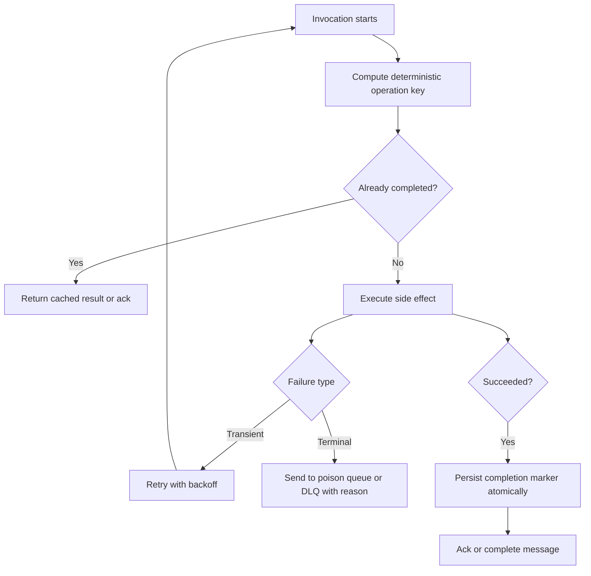
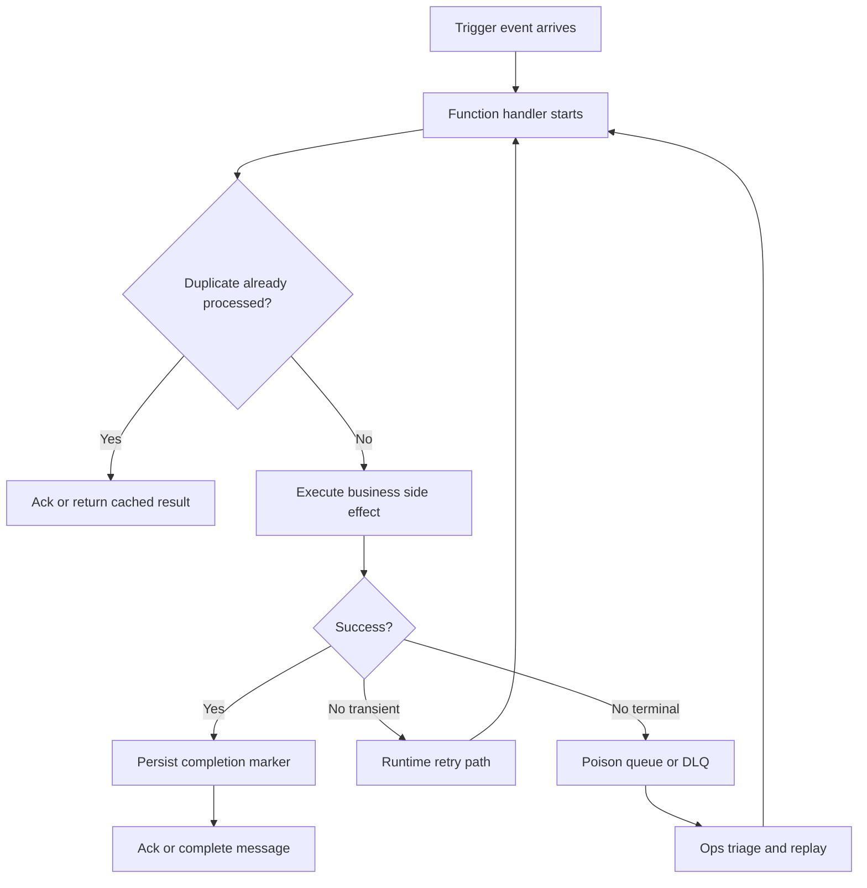

# Reliability Best Practices for Azure Functions

Reliable Azure Functions systems are built around the runtime execution model: most event-driven triggers (queues, Event Hubs, Service Bus, blob) deliver at-least-once, retries are normal, host instances can restart at any time, and dependencies can throttle. HTTP triggers behave differently — they are synchronous request/response and do not retry automatically. This guide focuses on safe execution patterns that keep behavior correct during duplicates, retries, scale-out, and partial outages.

!!! tip "Platform and operations context"
    Keep this guide focused on implementation choices. For platform behavior details and recovery runbooks, see [Platform Reliability](../platform/reliability.md), [Retries and Poison Handling](../operations/retries-and-poison-handling.md), and [Recovery](../operations/recovery.md).

## Why stateless is the default

Function instances are ephemeral. The runtime can:

- start multiple instances during scale-out,
- recycle an instance during host upgrade or health event,
- reassign future invocations to different workers.

Any in-memory state can disappear or become inconsistent across instances.

| Design style | State location | Behavior during restart/scale-out | Reliability risk | Recommended usage |
|---|---|---|---|---|
| Stateless (preferred) | External durable store | New instance can continue using shared state | Low when idempotency is implemented | Default for trigger handlers and API operations |
| Stateful in-memory cache | Worker process memory | Cache is lost on recycle; not shared across instances | High duplicate or skipped operations | Avoid for correctness-critical flows |
| Stateful local filesystem | Ephemeral local disk | Files may disappear on cold start or host move | High checkpoint/data loss risk | Use only for temporary non-critical artifacts |
| Durable orchestration state | Durable Functions backend | Replay and checkpoint survive restarts | Medium (determinism discipline required) | Multi-step workflows with wait states/compensation |

### What breaks when a function is stateful

- In-memory dedup caches miss duplicates after restart.
- Per-instance counters diverge during parallel scale-out.
- "Last processed timestamp" stored in memory causes skipped or duplicated work.
- Temporary local files are lost across cold starts and host moves.

!!! warning "Stateful handlers fail under retries and scale"
    If correctness depends on local memory, retries and replays will eventually create data corruption or duplicated side effects.

### Externalize state safely

Use external stores based on state type:

- **Dedup/index state**: Table Storage, Cosmos DB, SQL unique constraints.
- **Workflow state**: Durable Functions instance state.
- **Checkpoint state**: trigger-native checkpointing where provided.
- **Long-running orchestration progress**: Durable orchestrator history.

## Idempotency is mandatory for every trigger

At-least-once delivery means a message or event can be processed more than once. Build every handler so duplicate invocation is safe.

### Trigger-specific deduplication patterns

| Trigger type | Duplicate source | Recommended dedup key | Practical implementation |
|---|---|---|---|
| HTTP | Client retries, gateway retries, timeout retries | `Idempotency-Key` header or domain operation ID | Persist key + result status before external side effects |
| Storage Queue | Visibility timeout expiration, host restart | `MessageId` + business key | Upsert into processed-operations table with unique key |
| Service Bus | Lock loss, redelivery, transient failures | `MessageId` or domain command ID | Store processed command IDs with TTL and unique index |
| Event Hubs | Partition replay/checkpoint gaps | Event ID + partition + sequence constraints | Idempotent projection writes and version checks |
| Timer | Missed schedule catch-up, overlapping execution | Scheduled occurrence timestamp | Persist last completed schedule occurrence |

??? note "Idempotent means effect-safe, not just exception-safe"
    Returning `200` twice is not enough. The business side effect (charge, shipment, status transition) must happen once, or happen multiple times with identical final state.

## Retry-safe processing design

Treat each invocation as potentially repeated.

1. Validate input and compute deterministic operation key.
2. Check whether operation already completed.
3. Execute side effect with timeout budget.
4. Persist completion marker atomically.
5. Ack/complete message only after durable success.

### Queue trigger safety (Storage Queue)

- `visibilityTimeout` controls message reappearance window.
- `dequeueCount` increments on each receive.
- `maxDequeueCount` moves failed messages to poison queue.

Operational guidance:

- Set `visibilityTimeout` longer than normal processing time plus downstream jitter.
- Keep processing idempotent because visibility expiration can cause concurrent duplicate processing.
- Alert on poison queue growth rate, not just absolute count.

### Service Bus trigger safety

- Delivery lock can expire if processing exceeds lock duration.
- Retries can redeliver same message.
- Max delivery count routes to dead-letter queue.

Operational guidance:

- Keep handler duration inside lock window or enable lock renewal where supported.
- Move terminal business-rule failures to dead-letter with explicit reason metadata.
- Build replay tooling that can requeue selectively after remediation.

### HTTP trigger safety with client retries

Clients, proxies, and API gateways can retry when they see 408/429/5xx or connection resets.

Design pattern:

- Require `Idempotency-Key` for state-changing operations.
- Store key with operation status (`started`, `completed`, `failed-retryable`, `failed-terminal`).
- Return existing result when key already completed.
- Expire keys with retention aligned to client retry behavior.

### Timer trigger safety

Timer schedules can be delayed by host restarts and scale events.

Design pattern:

- Read schedule metadata and detect missed occurrences.
- Process windows by deterministic range (`from`, `to`) instead of "now only" logic.
- Use singleton/lease patterns for non-partitionable maintenance jobs.

## Storage dependency resilience (AzureWebJobsStorage)

`AzureWebJobsStorage` is a runtime dependency for core host behavior and many triggers.

Failure modes and impact:

- **Unavailable storage**: triggers may stop polling or fail initialization.
- **Throttled storage**: increased latency, repeated retries, backlog growth.
- **Misconfigured identity or connection**: startup failure, binding errors, trigger silence.

| Failure mode | Runtime symptom | Operational impact | Primary mitigation | Detection signal |
|---|---|---|---|---|
| Unavailable host storage | Trigger listener initialization fails or stops polling | Invocation gap and delayed processing | Ensure private/public path alignment and storage availability SLO | Host startup failures and trigger listener errors |
| Throttled host storage | Binding/lease/checkpoint operations slow down | Retry amplification and backlog growth | Capacity planning, retry budget tuning, isolate heavy app data workloads | Storage throttle metrics and queue lag growth |
| Identity/RBAC misconfiguration | Host startup errors, authentication failures to storage | App appears healthy but no trigger progress | Validate managed identity role assignments pre-production | Authorization failure logs and startup diagnostics |
| DNS/network mismatch to storage endpoint | Intermittent or persistent connection timeouts | Unpredictable trigger execution reliability | Align private endpoint, DNS links, and route policy for runtime subnet | Connection timeout spikes after network policy changes |

Mitigations:

- Use supported identity-based configuration where available.
- Monitor host startup failures and storage-related exceptions.
- Separate application data storage from host storage when isolation is needed.
- Test failure behavior in staging by simulating storage deny/throttle conditions.

!!! warning "Do not treat host storage as optional"
    If host storage access fails, reliability degrades before business logic runs. Guardrails must include configuration validation and RBAC checks.

## Durable Functions: when to use orchestrations

Use plain functions when work is short, stateless, and independently retryable.
Use Durable Functions when you need deterministic workflow state across retries and restarts.

Choose Durable when you need:

- fan-out/fan-in with durable checkpoints,
- long-running human or external-system waits,
- compensation workflows,
- deterministic replayed orchestration logic.

Keep plain functions when you need:

- single-step event handling,
- low-latency stateless transformations,
- simple queue-to-API processing.

| Decision criteria | Plain Functions | Durable Functions |
|---|---|---|
| Workflow length | Short, single-step units | Multi-step or long-running workflows |
| State management | Externalized manually in app/storage | Built-in orchestration history and checkpoints |
| Retry model | Trigger/runtime retries per invocation | Deterministic replay with orchestrator semantics |
| Human interaction/waits | Complex to implement reliably | First-class pattern (wait for external event/timer) |
| Compensation/saga | Manual compensation logic | Structured orchestrations and compensation flows |
| Latency sensitivity | Better for low-latency stateless handlers | Additional orchestration overhead |

## Timeout and cancellation handling

Plan-specific execution limits must drive handler design.

- Break long tasks into chunked operations.
- Use cancellation tokens or equivalent cancellation signals.
- Stop creating new outbound calls once cancellation is requested.
- Persist safe resume checkpoints before exiting.

Example cancellation-aware strategy:

1. Read cancellation signal at loop boundaries.
2. Complete current atomic unit.
3. Persist checkpoint state.
4. Exit gracefully so retry resumes from checkpoint.

| Hosting plan | Default timeout behavior | Maximum timeout behavior | Reliability design guidance |
|---|---|---|---|
| Consumption (Y1) | Default is short-running oriented | Bounded maximum (plan-specific) | Keep handlers chunked and checkpoint frequently |
| Flex Consumption (FC1) | Default around 30 minutes | Supports long-running/unbounded scenarios by configuration | Use explicit cancellation and progress checkpoints |
| Premium (EP) | Suitable for long-running workloads | Extended runtime support by plan/runtime settings | Prefer resilient chunking even when long timeout is available |
| Dedicated (App Service Plan) | App Service-style execution behavior | Configurable with host/runtime constraints | Guard against runaway executions with explicit budgets |

## Poison and dead-letter handling strategy

Do not treat poison/dead-letter paths as final discard queues.

Minimum production pattern:

- capture payload, trigger metadata, and failure reason,
- classify transient versus terminal failures,
- create replay process with dedup protection,
- track mean time to remediate poison items.

### Trigger-specific poison handling

- **Storage Queue**: monitor `<queue>-poison`; create poison processor.
- **Service Bus**: monitor DLQ counts and age; preserve dead-letter reason.
- **Event-based systems**: implement side-channel failed-event store if no native poison queue exists.

| Trigger family | Native poison/dead-letter path | What to retain for replay | Replay control recommendation |
|---|---|---|---|
| Storage Queue | `<queue>-poison` via `maxDequeueCount` | Payload, `dequeueCount`, insertion/expiration metadata | Reprocess with dedup key check before side effects |
| Service Bus | Entity DLQ with dead-letter reason/description | Payload, `MessageId`, dead-letter reason, delivery count | Replay selectively after root-cause tagging |
| Event Hubs/Event Grid style eventing | No universal poison queue in all patterns | Event envelope, partition/offset or event ID, failure category | Store failed events in side channel and build idempotent re-drive pipeline |
| HTTP | No native poison queue | Request body hash, idempotency key, response status timeline | Client-safe retry contract and operator replay endpoint |

## Message processing lifecycle (retry and poison path)

## Reliability checklist

- [ ] Every trigger handler has explicit idempotency key logic.
- [ ] Side effects are guarded by dedup store or domain unique constraint.
- [ ] Queue `visibilityTimeout` and `maxDequeueCount` are tuned and documented.
- [ ] Service Bus lock duration/renewal and DLQ strategy are documented.
- [ ] HTTP write operations require idempotency key and replay-safe status model.
- [ ] Timer jobs handle missed schedules and avoid overlap issues.
- [ ] `AzureWebJobsStorage` identity/permissions/config are validated in pre-production.
- [ ] Timeout budget exists for each dependency call path.
- [ ] Poison and dead-letter queues have alerts, dashboard, and replay runbook.
- [ ] Durable Functions is used for multi-step workflows that need durable state.

## See Also

- [Platform Reliability](../platform/reliability.md)
- [Retries and Poison Handling](../operations/retries-and-poison-handling.md)
- [Recovery](../operations/recovery.md)
- [Security Best Practices](./security.md)

## Sources

- [Designing Azure Functions for identical input (idempotency)](https://learn.microsoft.com/azure/azure-functions/functions-idempotent)
- [Reliable event processing in Azure Functions](https://learn.microsoft.com/azure/azure-functions/functions-reliable-event-processing)
- [Error handling and retries in Azure Functions](https://learn.microsoft.com/azure/azure-functions/functions-bindings-error-pages)
- [Queue trigger for Azure Functions](https://learn.microsoft.com/azure/azure-functions/functions-bindings-storage-queue-trigger)
- [Service Bus trigger for Azure Functions](https://learn.microsoft.com/azure/azure-functions/functions-bindings-service-bus-trigger)
- [Azure Functions host storage considerations](https://learn.microsoft.com/azure/azure-functions/storage-considerations)
- [Function app timeout duration](https://learn.microsoft.com/azure/azure-functions/functions-scale#timeout)
- [Durable Functions overview](https://learn.microsoft.com/azure/azure-functions/durable/durable-functions-overview)
