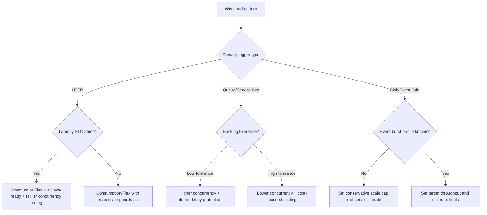
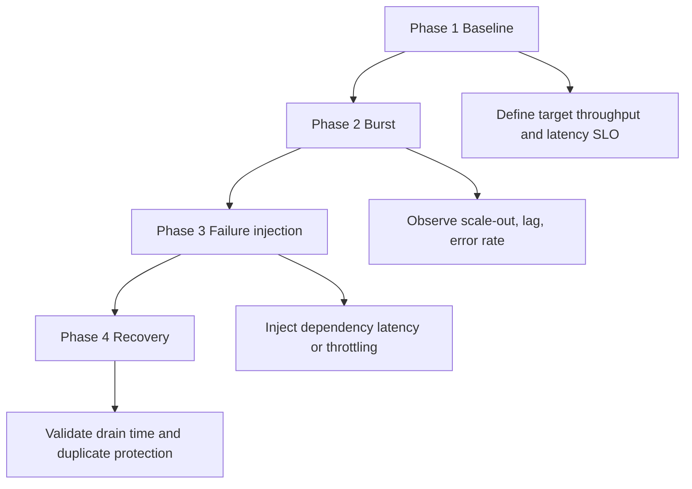

---
content_sources:
  - type: mslearn-adapted
    url: https://learn.microsoft.com/azure/azure-functions/event-driven-scaling
  - type: mslearn-adapted
    url: https://learn.microsoft.com/azure/azure-functions/functions-concurrency
  - type: mslearn-adapted
    url: https://learn.microsoft.com/azure/azure-functions/functions-scale
  - type: mslearn-adapted
    url: https://learn.microsoft.com/azure/azure-functions/flex-consumption-plan
content_validation:
  status: verified
  last_reviewed: 2026-04-12
  reviewer: agent
  core_claims:
    - claim: "Azure Functions 스케일링은 이벤트 기반이며 다운스트림 한계 때문에 선형 확장을 보장하지 않는다."
      source: https://learn.microsoft.com/azure/azure-functions/event-driven-scaling
      verified: true
    - claim: "Consumption과 Premium에서는 functionAppScaleLimit로 최대 인스턴스 수를 제한할 수 있다."
      source: https://learn.microsoft.com/azure/azure-functions/functions-scale
      verified: true
    - claim: "Flex Consumption은 always-ready 인스턴스와 메모리 프로필 같은 추가 스케일 튜닝 옵션을 제공한다."
      source: https://learn.microsoft.com/azure/azure-functions/flex-consumption-plan
      verified: true
    - claim: "동시성 설정은 트리거 유형과 런타임 특성에 맞게 조정해야 한다."
      source: https://learn.microsoft.com/azure/azure-functions/functions-concurrency
      verified: true
---

# Scaling Best Practices

Scaling in Azure Functions is most effective when treated as an operational contract, not a platform mystery. The practical goal is to set expectations and limits so trigger-driven scale-out improves throughput without overloading dependencies.

For platform mechanics, see [Platform: Scaling](../platform/scaling.md). This page focuses on tuning choices and safety guardrails.

<!-- diagram-id: scaling-best-practices -->


## Why This Matters

Use these expectations to set realistic SLOs before load testing.

| Plan | HTTP expectation | Async trigger expectation | Operational focus |
|---|---|---|---|
| Consumption (Y1) | Good for moderate burst, cold start risk after idle | Strong for burst queues with proper retries | Cap scale and protect dependencies |
| Flex Consumption (FC1) | Strong with always-ready + HTTP concurrency controls | Strong high-burst behavior with per-function/group scaling | Tune memory profile and always-ready |
| Premium (EP) | Best for strict latency with warm baseline | Strong and predictable with pre-warmed capacity | Size minimum/pre-warmed instances |
| Dedicated | Stable fixed-capacity behavior | Predictable if autoscale rules are accurate | Capacity planning and autoscale governance |

!!! warning "Do not promise linear scaling"
    Throughput increases can stall when downstream quotas, storage contention, or network limits become bottlenecks.

## Recommended Practices

### Set hard limits before production

Two settings are central to scale safety:

- `functionAppScaleLimit` for app-level maximum instance count (Consumption and Premium plans).
- `FUNCTIONS_MAX_HTTP_TRIGGER_CONCURRENCY` to cap per-instance HTTP concurrency (**Flex Consumption only** — this setting does not apply to Consumption, Premium, or Dedicated plans).

### Why these limits matter

- Prevents runaway scale during traffic spikes, replay storms, or event loops.
- Protects downstream databases and APIs from connection saturation.
- Gives predictable failure mode (queueing/throttling) instead of systemic collapse.

```bash
# App-level instance limit (Consumption / Premium)
az resource update \
  --resource-group "$RG" \
  --name "$APP_NAME" \
  --resource-type "Microsoft.Web/sites" \
  --set properties.siteConfig.functionAppScaleLimit=30
```

```bash
# Per-instance HTTP concurrency (Flex Consumption ONLY)
az functionapp config appsettings set \
  --resource-group "$RG" \
  --name "$APP_NAME" \
  --settings "FUNCTIONS_MAX_HTTP_TRIGGER_CONCURRENCY=50"
```

!!! warning "Plan-specific concurrency controls"
    For **Consumption and Premium** plans, per-function concurrency is controlled through `host.json` settings (`maxConcurrentRequests` for HTTP, `batchSize` for queues, etc.) — not through the `FUNCTIONS_MAX_HTTP_TRIGGER_CONCURRENCY` app setting.

### Concurrency tuning by language runtime

Scale-out and per-instance concurrency interact differently by language.

| Language | Runtime characteristic | Tuning implication |
|---|---|---|
| Python | GIL limits CPU-bound parallelism in a single process | Prefer scale-out and multiple worker processes for CPU-heavy loads; avoid overestimating single-instance concurrency |
| Node.js | Event loop excels at I/O concurrency, weak for CPU-bound work | Keep handlers non-blocking; offload CPU-heavy operations |
| .NET | Thread pool and async model support high concurrency when tuned | Monitor thread pool starvation and blocking calls |
| Java | JVM warmup and memory footprint can affect cold path | Right-size memory and monitor GC under burst |

### Practical tuning sequence

1. Establish baseline with conservative concurrency limits.
2. Increase per-instance concurrency in small increments.
3. Validate p95 latency and downstream error rates at each step.
4. Stop increasing when error rate or tail latency worsens.

### Storage-bound scaling bottlenecks

Many scale issues are actually storage coordination issues.

| Bottleneck | Symptom | Mitigation |
|---|---|---|
| Queue polling pressure | High dequeue churn with limited throughput gain | Tune batch size/new batch threshold and visibility timeout |
| Blob lease contention | Duplicate work or delayed processing under burst | Partition workload and avoid single hot path/container pattern |
| Host storage latency | Trigger lag and checkpoint delays | Validate storage SKU, network path, and regional latency |

!!! warning "Invisible dependency risk"
    Even non-storage business logic can fail if host storage is degraded, because trigger coordination and checkpoints depend on it.

### Scale-to-zero tradeoffs

Scale-to-zero reduces idle cost but can increase startup latency.

| Priority | Prefer | Tradeoff |
|---|---|---|
| Lowest idle cost | Consumption or Flex with zero always-ready | Higher cold-start probability |
| Balanced latency and cost | Flex with small always-ready baseline | Some baseline cost |
| Lowest startup latency | Premium with warm baseline + pre-warmed capacity | Higher fixed monthly spend |

### Flex Consumption best-practice tuning

### Instance memory selection

- Start with memory profile matched to per-request working set.
- Increase memory when handlers are memory-constrained or CPU-throttled.
- Re-test throughput density after each change; larger instances can reduce required instance count.

### Always-ready instances

- Use always-ready for latency-sensitive functions only.
- Keep background batch functions at lower baseline if latency is less critical.
- Revisit always-ready count after major traffic seasonality changes.

### HTTP concurrency on Flex

- Set `FUNCTIONS_MAX_HTTP_TRIGGER_CONCURRENCY` intentionally.
- Validate with realistic payload and dependency latency.
- Avoid very high values that create downstream fan-out bursts.

### Premium best-practice tuning

- Configure minimum instances for baseline low latency.
- Configure pre-warmed instances to absorb sudden spikes.
- Validate cost and latency under failover and deployment events.

!!! tip "Cold start linkage"
    For warm-path tactics and startup profiling, use [Operations: Cold Start](../operations/cold-start.md) alongside this guide.

### Scale testing methodology

### Phase 1: Baseline

- Define target RPS/events per second and acceptable p95/p99 latency.
- Run steady load with representative payload size.

### Phase 2: Burst

- Apply burst traffic (3x to 10x baseline depending on workload).
- Observe instance count, queue lag, dependency latency, and error rate.

### Phase 3: Failure injection

- Introduce dependency throttling or increased latency.
- Validate that scale limits and retries prevent cascading failure.

### Phase 4: Recovery

- Remove fault and measure backlog drain time.
- Confirm no duplicate side effects or poison explosion.

| Phase | Primary action | Metrics to watch | Pass criteria |
|---|---|---|---|
| Baseline | Run steady representative load at target traffic | p95/p99 latency, success rate, CPU/memory per instance | Latency and error budget remain within SLO for sustained window |
| Burst | Increase to 3x-10x load with realistic payload mix | Instance count growth, queue lag/age, dependency saturation signals | Throughput rises without uncontrolled error growth or severe tail-latency collapse |
| Failure injection | Introduce dependency throttling, latency, or partial outage | Retry volume, throttling responses, poison/dead-letter growth | System degrades predictably, retries stay bounded, no cascading failure |
| Recovery | Remove injected fault and continue traffic | Backlog drain time, duplicate side effects, steady-state re-entry time | Backlog drains to normal and service returns to baseline behavior |

<!-- diagram-id: phase-4-recovery -->


## Common Mistakes / Anti-Patterns

| Mistake | Impact | Safer alternative |
|---|---|---|
| No maximum scale limit | Runaway instance growth and cost spikes | Set `functionAppScaleLimit` (or equivalent plan limit) |
| High HTTP concurrency without backend budgets | Database/API saturation | Set concurrency caps and dependency throttles |
| Triggering self-reinforcing event loops | Exponential invocation growth | Isolate output routes and add loop guards |
| Assuming queue backlog always means "add more instances" | Higher contention with no throughput gain | Tune batching/concurrency and remove downstream bottleneck |
| Ignoring language runtime behavior | Inefficient scaling and unstable latency | Tune per runtime (Python/Node/.NET/Java) |

---

## Validation Checklist

- [ ] Hosting plan choice matches latency and networking requirements (Consumption, Flex Consumption, Premium, or Dedicated).
- [ ] Scale cap is explicitly configured (`functionAppScaleLimit` or Flex `maximumInstanceCount`) for production apps.
- [ ] HTTP concurrency is intentionally set and validated for plan/runtime (`FUNCTIONS_MAX_HTTP_TRIGGER_CONCURRENCY` for Flex; `host.json` concurrency for other plans).
- [ ] Load tests include baseline, burst, failure injection, and recovery phases with pass criteria recorded.
- [ ] Dependency budgets (database, messaging, API quotas, and connection limits) are defined and verified under peak scale-out.
- [ ] Queue and event workloads include backlog age, retry, poison/dead-letter, and drain-time monitoring.
- [ ] Cold-start mitigation strategy is documented (always-ready/pre-warmed where needed) and measured against p95/p99 targets.
- [ ] Runtime-specific tuning is applied and reviewed (Python worker model, Node.js non-blocking handlers, .NET/Java thread and memory behavior).

## See Also

- [Platform: Scaling](../platform/scaling.md)
- [Best Practices: Hosting Plan Selection](./hosting-plan-selection.md)
- [Operations: Cold Start](../operations/cold-start.md)
- [Platform: Triggers and Bindings](../platform/triggers-and-bindings.md)

## Sources

- [Azure Functions event-driven scaling (Microsoft Learn)](https://learn.microsoft.com/azure/azure-functions/event-driven-scaling)
- [Azure Functions concurrency (Microsoft Learn)](https://learn.microsoft.com/azure/azure-functions/functions-concurrency)
- [Azure Functions hosting options and scaling (Microsoft Learn)](https://learn.microsoft.com/azure/azure-functions/functions-scale)
- [Azure Functions Flex Consumption plan (Microsoft Learn)](https://learn.microsoft.com/azure/azure-functions/flex-consumption-plan)
