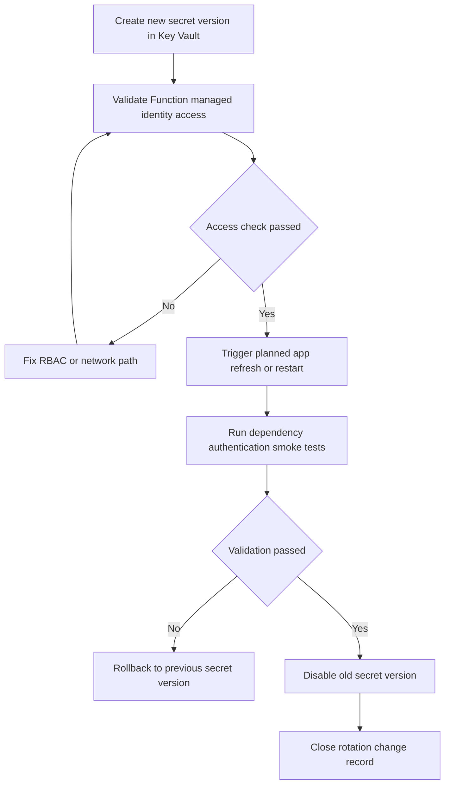
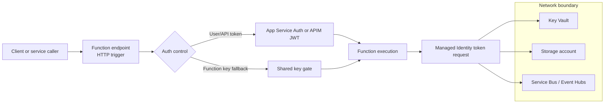

# Security Best Practices for Azure Functions

Security for Azure Functions must align to runtime behavior: triggers execute with app identity, settings are loaded at startup, retries can repeat sensitive operations, and scale-out multiplies blast radius if permissions are broad. This guide provides practical controls for identity, secret handling, app settings, and network hardening.

!!! tip "Architecture and operations references"
    For design background and operational runbooks, see [Platform Security](../platform/security.md), [Security Operations](../operations/security.md), and [Configuration Operations](../operations/configuration.md).

## Managed identity for everything

Default rule: authenticate from Functions to Azure resources using managed identity, not embedded secrets.

Apply managed identity for:

- host and binding storage access where supported,
- Key Vault secret resolution,
- Service Bus, Event Hubs, and Storage SDK clients,
- SQL, Cosmos DB, and other Entra-integrated services.

Why this matters operationally:

- no secret rollover outages from expired connection strings,
- per-resource RBAC scopes reduce breach impact,
- identity usage is auditable through control plane and resource logs.

!!! warning "Connection strings with secrets should be exception-only"
    If a secret-based connection string is unavoidable, isolate it to the minimum scope and define explicit rotation runbooks with cutover validation.

## App settings vs Key Vault references vs environment values

Use this decision model:

- **Non-sensitive config** (feature flags, endpoint names): app settings.
- **Sensitive secrets** (API keys, passwords): Key Vault reference in app settings.
- **Local development values**: local environment files not committed to source.

| Configuration source | Typical value type | Best use case | Security level | Rotation complexity | Operational notes |
|---|---|---|---|---|---|
| App settings (plain value) | Non-sensitive flags, endpoint names, tuning knobs | Runtime behavior toggles and non-secret environment values | Medium (platform protected, but readable by config operators) | Low | Keep in IaC/pipeline variables and review change history |
| App settings + Key Vault reference | Passwords, API keys, certificates, connection secrets | Production secrets consumed by Functions host or code | High (secret stays in Key Vault, app setting stores reference) | Medium | Requires managed identity permission and Key Vault network reachability |
| Local environment values | Developer-only secrets and mocks | Local development and integration testing | Variable (depends on developer workstation controls) | Medium | Keep out of source control and rotate when team membership changes |
| CI/CD secret store variables | Pipeline tokens, deployment-only values | Build/deploy automation where direct Key Vault read is unavailable | Medium-High | Medium | Prefer OIDC/managed identity and minimize long-lived pipeline secrets |

### Identity-based connections vs classic secret connections

Prefer identity-based setting patterns for supported extensions.

Example pattern for host storage:

- `AzureWebJobsStorage__accountName=<storage-account-name>`
- `AzureWebJobsStorage__credential=managedidentity` (or equivalent supported pattern)

Avoid classic secret pattern unless required:

- `AzureWebJobsStorage=<connection-string-with-key>`

### Key Vault reference syntax and common errors

Reference format:

```text
@Microsoft.KeyVault(SecretUri=https://<key-vault-name>.vault.azure.net/secrets/<secret-name>/)
```

Common operational failures:

- typo in secret URI or missing trailing slash behavior mismatch,
- function identity lacks Key Vault `get` permission,
- vault firewall blocks function outbound path,
- secret version pinned unintentionally and never updated.

## Function keys are not complete security

Function keys are shared secrets for invocation control, not user identity.

Use auth levels intentionally:

- `anonymous`: only with compensating controls (Easy Auth, APIM JWT, private network).
- `function`: shared-secret integration scenarios.
- `admin`: runtime operations only, never broad exposure.

| Auth level | Primary use case | Caller identity assurance | Risk profile | Required compensating controls |
|---|---|---|---|---|
| `anonymous` | Public ingress behind centralized auth gateway | None at function endpoint | High | Easy Auth or APIM JWT validation, WAF, strict rate limiting, private backend dependencies |
| `function` | Service integration with key-based invocation | Shared secret only | Medium-High | Key rotation policy, source IP restrictions, monitoring for key leakage, optional gateway token validation |
| `admin` | Host/runtime administrative operations | Shared admin key | Very High | Never expose publicly, restrict to trusted ops network and break-glass workflows |

### Why keys alone are insufficient

- no per-user identity claims,
- hard to enforce conditional access,
- secret leakage grants direct invocation capability,
- weak audit attribution for caller identity.

Recommended pattern:

1. User-facing APIs: enforce identity token validation (platform or gateway).
2. Service-to-service: managed identity or OAuth token.
3. Keep keys as compatibility fallback, not primary trust boundary.

## Identity-based connections and required RBAC

For identity-based host and binding access, grant least-privilege roles to Function App identity.

Typical role mappings:

| Target resource | Common minimum role for runtime behavior |
|---|---|
| Storage blobs | `Storage Blob Data Contributor` |
| Storage queues | `Storage Queue Data Contributor` |
| Storage tables | `Storage Table Data Contributor` |
| Key Vault (RBAC model) | `Key Vault Secrets User` |
| Service Bus receive | `Azure Service Bus Data Receiver` |
| Service Bus send | `Azure Service Bus Data Sender` |
| Event Hubs receive | `Azure Event Hubs Data Receiver` |

!!! note "RBAC scope discipline"
    Assign roles at the narrowest scope that works (resource, not subscription). Broad Contributor assignments increase blast radius and hide permission drift.

## RBAC model for Functions operations

Separate operational personas:

- **Deployment principal**: deploy code/config, no data-plane access unless required.
- **Runtime managed identity**: data-plane access to dependencies.
- **Operations/on-call**: monitoring and incident response permissions.

Practical minimums to review:

- deployment identity should avoid Owner where possible,
- runtime identity should avoid general Contributor,
- monitor role assignment drift on app, storage, and Key Vault scopes.

## Network security controls that support identity

Identity is necessary but not sufficient. Add network boundaries for sensitive workloads.

Core controls:

- access restrictions for approved source IP/ranges,
- private endpoint for private inbound access,
- VNet integration for private outbound dependencies,
- service tags and NSG controls where applicable.

| Control layer | Primary control | Protects against | Plan support snapshot | Notes for operations |
|---|---|---|---|---|
| Edge ingress | Access restrictions (allowlist IP/ranges) | Unapproved internet source access | Y1, FC1, EP, Dedicated | Revalidate allowlists after corporate egress IP changes |
| Private ingress | Private Endpoint | Public inbound exposure | EP, Dedicated (and plan/region-dependent scenarios) | Pair with private DNS zone governance |
| Outbound isolation | VNet integration + route controls | Unintended egress paths to public endpoints | FC1, EP, Dedicated (plan/region dependent) | Test dependency DNS resolution and failover routes |
| Service boundary | NSG/service tag controls | Lateral movement between subnets/services | With VNet-integrated plans | Keep rules least-privilege and document exceptions |
| Secret boundary | Key Vault firewall + private access | Secret retrieval from unauthorized networks | All plans via design-specific topology | Validate Function outbound path and managed identity permissions together |

See [Platform Security](../platform/security.md) and [Platform Networking](../platform/networking.md) for design combinations.

## CORS done safely

CORS only protects browser-origin access behavior; it is not authentication.

Best practices:

- allow only known origins,
- avoid wildcard `*` in production,
- validate staging and production origin lists independently,
- review CORS when front-end domains change.

| CORS practice | Recommended state | Risk when misconfigured | Validation method |
|---|---|---|---|
| Allowed origins | Explicit allowlist only | Any site can invoke browser requests if wildcard is used | Compare configured origins against approved domain inventory |
| Environment separation | Staging and production lists managed separately | Test domains accidentally allowed in production | Check slot/app settings per environment before release |
| Credentialed requests | Only enable when strictly required | Browser may send cookies/tokens to unintended origins | Security test with browser dev tools and preflight inspection |
| Change management | CORS updates tied to front-end release checklist | Drift between UI domain changes and backend policy | Add CORS review gate in deployment checklist |

!!! warning "Wildcard CORS anti-pattern"
    `*` with sensitive browser APIs can expose data to unintended origins, especially when teams assume CORS equals authentication.

## TLS and HTTPS enforcement

Minimum baseline:

- enforce `HTTPS-only` on every Function App,
- enforce minimum TLS version 1.2 or higher,
- monitor certificate expiry for custom domains,
- verify redirects and TLS settings after infrastructure changes.

| Transport control | Baseline setting | Threat reduced | Audit signal |
|---|---|---|---|
| HTTPS enforcement | `HTTPS-only=true` | Plaintext transport and downgrade paths | Function App configuration baseline check |
| TLS minimum | `min-tls-version=1.2` or higher | Legacy protocol exploitation | Policy compliance and config drift alerts |
| Certificate lifecycle | Track custom domain cert expiry | Service interruption or trust errors | Expiry alert windows (30/14/7 days) |
| Redirect behavior | Validate HTTP to HTTPS redirect path | Users remaining on insecure endpoint due to misrouting | Synthetic probe for HTTP endpoint response |

| Common mistake | Likely impact | Recommended fix | Severity |
|---|---|---|---|
| Treating function keys as sole protection for sensitive API | Unauthorized invocation after key disclosure | Enforce Entra/JWT validation at platform or gateway layer | High |
| Broad RBAC assignment (`Contributor` at subscription) for runtime identity | Expanded blast radius during compromise | Scope roles to resource-level data-plane permissions | High |
| Wildcard CORS in production | Browser-based data exfiltration path | Replace with explicit origin allowlist and periodic review | Medium-High |
| Secret value stored directly in app setting when Key Vault is available | Secret sprawl and harder rotation governance | Replace with Key Vault references and managed identity access | Medium |
| Rotating secret without runtime validation plan | Authentication outage after cutover | Use staged rotation with post-rotation dependency checks | High |

## Secret rotation and runtime behavior

Secret rotation must be routine, tested, and observable.

Rotation model:

1. Create new Key Vault secret version.
2. Confirm Function App identity can read it.
3. Trigger safe refresh (app restart or configuration refresh workflow as needed).
4. Validate dependency connectivity and auth success metrics.
5. Revoke old secret version according to retention policy.

| Rotation step | Owner | Key check | Evidence to capture | Rollback trigger |
|---|---|---|---|---|
| Create new secret version | Security/platform engineer | Secret created with expected naming/version metadata | Key Vault secret version ID and timestamp | Version missing metadata or wrong value format |
| Validate identity access | Platform engineer | Function managed identity can `get` secret | Access test log or successful secret resolution telemetry | Access denied or firewall blocked |
| Refresh runtime resolution | App operator | App restart/refresh completed in planned window | Deployment event + host restart timestamp | Host fails to start or settings not refreshed |
| Execute functional checks | Application owner/on-call | Dependency authentication and critical paths pass | Smoke test output + error-rate dashboard snapshot | Elevated auth failures or dependency timeouts |
| Retire previous secret version | Security/platform engineer | Previous version disabled/revoked per policy | Rotation ticket closure and policy artifact update | Need immediate rollback to prior version |

Operational notes:

- avoid tightly coupled simultaneous rotation for all dependencies,
- rotate high-risk secrets more frequently,
- test rollback path when rotated secret is malformed.

??? tip "How Functions picks up rotated values"
    Key Vault references are resolved by platform integration. In production, plan explicit validation after rotation and include restart/refresh procedures in runbooks so update timing is predictable.



## Security boundary and identity flow



## Practical hardening commands (long flags only)

Enable managed identity:

```bash
az functionapp identity assign \
    --name "$APP_NAME" \
    --resource-group "$RG"
```

Set HTTPS-only and TLS minimum:

```bash
az functionapp update \
    --name "$APP_NAME" \
    --resource-group "$RG" \
    --https-only true

az functionapp config set \
    --name "$APP_NAME" \
    --resource-group "$RG" \
    --min-tls-version "1.2"
```

Set Key Vault-backed app setting:

```bash
az functionapp config appsettings set \
    --name "$APP_NAME" \
    --resource-group "$RG" \
    --settings "DbPassword=@Microsoft.KeyVault(SecretUri=https://$KEYVAULT_NAME.vault.azure.net/secrets/DbPassword/)"
```

Grant storage data role to managed identity principal:

```bash
az role assignment create \
    --assignee-object-id "xxxxxxxx-xxxx-xxxx-xxxx-xxxxxxxxxxxx" \
    --assignee-principal-type "ServicePrincipal" \
    --role "Storage Blob Data Contributor" \
    --scope "/subscriptions/<subscription-id>/resourceGroups/$RG/providers/Microsoft.Storage/storageAccounts/$STORAGE_NAME"
```

## Security checklist

- [ ] Managed identity is enabled and used for supported dependencies.
- [ ] Secret-based connection strings are eliminated or formally exception-tracked.
- [ ] `AzureWebJobsStorage` uses approved identity-based pattern where supported.
- [ ] Key Vault references are used for sensitive app settings.
- [ ] Function keys are not the only control for sensitive HTTP endpoints.
- [ ] RBAC assignments are least-privilege and scoped narrowly.
- [ ] Access restrictions/private endpoints enforce intended ingress boundary.
- [ ] CORS allowlist contains only approved origins; no production wildcard.
- [ ] HTTPS-only and minimum TLS version policy are enforced.
- [ ] Secret rotation runbook is tested and includes validation/rollback steps.

## See Also

- [Platform Security](../platform/security.md)
- [Security Operations](../operations/security.md)
- [Configuration Operations](../operations/configuration.md)
- [Networking Best Practices](./networking.md)

## Sources

- [Azure Functions security concepts](https://learn.microsoft.com/azure/azure-functions/security-concepts)
- [Tutorial: Create a function app that connects to Azure services using identities](https://learn.microsoft.com/azure/azure-functions/functions-identity-based-connections-tutorial)
- [Identity-based connections in Azure Functions](https://learn.microsoft.com/azure/azure-functions/functions-reference#configure-an-identity-based-connection)
- [App settings reference for Azure Functions](https://learn.microsoft.com/azure/azure-functions/functions-app-settings)
- [Use Key Vault references for App Service and Functions](https://learn.microsoft.com/azure/app-service/app-service-key-vault-references)
- [Function keys in Azure Functions](https://learn.microsoft.com/azure/azure-functions/function-keys-how-to)
