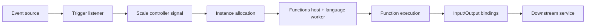

# Trigger and Binding Best Practices

Trigger and binding choices directly determine execution safety in Azure Functions. The goal is not to use the most feature-rich trigger, but to choose the trigger model whose delivery semantics, scaling behavior, and failure handling match your workload.

For trigger mechanics and extension details, see [Platform: Triggers and Bindings](../platform/triggers-and-bindings.md).



## Trigger selection by use case

| Use case | Preferred trigger | Why | Watch-outs |
|---|---|---|---|
| Public API endpoint | HTTP | Synchronous request-response path | Auth level, CORS, rate limiting, cold start impact |
| Deferred background jobs | Queue (Storage Queue or Service Bus) | Decouples response latency from processing | Poison handling, visibility timeout, idempotency |
| Scheduled batch operations | Timer | Deterministic schedule execution | CRON drift assumptions, timezone consistency |
| File ingestion pipeline | Blob trigger (plan-dependent source) | Direct storage-driven processing | On Flex, use Event Grid source |
| Integration event fan-out | Event Grid | Reactive and lightweight routing | Event schema/version handling |
| Enterprise messaging workflows | Service Bus | DLQ support, richer broker semantics | Lock duration, max delivery count, throughput tuning |

!!! tip "Trigger-first design"
    Choose trigger based on delivery semantics first, then optimize language/runtime implementation details.

## Plan-trigger compatibility guidance

This matrix is operational guidance, not a hard capability list.

| Trigger | Consumption (Y1) | Flex Consumption (FC1) | Premium (EP) | Dedicated |
|---|---|---|---|---|
| HTTP | Good for moderate, bursty API traffic | Good with optional always-ready | Best for strict latency SLO | Good for fixed-capacity web/API estates |
| Queue | Strong default | Strong default (high burst scale) | Strong default | Good if capacity pre-provisioned |
| Service Bus | Good | Good | Strong for enterprise integration | Good with autoscale rules |
| Timer | Good | Good | Good | Good |
| Blob | Polling model supported | Use Event Grid-backed blob trigger source | Good | Good |
| Event Grid | Good | Good | Good | Good |

!!! warning "Flex blob trigger requirement"
    On Flex Consumption, use Event Grid source for blob-triggered flows. Standard polling blob trigger mode is not supported.

## Binding configuration best practices

### Prefer identity-based connections when supported

Use managed identity over raw connection strings to reduce secret sprawl and rotation risk.

| Pattern | Recommended when | Operational impact |
|---|---|---|
| Identity-based binding configuration | Target service supports Entra ID and RBAC | Better secret hygiene, clearer permission model |
| Connection string setting | Legacy integration or unsupported identity path | Faster setup, but higher secret rotation burden |

!!! note "Storage dependency"
    Function host startup and some triggers depend on host storage configuration. Treat storage access as a platform dependency, not only an application dependency.

### Keep binding contracts explicit

- Use stable payload schemas and document expected fields.
- Avoid oversized messages that silently stress memory and retry behavior.
- Keep output bindings idempotent where downstream operations can be repeated.

## HTTP trigger operational defaults

### Authentication level selection

| Auth level | Use when | Avoid when |
|---|---|---|
| `anonymous` | Endpoint is protected by upstream gateway auth | Direct internet exposure without compensating controls |
| `function` | Service-to-service invocation with key control | Human-facing identity-based scenarios |
| `admin` | Rare operational endpoints only | General API usage |

### CORS and rate safety

- Restrict allowed origins to known frontends.
- Avoid wildcard CORS in production APIs.
- Apply throttling/rate limiting at API Management, Front Door, or Application Gateway layer.

```bash
az functionapp cors add \
  --resource-group "$RG" \
  --name "$APP_NAME" \
  --allowed-origins "https://portal.contoso.example"
```

## Queue trigger best practices

Queue-trigger workloads are operationally safe only when retry and poison behavior are explicit.

### Recommended controls

- Tune queue batch size to balance throughput and downstream pressure.
- Set visibility timeout long enough for worst-case processing + retry buffer.
- Cap retry count and route failures to poison/dead-letter processing.
- Use idempotency keys to tolerate duplicate delivery.

```json
{
  "version": "2.0",
  "extensions": {
    "queues": {
      "batchSize": 16,
      "newBatchThreshold": 8,
      "maxDequeueCount": 5,
      "visibilityTimeout": "00:05:00"
    }
  }
}
```

!!! warning "Poison queue is mandatory telemetry"
    Never discard poison events silently. Alert on poison queue growth and define replay ownership.

## Blob trigger design: polling vs Event Grid

| Scenario | Recommended model |
|---|---|
| Consumption/Premium/Dedicated with conventional blob ingestion | Polling blob trigger can be acceptable |
| Flex Consumption workload | Use Event Grid-backed blob trigger source |
| Near-real-time reaction with explicit event contracts | Event Grid-first model |

Operationally, Event Grid models provide clearer event-flow visibility and reduce hidden polling assumptions.

## Timer trigger best practices

- Keep CRON expressions explicit and peer-reviewed.
- Align timezone assumptions with UTC-first operations unless strong business need requires local time.
- Treat timer handlers as singleton-intent workloads and enforce idempotency for reruns.
- Ensure scheduled jobs can overlap safely if a previous run exceeds schedule interval.

### Timer checklist

| Check | Why |
|---|---|
| CRON expression validated in test environment | Prevents accidental high-frequency execution |
| Long-running timer job split into chunks | Reduces single-run failure impact |
| Rerun-safe logic implemented | Handles host restarts and duplicate execution windows |

## Common trigger mistakes and how to avoid them

| Mistake | Impact | Safer pattern |
|---|---|---|
| Using HTTP trigger for heavy async processing | Client latency and timeout failures | HTTP ingest + queue output + async processor |
| Missing retry and poison strategy on queue/service bus | Infinite failures or silent drops | Define retry bounds + dead-letter/poison path |
| Assuming blob trigger behaves identically across plans | Missed events on incompatible setup | Validate plan-specific blob trigger model |
| Over-permissive HTTP auth + broad CORS | Exposure risk | Layered auth with scoped origins |
| Treating bindings as guaranteed exactly-once delivery | Duplicate side effects | Idempotent handlers and dedup controls |

!!! tip "Reliability alignment"
    Pair this guidance with [Platform: Reliability](../platform/reliability.md) and [Best Practices: Reliability](./reliability.md) for idempotency patterns, retry boundaries, and poison-message workflows.

---

## See Also

- [Platform: Triggers and Bindings](../platform/triggers-and-bindings.md)
- [Platform: Reliability](../platform/reliability.md)
- [Platform: Scaling](../platform/scaling.md)
- [Operations: Retries and Poison Handling](../operations/retries-and-poison-handling.md)

## References

- [Azure Functions triggers and bindings (Microsoft Learn)](https://learn.microsoft.com/azure/azure-functions/functions-triggers-bindings)
- [Azure Blob storage trigger for Azure Functions (Microsoft Learn)](https://learn.microsoft.com/azure/azure-functions/functions-bindings-storage-blob-trigger)
- [Event Grid blob trigger for Azure Functions (Microsoft Learn)](https://learn.microsoft.com/azure/azure-functions/functions-event-grid-blob-trigger)
