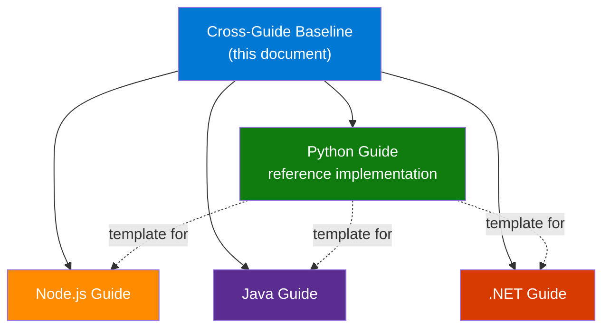

---
content_sources:
  - type: mslearn-adapted
    url: https://learn.microsoft.com/azure/azure-functions/supported-languages
  - type: mslearn-adapted
    url: https://learn.microsoft.com/azure/azure-functions/functions-reference
  - type: mslearn-adapted
    url: https://learn.microsoft.com/azure/azure-functions/functions-best-practices
---

# Cross-Guide Shared Structure Baseline

This document defines the canonical file tree, heading skeletons, navigation conventions, and quality gates that every language guide in this repository must follow. The Python guide (`docs/language-guides/python/`) is the reference implementation — all other languages replicate its structure with language-specific content.

## Why This Baseline Exists

Multiple language guides (Python, Node.js, Java, .NET) share the same tutorial structure, recipe categories, and reference pages. A single baseline prevents structural drift and ensures readers can switch between languages without re-learning the navigation.

<!-- diagram-id: why-this-baseline-exists -->


## Canonical File Tree

Every language guide (`docs/language-guides/{lang}/`) MUST contain the following files:

```text
docs/language-guides/{lang}/
├── index.md                              # Language overview page
├── {model}.md                           # Programming model deep dive
├── {lang}-runtime.md                     # Runtime versions, worker settings, dependencies
├── tutorial/
│   ├── index.md                          # Plan chooser (mermaid flowchart + comparison table)
│   ├── consumption/
│   │   ├── 01-local-run.md
│   │   ├── 02-first-deploy.md
│   │   ├── 03-configuration.md
│   │   ├── 04-logging-monitoring.md
│   │   ├── 05-infrastructure-as-code.md
│   │   ├── 06-ci-cd.md
│   │   └── 07-extending-triggers.md
│   ├── flex-consumption/
│   │   └── (same 01–07 structure)
│   ├── premium/
│   │   └── (same 01–07 structure)
│   └── dedicated/
│       └── (same 01–07 structure)
├── recipes/
│   ├── index.md                          # Recipe category overview
│   ├── http-api.md
│   ├── http-auth.md
│   ├── cosmosdb.md
│   ├── blob-storage.md
│   ├── queue.md
│   ├── key-vault.md
│   ├── managed-identity.md
│   ├── timer.md
│   ├── durable-orchestration.md
│   ├── event-grid.md
│   └── custom-domain-certificates.md
├── cli-cheatsheet.md                     # Language-specific CLI quick reference
├── environment-variables.md              # App settings and environment variables
├── host-json.md                          # host.json configuration reference
├── platform-limits.md                    # Quotas, timeouts, instance limits
└── troubleshooting.md                    # Common issues and resolutions
```

**Total: 48 files per language guide.**

### Programming Model File Naming

| Language | File Name | Model |
|----------|-----------|-------|
| Python | `v2-programming-model.md` | v2 decorator model |
| Node.js | `v4-programming-model.md` | v4 code-first model |
| Java | `annotation-programming-model.md` | Annotation-based model |
| .NET | `isolated-worker-model.md` | Isolated worker model |

### Runtime File Naming

| Language | File Name |
|----------|-----------|
| Python | `python-runtime.md` |
| Node.js | `nodejs-runtime.md` |
| Java | `java-runtime.md` |
| .NET | `dotnet-runtime.md` |

## Heading Skeletons

### Tutorial (01–07)

Every tutorial file MUST follow this heading skeleton:

```markdown
# NN - Title (Plan Name)

Brief introduction (1–2 sentences).

## Prerequisites

| Tool | Version | Purpose |
|------|---------|---------|
| {Language runtime} | {version}+ | Local runtime |
| Azure Functions Core Tools | v4 | Local host and deployment |
| Azure CLI | 2.61+ | Provision and configure resources |

## What You'll Build

Brief description of the function, trigger, and expected local validation result.

## Steps

### Step 1 - {Action}

### Step N - {Action}

## Verification

Show the command output, host output, or HTTP/trigger result that proves the step succeeded.

## Next Steps (optional)

## See Also

## Sources
```

!!! tip "Plan-specific admonition"
    Each tutorial's Prerequisites section should include a plan-specific `!!! info` admonition summarizing the plan's key characteristics (scale-to-zero, memory, timeout, VNet support).

### Tutorial Plan Chooser (tutorial/index.md)

The plan chooser page MUST contain:

1. **Mermaid flowchart** — decision tree routing readers to the right plan
2. **Plan comparison table** — features (scale-to-zero, VNet, slots, instances, timeout, memory, OS, pricing) across all four plans
3. **Tutorial track tables** — one table per plan listing all 7 steps with links
4. **"What Each Step Covers"** — summary table mapping step numbers to topics and learning outcomes

### Programming Model Document

```markdown
# {Language} {Model} Programming Model

Brief introduction.

## {v1/legacy} vs. {v2/current}: What Changed

## {AppObject/Class} — The Application Entry Point

## {Modular Organization Pattern}

## Request/Response Objects

## Route Configuration

## Complete Example

## See Also

## Sources
```

### Runtime Document

```markdown
# {Language} Runtime

Brief introduction.

## Supported {Language} Versions

(Table: Version | Support Status | End of Life)

### Setting the {Language} Version

### Checking the Current Version

## Worker Process Settings

## Dependency Management

## See Also

## Sources
```

### Recipe

```markdown
# {Recipe Title}

Brief introduction covering when and why to use this pattern.

## {Primary Pattern}

### Code Example

## {Variation or Advanced Pattern}

## See Also

## Sources
```

### Recipe Index (recipes/index.md)

```markdown
# {Language} Recipes

Brief introduction.

## Recipe Categories

### HTTP
(table: Recipe | Description)

### Storage
(table: Recipe | Description)

### Security
(table: Recipe | Description)

### Advanced
(table: Recipe | Description)

## How to Consume Recipes Effectively

## See Also

## Sources (optional — omit only when there are no external references)
```

### Reference Documents (cli-cheatsheet, environment-variables, host-json, platform-limits, troubleshooting)

```markdown
# {Title}

Brief introduction.

## {Command/Setting Groups}

## Usage Notes (optional)

## See Also

## Sources
```

## See Also Link Patterns

### Tutorials

Every tutorial (01–07) MUST include these See Also links:

```markdown
## See Also

- [Tutorial Overview & Plan Chooser](../index.md)
- [{Language} Language Guide](../../index.md)
- [Platform: Hosting Plans](../../../../platform/hosting.md)
- [Operations: Deployment](../../../../operations/deployment.md)
- [Recipes Index](../../recipes/index.md)
```

### Language Guide Index Pages

```markdown
## See Also

- [Language Guides Overview](../index.md)
- [Python Guide (reference implementation)](../python/index.md)
- [{Other Language 1} Guide](../{lang1}/index.md)
- [{Other Language 2} Guide](../{lang2}/index.md)
- [Platform: Architecture](../../platform/architecture.md)
- [Platform: Hosting](../../platform/hosting.md)
- [Operations: Deployment](../../operations/deployment.md)
- [Operations: Monitoring](../../operations/monitoring.md)
```

### Programming Model and Runtime Pages

```markdown
## See Also

- [{Language} Language Guide](index.md)
- [{Language} Runtime / Programming Model](the-other-page.md)
- [Tutorial Overview & Plan Chooser](tutorial/index.md)
- [Recipes Index](recipes/index.md)
```

### Recipe Pages

```markdown
## See Also

- [{Language} Recipes Index](index.md)
- [{Language} Language Guide](../index.md)
- [Platform: Triggers and Bindings](../../../platform/triggers-and-bindings.md)
```

## Navigation Naming Conventions

Every language guide MUST be registered in `mkdocs.yml` following this pattern:

```yaml
- {Language Name}:
    - language-guides/{lang}/index.md
    - language-guides/{lang}/{model}.md
    - language-guides/{lang}/{lang}-runtime.md
    - Tutorial:
        - Overview & Plan Chooser: language-guides/{lang}/tutorial/index.md
        - Consumption (Y1):
            - language-guides/{lang}/tutorial/consumption/01-local-run.md
            - language-guides/{lang}/tutorial/consumption/02-first-deploy.md
            - language-guides/{lang}/tutorial/consumption/03-configuration.md
            - language-guides/{lang}/tutorial/consumption/04-logging-monitoring.md
            - language-guides/{lang}/tutorial/consumption/05-infrastructure-as-code.md
            - language-guides/{lang}/tutorial/consumption/06-ci-cd.md
            - language-guides/{lang}/tutorial/consumption/07-extending-triggers.md
        - Flex Consumption (FC1):
            - language-guides/{lang}/tutorial/flex-consumption/01-local-run.md
            # ... (same 01–07 pattern)
        - Premium (EP):
            - language-guides/{lang}/tutorial/premium/01-local-run.md
            # ... (same 01–07 pattern)
        - Dedicated (App Service Plan):
            - language-guides/{lang}/tutorial/dedicated/01-local-run.md
            # ... (same 01–07 pattern)
    - {Language} Recipes:
        - language-guides/{lang}/recipes/index.md
        - language-guides/{lang}/recipes/http-api.md
        - language-guides/{lang}/recipes/http-auth.md
        - language-guides/{lang}/recipes/cosmosdb.md
        - language-guides/{lang}/recipes/blob-storage.md
        - language-guides/{lang}/recipes/queue.md
        - language-guides/{lang}/recipes/key-vault.md
        - language-guides/{lang}/recipes/managed-identity.md
        - language-guides/{lang}/recipes/timer.md
        - language-guides/{lang}/recipes/durable-orchestration.md
        - language-guides/{lang}/recipes/event-grid.md
        - language-guides/{lang}/recipes/custom-domain-certificates.md
    - {Language} Reference:
        - language-guides/{lang}/cli-cheatsheet.md
        - language-guides/{lang}/environment-variables.md
        - language-guides/{lang}/host-json.md
        - language-guides/{lang}/platform-limits.md
        - language-guides/{lang}/troubleshooting.md
```

!!! warning "Indentation"
    All `mkdocs.yml` nav entries use 4-space indentation. Inconsistent indentation causes silent build failures.

### Language-Specific Values

| Placeholder | Python | Node.js | Java | .NET |
|-------------|--------|---------|------|------|
| `{Language Name}` | Python | Node.js | Java | .NET |
| `{lang}` | python | nodejs | java | dotnet |
| `{model}` | v2-programming-model | v4-programming-model | annotation-programming-model | isolated-worker-model |
| `{Language} Recipes` | Python Recipes | Node.js Recipes | Java Recipes | .NET Recipes |
| `{Language} Reference` | Python Reference | Node.js Reference | Java Reference | .NET Reference |

## Consistency Review Checklist

Use this checklist when adding or reviewing a language guide:

1. All 48 files present per the canonical file tree
2. Every file has `## See Also` as the second-to-last section
3. Every file with external references has `## Sources` as the last section
4. `## See Also` always appears before `## Sources` (never reversed)
5. All admonitions use 4-space indentation
6. All nested lists use 4-space indentation
7. All CLI examples use long flags (`--resource-group`, not `-g`)
8. At least one mermaid diagram per documentation page
9. No PII in CLI output examples (UUIDs masked, subscription IDs replaced)
10. `tutorial/index.md` contains plan chooser flowchart and comparison table
11. All tutorials follow the heading skeleton (Prerequisites → What You'll Build → Steps → Verification → Next Steps → See Also → Sources)
12. Programming model and runtime docs follow their respective skeletons
13. Recipe index categorizes all recipes in tables (HTTP, Storage, Security, Advanced)
14. Nav entries in `mkdocs.yml` match the naming convention exactly
15. `mkdocs build --strict` passes with zero warnings

## See Also

- [Python Language Guide (reference implementation)](../language-guides/python/index.md)
- [Node.js Language Guide](../language-guides/nodejs/index.md)
- [Java Language Guide](../language-guides/java/index.md)
- [.NET Language Guide](../language-guides/dotnet/index.md)
- [Platform: Architecture](../platform/architecture.md)
- [Start Here: Repository Map](../start-here/repository-map.md)

## Sources

- [Azure Functions supported languages and runtimes (Microsoft Learn)](https://learn.microsoft.com/azure/azure-functions/supported-languages)
- [Azure Functions developer guide (Microsoft Learn)](https://learn.microsoft.com/azure/azure-functions/functions-reference)
- [Azure Functions best practices (Microsoft Learn)](https://learn.microsoft.com/azure/azure-functions/functions-best-practices)
