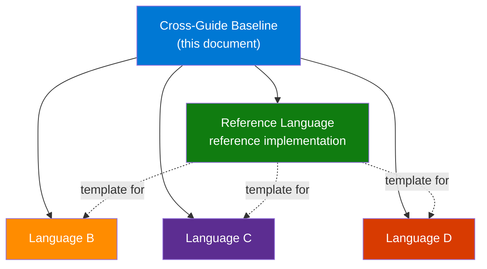

---
content_sources:
  references:
    - type: self-generated
      justification: Series-wide language-guide baseline. No direct Microsoft Learn source; synthesized from repeated language-guide practice across Functions, Container Apps, and App Service sibling repos.
  diagrams:
    - id: why-this-baseline-exists
      type: flowchart
      source: self-generated
      justification: Flow view of why this baseline exists, synthesized from repeated language-guide practice across Functions, Container Apps, and App Service sibling repos.
---

# Cross-Guide Shared Structure Baseline

!!! info "Series-wide canonical version"
    The canonical series-wide language-guide baseline lives in the Azure Architecture Practical Guide:
    [Language Guide Baseline](https://yeongseon.github.io/azure-architecture-practical-guide/contributing/language-guide-baseline/).

    This Functions page remains as the local worked example and adaptation surface for Azure Functions.

This document defines the canonical file tree, heading skeletons, navigation conventions, and quality gates that every language guide in this repository must follow. The Python guide (`docs/language-guides/python/`) is the reference implementation — all other languages replicate its structure with language-specific content.

## Why This Baseline Exists

Multiple language guides (Python, Node.js, Java, .NET) share the same tutorial structure, recipe categories, and reference pages. A single baseline prevents structural drift and ensures readers can switch between languages without re-learning the navigation.

<!-- diagram-id: why-this-baseline-exists -->


Reference Language is a per-repo choice. Functions and Container Apps currently use Python as the reference implementation; a future TypeScript-centric repo could choose Node.js instead.

## Canonical File Tree

Every language guide (`docs/language-guides/{lang}/`) SHOULD contain the following files. Individual repos MAY omit or extend based on service-specific needs.

```text
docs/language-guides/{lang}/
├── Core shared files
├── index.md                              # Language overview page
├── {model}.md                           # Programming model deep dive
├── {lang}-runtime.md                    # Runtime versions, worker settings, dependencies
├── tutorial/
│   ├── index.md                         # Deployment-option chooser (flowchart + comparison table)
│   └── {option}/                        # One directory per deployment option / tier / SKU
│       ├── 01-local-run.md
│       ├── 02-first-deploy.md
│       ├── 03-configuration.md
│       ├── 04-logging-monitoring.md
│       ├── 05-infrastructure-as-code.md
│       ├── 06-ci-cd.md
│       └── 07-service-extension.md
├── recipes/
│   ├── index.md                         # Recipe category overview
│   ├── http-api.md
│   ├── http-auth.md
│   ├── cosmosdb.md
│   ├── blob-storage.md
│   ├── queue.md
│   ├── key-vault.md
│   ├── managed-identity.md
│   ├── timer.md
│   ├── durable-orchestration.md
│   ├── event-grid.md
│   └── custom-domain-certificates.md
├── cli-cheatsheet.md                    # Language-specific CLI quick reference
├── environment-variables.md             # App settings and environment variables
├── service-limits.md                    # Service quotas, timeouts, instance limits
└── troubleshooting.md                   # Common issues and resolutions

Service-specific files
├── service-config-reference.md          # Service-native configuration reference
└── service-concept-reference.md         # Service-native operational or packaging concept
```

**Baseline: ~40 shared files per language guide + service-specific files at the repo owner's discretion.**

Interpret the tree in two layers:

- **Core shared files** are the cross-repo baseline that most service-focused practical guides should converge on.
- **Service-specific files** document concepts unique to the service's deployment model, runtime contract, or configuration surface.
- Repo owners MAY add more recipe files, more tutorial steps, or extra reference pages when the service has materially different reader needs.

### Example — Functions service-specific reference files

`host-json.md` documents the host configuration contract.

Container Apps sibling example: a comparable slot is better used for a container-image or startup-conventions reference page.

### Example — Functions programming-model file naming

The programming-model file captures the language's currently recommended way of authoring code in the service. Each repo picks the file name; the table below is the Functions example.

| Language | File Name | Model |
|----------|-----------|-------|
| Python | `v2-programming-model.md` | v2 decorator model |
| Node.js | `v4-programming-model.md` | v4 code-first model |
| Java | `annotation-programming-model.md` | Annotation-based model |
| .NET | `isolated-worker-model.md` | Isolated worker model |

Container Apps sibling example: use a service-specific concept document such as `container-startup.md` or `entrypoint-conventions.md` when there is no framework-imposed programming model.

### Example — Functions runtime file naming

The runtime file captures version support, runtime selection, and local/runtime-specific operational details. The table below is the Functions example.

| Language | File Name |
|----------|-----------|
| Python | `python-runtime.md` |
| Node.js | `nodejs-runtime.md` |
| Java | `java-runtime.md` |
| .NET | `dotnet-runtime.md` |

Container Apps sibling example: because the runtime is whatever the container image provides, a repo MAY omit this file or replace it with an image/runtime contract page.

## Heading Skeletons

### Tutorial Step Files

Every tutorial file MUST follow this heading skeleton:

```markdown
# NN - Title (Deployment Option Name)

Brief introduction (1–2 sentences).

## Prerequisites

| Tool | Version | Purpose |
|------|---------|---------|
| {Language runtime} | {version}+ | Local runtime |
| Azure CLI | 2.61+ | Provision and configure resources |

Repos SHOULD add service-specific tooling rows as needed (for example, a service-native local host/deployment tool or an ingress/tunnel helper).

## What You'll Build

Brief description of the code artifact (function, endpoint, worker, job — whatever the service unit of deployment is), the interaction pattern (HTTP, trigger, message, schedule), and the expected local validation result.

## Steps

### Step 1 - {Action}

### Step N - {Action}

## Verification

Show the command output, host output, or HTTP/trigger result that proves the step succeeded.

## Next Steps (optional)

## See Also

## Sources
```

!!! tip "Deployment-option-specific admonition"
    Each tutorial's Prerequisites section should include a deployment-option-specific `!!! info` admonition summarizing the option's key characteristics (scale-to-zero, memory, timeout, VNet support).

### Tutorial Plan Chooser (tutorial/index.md)

The plan chooser page MUST contain:

1. **Mermaid flowchart** — decision tree routing readers to the right plan
2. **Plan / SKU / tier comparison table** — features across the deployment options the service exposes. For Functions this is the four plans. For Container Apps this is the serverless versus workload-profile decision surface. For App Service this is App Service Plan tiers.
3. **Tutorial track tables** — one table per deployment option, listing tutorial step files with links. The number of steps is service-dependent.
4. **"What Each Step Covers"** — summary table mapping step numbers to topics and learning outcomes

### Programming Model Document

```markdown
# {Language} {Model} Programming Model

Brief introduction.

## {v1/legacy} vs. {v2/current}: What Changed

## {AppObject/Class} — The Application Entry Point

## {Modular Organization Pattern}

## Request/Response Objects

## Route Configuration

## Complete Example

## See Also

## Sources
```

### Runtime Document

```markdown
# {Language} Runtime

Brief introduction.

## Supported {Language} Versions

(Table: Version | Support Status | End of Life)

### Setting the {Language} Version

### Checking the Current Version

## Worker Process Settings

## Dependency Management

## See Also

## Sources
```

### Recipe

```markdown
# {Recipe Title}

Brief introduction covering when and why to use this pattern.

## {Primary Pattern}

### Code Example

## {Variation or Advanced Pattern}

## See Also

## Sources
```

### Recipe Index (recipes/index.md)

```markdown
# {Language} Recipes

Brief introduction.

## Recipe Categories

### HTTP
(table: Recipe | Description)

### Storage
(table: Recipe | Description)

### Security
(table: Recipe | Description)

### Advanced
(table: Recipe | Description)

## How to Consume Recipes Effectively

## See Also

## Sources (optional — omit only when there are no external references)
```

### Reference Documents (cli-cheatsheet, environment-variables, service-limits, troubleshooting)

```markdown
# {Title}

Brief introduction.

## {Command/Setting Groups}

## Usage Notes (optional)

## See Also

## Sources
```

## See Also Link Patterns

### Tutorials

Every tutorial step file MUST include these See Also links:

```markdown
## See Also

- [Tutorial Overview & Plan Chooser](../index.md)
- [{Language} Language Guide](../../index.md)
- [Platform: Hosting Model / Deployment Model](../../../../platform/hosting.md)
- [Operations: Deployment](../../../../operations/deployment.md)
- [Recipes Index](../../recipes/index.md)
```

### Language Guide Index Pages

```markdown
## See Also

- [Language Guides Overview](../index.md)
- [Python Guide (reference implementation)](../python/index.md)
- [{Other Language 1} Guide](../{lang1}/index.md)
- [{Other Language 2} Guide](../{lang2}/index.md)
- [Platform: Architecture](../../platform/architecture/index.md)
- [Platform: Hosting](../../platform/hosting.md)
- [Operations: Deployment](../../operations/deployment.md)
- [Operations: Monitoring](../../operations/monitoring.md)
```

### Programming Model and Runtime Pages

```markdown
## See Also

- [{Language} Language Guide](index.md)
- [{Language} Runtime / Programming Model](the-other-page.md)
- [Tutorial Overview & Plan Chooser](tutorial/index.md)
- [Recipes Index](recipes/index.md)
```

### Recipe Pages

```markdown
## See Also

- [{Language} Recipes Index](index.md)
- [{Language} Language Guide](../index.md)
- [Platform: Integration Patterns](../../../platform/integration-patterns.md)
```

Services with distinct trigger/binding vocabulary MAY substitute the service-specific platform page title and path.

## Navigation Naming Conventions

Every language guide MUST be registered in `mkdocs.yml` following a pattern that matches the repo's deployment-option structure.

### Example — Functions nav pattern

```yaml
- {Language Name}:
    - language-guides/{lang}/index.md
    - language-guides/{lang}/{model}.md
    - language-guides/{lang}/{lang}-runtime.md
    - Tutorial:
        - Overview & Plan Chooser: language-guides/{lang}/tutorial/index.md
        - Consumption (Y1):
            - language-guides/{lang}/tutorial/consumption/01-local-run.md
            - language-guides/{lang}/tutorial/consumption/02-first-deploy.md
            - language-guides/{lang}/tutorial/consumption/03-configuration.md
            - language-guides/{lang}/tutorial/consumption/04-logging-monitoring.md
            - language-guides/{lang}/tutorial/consumption/05-infrastructure-as-code.md
            - language-guides/{lang}/tutorial/consumption/06-ci-cd.md
            - language-guides/{lang}/tutorial/consumption/07-extending-triggers.md
        - Flex Consumption (FC1):
            - language-guides/{lang}/tutorial/flex-consumption/01-local-run.md
            # ... (same 01–07 pattern)
        - Premium (EP):
            - language-guides/{lang}/tutorial/premium/01-local-run.md
            # ... (same 01–07 pattern)
        - Dedicated (App Service Plan):
            - language-guides/{lang}/tutorial/dedicated/01-local-run.md
            # ... (same 01–07 pattern)
    - {Language} Recipes:
        - language-guides/{lang}/recipes/index.md
        - language-guides/{lang}/recipes/http-api.md
        - language-guides/{lang}/recipes/http-auth.md
        - language-guides/{lang}/recipes/cosmosdb.md
        - language-guides/{lang}/recipes/blob-storage.md
        - language-guides/{lang}/recipes/queue.md
        - language-guides/{lang}/recipes/key-vault.md
        - language-guides/{lang}/recipes/managed-identity.md
        - language-guides/{lang}/recipes/timer.md
        - language-guides/{lang}/recipes/durable-orchestration.md
        - language-guides/{lang}/recipes/event-grid.md
        - language-guides/{lang}/recipes/custom-domain-certificates.md
    - {Language} Reference:
        - language-guides/{lang}/cli-cheatsheet.md
        - language-guides/{lang}/environment-variables.md
        - language-guides/{lang}/host-json.md
        - language-guides/{lang}/platform-limits.md
        - language-guides/{lang}/troubleshooting.md
```

Container Apps sibling example: replace the four Functions plan groups with only the deployment-option groups that repo exposes, while preserving the same Tutorial → step-file nesting shape.

### Example — Container Apps nav pattern

```yaml
- {Language Name}:
    - language-guides/{lang}/index.md
    - Tutorial:
        - Overview: language-guides/{lang}/tutorial/index.md
        - Consumption:
            - language-guides/{lang}/tutorial/consumption/01-local-run.md
            - language-guides/{lang}/tutorial/consumption/02-first-deploy.md
            # ... additional service-defined steps
        - Dedicated:
            - language-guides/{lang}/tutorial/dedicated/01-local-run.md
            - language-guides/{lang}/tutorial/dedicated/02-first-deploy.md
            # ... additional service-defined steps
    - {Language} Recipes:
        - language-guides/{lang}/recipes/index.md
    - {Language} Reference:
        - language-guides/{lang}/cli-cheatsheet.md
        - language-guides/{lang}/environment-variables.md
        - language-guides/{lang}/service-limits.md
        - language-guides/{lang}/troubleshooting.md
```

App Service sibling example: the same pattern can expand or collapse depending on how many deployment options the repo documents, but the nav hierarchy should stay consistent within a repo.

!!! warning "Indentation"
    All `mkdocs.yml` nav entries use 4-space indentation. Inconsistent indentation causes silent build failures.

### Example — Functions placeholder values

| Placeholder | Python | Node.js | Java | .NET |
|-------------|--------|---------|------|------|
| `{Language Name}` | Python | Node.js | Java | .NET |
| `{lang}` | python | nodejs | java | dotnet |
| `{model}` | v2-programming-model | v4-programming-model | annotation-programming-model | isolated-worker-model |
| `{Language} Recipes` | Python Recipes | Node.js Recipes | Java Recipes | .NET Recipes |
| `{Language} Reference` | Python Reference | Node.js Reference | Java Reference | .NET Reference |

Container Apps sibling example: keep `{Language Name}`, `{lang}`, and `{Language} Recipes`, but substitute whatever concept-doc filename the repo uses instead of the Functions-specific `{model}` values.

## Consistency Review Checklist

Use this checklist when adding or reviewing a language guide:

1. All baseline files present per the canonical file tree (service-specific extensions per repo)
2. Every file has `## See Also` as the second-to-last section
3. Every file with external references has `## Sources` as the last section
4. `## See Also` always appears before `## Sources` (never reversed)
5. All admonitions use 4-space indentation
6. All nested lists use 4-space indentation
7. All CLI examples use long flags (`--resource-group`, not `-g`)
8. At least one mermaid diagram per documentation page
9. No PII in CLI output examples (UUIDs masked, subscription IDs replaced)
10. `tutorial/index.md` contains plan chooser flowchart and comparison table
11. All tutorials follow the heading skeleton (Prerequisites → What You'll Build → Steps → Verification → Next Steps → See Also → Sources)
12. Programming model and runtime docs follow their respective skeletons
13. Recipe index categorizes all recipes in tables (HTTP, Storage, Security, Advanced)
14. Nav entries in `mkdocs.yml` match the naming convention exactly
15. `mkdocs build --strict` passes with zero warnings

## See Also

- [Python Language Guide (reference implementation)](../language-guides/python/index.md)
- [Node.js Language Guide](../language-guides/nodejs/index.md)
- [Java Language Guide](../language-guides/java/index.md)
- [.NET Language Guide](../language-guides/dotnet/index.md)
- [Platform: Architecture](../platform/architecture/index.md)
- [Start Here: Repository Map](../start-here/repository-map.md)
- [Language Guide Baseline (series-wide canonical version)](https://yeongseon.github.io/azure-architecture-practical-guide/contributing/language-guide-baseline/)

## Sources

- [Azure Functions supported languages and runtimes (Microsoft Learn)](https://learn.microsoft.com/en-us/azure/azure-functions/supported-languages)
- [Azure Functions developer guide (Microsoft Learn)](https://learn.microsoft.com/en-us/azure/azure-functions/functions-reference)
- [Azure Functions best practices (Microsoft Learn)](https://learn.microsoft.com/en-us/azure/azure-functions/functions-best-practices)
