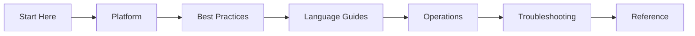

# Azure Functions Hub

Welcome to the Azure Functions Hub.

This documentation is a practical, architecture-to-operations guide for building and running Azure Functions workloads across hosting plans, trigger patterns, and languages.

Everything in this hub is aligned with Microsoft Learn guidance for Azure Functions, with opinionated navigation for day-0 through day-2 work.

## What this hub covers

Azure Functions is a serverless compute service for event-driven applications. You focus on function code, while the platform handles infrastructure, scaling behavior, and runtime hosting.

This hub is organized to match how teams actually work:

- Learn core concepts quickly
- Pick hosting and scaling strategy deliberately
- Implement by language and trigger pattern
- Operate in production with monitoring and recovery playbooks
- Troubleshoot incidents with repeatable methods

## Start Here first

If you are new to this repository, begin in **Start Here**:

- [Start Here Index](start-here/index.md)
- [Overview: What is Azure Functions](start-here/overview.md)
- [Learning Paths](start-here/learning-paths.md)
- [Hosting Options](start-here/hosting-options.md)
- [Repository Map](start-here/repository-map.md)

!!! tip "New to Functions"
    Start with [Overview](start-here/overview.md), then choose a guided track in [Learning Paths](start-here/learning-paths.md).

## Hub sections

| Section | Purpose | Start page |
|---|---|---|
| Start Here | Onboarding, plan selection, learning tracks | [Start Here](start-here/index.md) |
| Platform | Architecture, hosting internals, scaling, networking, reliability, security | [Platform](platform/index.md) |
| Language Guides | Implementation guidance for Python, Node.js, .NET, Java | [Language Guides](language-guides/index.md) |
| Operations | Deployment, configuration, monitoring, alerting, recovery | [Operations](operations/index.md) |
| Troubleshooting | Incident-first diagnosis, playbooks, KQL, lab guides | [Troubleshooting](troubleshooting/index.md) |
| Reference | Cheatsheets and platform limits | [Reference / CLI Cheatsheet](language-guides/python/cli-cheatsheet.md) |

## Hosting plans you will use in this hub

This hub emphasizes four Azure Functions hosting plans:

1. **Consumption (Y1)** — legacy serverless plan (Windows supported)
2. **Flex Consumption (FC1)** — recommended serverless plan for new apps
3. **Premium (EP)** — elastic scale with always-warm behavior and advanced networking
4. **Dedicated (App Service Plan)** — predictable, fixed-capacity hosting model

For Microsoft Learn comparisons, see:

- [Azure Functions scale and hosting options](https://learn.microsoft.com/azure/azure-functions/functions-scale)
- [Flex Consumption plan](https://learn.microsoft.com/azure/azure-functions/flex-consumption-plan)
- [Premium plan](https://learn.microsoft.com/azure/azure-functions/functions-premium-plan)
- [Dedicated plan](https://learn.microsoft.com/azure/azure-functions/dedicated-plan)
- [Consumption plan (legacy)](https://learn.microsoft.com/azure/azure-functions/consumption-plan)

## Supported language focus

The hub currently focuses on these language stacks documented by Microsoft Learn:

- Python
- Node.js
- .NET
- Java

Primary reference:

- [Supported languages in Azure Functions](https://learn.microsoft.com/azure/azure-functions/supported-languages)

## Suggested onboarding flow

1. Read [Start Here Overview](start-here/overview.md)
2. Choose your learning track in [Learning Paths](start-here/learning-paths.md)
3. Select a hosting plan with [Hosting Options](start-here/hosting-options.md)
4. Use [Repository Map](start-here/repository-map.md) to navigate platform, language, and operations docs

!!! tip "Production readiness"
    After onboarding, continue to [Monitoring](operations/monitoring.md), [Alerts](operations/alerts.md), and the rest of [Operations](operations/index.md) before go-live.

## Source-of-truth policy

This hub references Microsoft Learn pages as the canonical product source for:

- Runtime and hosting behavior
- Platform limits and retirement notices
- Trigger and binding capabilities
- Networking and security feature availability

When in doubt, validate against Microsoft Learn first, then update local runbooks.

## See Also

- [Start Here](start-here/index.md)
- [Platform](platform/index.md)
- [Language Guides](language-guides/index.md)
- [Operations](operations/index.md)
- [Troubleshooting](troubleshooting/index.md)
- [Reference](reference/index.md)

## Sources

- [Azure Functions scale and hosting options](https://learn.microsoft.com/azure/azure-functions/functions-scale)
- [Flex Consumption plan](https://learn.microsoft.com/azure/azure-functions/flex-consumption-plan)
- [Premium plan](https://learn.microsoft.com/azure/azure-functions/functions-premium-plan)
- [Dedicated plan](https://learn.microsoft.com/azure/azure-functions/dedicated-plan)
- [Consumption plan (legacy)](https://learn.microsoft.com/azure/azure-functions/consumption-plan)
- [Supported languages in Azure Functions](https://learn.microsoft.com/azure/azure-functions/supported-languages)
