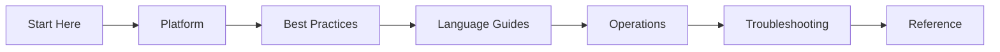

# Azure Functions Practical Guide

Comprehensive, practical documentation for building, deploying, operating, and troubleshooting serverless applications on Azure Functions.

-   :material-rocket-launch:{ .lg .middle } **New to Azure Functions?**

    ---

    Start with the [Overview](start-here/overview.md), choose a hosting plan in [Hosting Options](start-here/hosting-options.md), then follow a guided track in [Learning Paths](start-here/learning-paths.md).

    [:octicons-arrow-right-24: Start Here](start-here/index.md)

-   :material-server:{ .lg .middle } **Running Production Workloads?**

    ---

    Review [Best Practices](best-practices/index.md) for hosting, scaling, and reliability patterns, then set up [Monitoring](operations/monitoring.md) and [Alerts](operations/alerts.md).

    [:octicons-arrow-right-24: Operations](operations/index.md)

-   :material-bug:{ .lg .middle } **Investigating an Incident?**

    ---

    Jump to [First 10 Minutes](troubleshooting/first-10-minutes.md) for rapid triage, then use [Playbooks](troubleshooting/playbooks.md) and [KQL queries](troubleshooting/kql.md) for deeper diagnosis.

    [:octicons-arrow-right-24: Troubleshooting](troubleshooting/index.md)

## Navigate the Guide

| Section | Purpose | Start page |
|---|---|---|
| Start Here | Onboarding, plan selection, learning tracks | [Start Here](start-here/index.md) |
| Platform | Architecture, hosting internals, scaling, networking, reliability, security | [Platform](platform/index.md) |
| Best Practices | Production patterns and anti-patterns for hosting, triggers, scaling, and deployment | [Best Practices](best-practices/index.md) |
| Language Guides | Implementation guidance for Python, Node.js, .NET, Java | [Language Guides](language-guides/index.md) |
| Operations | Deployment, configuration, monitoring, alerting, recovery | [Operations](operations/index.md) |
| Troubleshooting | Incident-first diagnosis, playbooks, KQL, lab guides | [Troubleshooting](troubleshooting/index.md) |
| Reference | CLI cheatsheets, host.json, platform limits | [Reference](reference/index.md) |

## Learning flow

## Scope and disclaimer

This is an independent community project. It is not affiliated with or endorsed by Microsoft. Azure and Azure Functions are trademarks of Microsoft Corporation.

All content is based on publicly available Microsoft Learn documentation. When in doubt, treat [Microsoft Learn](https://learn.microsoft.com/azure/azure-functions/) as the authoritative source.

## See Also

- [Start Here](start-here/index.md)
- [Platform](platform/index.md)
- [Best Practices](best-practices/index.md)
- [Language Guides](language-guides/index.md)
- [Operations](operations/index.md)
- [Troubleshooting](troubleshooting/index.md)
- [Reference](reference/index.md)

## Sources

- [Azure Functions documentation (Microsoft Learn)](https://learn.microsoft.com/azure/azure-functions/)
