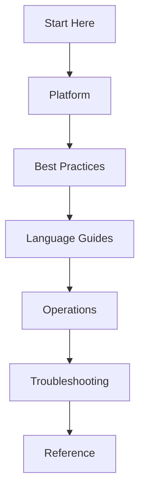

---
content_sources:
  - type: mslearn-adapted
    url: https://learn.microsoft.com/azure/azure-functions/
---

# Azure Functions Practical Guide

**Production-focused documentation for operators and engineers** — from first deployment to incident response.

Unlike introductory tutorials, this guide emphasizes what happens *after* your functions go live: troubleshooting real incidents, hypothesis-driven debugging with KQL, runbooks for common failures, and battle-tested operational patterns.

-   :material-bug:{ .lg .middle } **Investigating an Incident?**

    ---

    Jump straight to hypothesis-driven playbooks with real KQL queries, evidence patterns, and hands-on lab exercises.

    [:octicons-arrow-right-24: Troubleshooting](troubleshooting/index.md)

-   :material-server:{ .lg .middle } **Running Production Workloads?**

    ---

    Apply battle-tested patterns for hosting selection, scaling, reliability, networking, and deployment safety.

    [:octicons-arrow-right-24: Best Practices](best-practices/index.md)

-   :material-rocket-launch:{ .lg .middle } **New to Azure Functions?**

    ---

    Start with platform fundamentals, choose a hosting plan, and deploy your first function app.

    [:octicons-arrow-right-24: Start Here](start-here/index.md)

## What Makes This Guide Different

| This Guide | Typical Tutorials |
|---|---|
| **Troubleshooting playbooks** with falsifiable hypotheses | "It works" happy-path only |
| **KQL query library** for real investigation | No observability guidance |
| **Hands-on lab guides** reproducing actual failures | No failure scenarios |
| **Operations runbooks** for day-2 tasks | Setup-only documentation |
| **4 languages × 4 hosting plans** with tested CLI | Single language/plan examples |

## Navigate the Guide

| Section | Purpose |
|---|---|
| [Start Here](start-here/index.md) | Orientation, learning paths, hosting plan selection, and repository map. |
| [Platform](platform/index.md) | Understand core Azure Functions architecture, hosting, scaling, networking, and security. |
| [Best Practices](best-practices/index.md) | Apply production patterns for hosting selection, triggers, scaling, reliability, and deployment. |
| [Language Guides](language-guides/index.md) | Follow end-to-end implementation tracks for Python, Node.js, Java, and .NET. |
| [Operations](operations/index.md) | Run production workloads with deployment, monitoring, alerting, and recovery practices. |
| [Troubleshooting](troubleshooting/index.md) | Diagnose trigger, scaling, dependency, and deployment issues quickly. |
| [Reference](reference/index.md) | Use quick lookups for CLI, host.json, environment variables, and platform limits. |

For orientation and study order, start with [Start Here](start-here/index.md).

## Learning flow

<!-- diagram-id: learning-flow -->

## Scope and disclaimer

This is an independent community project. Not affiliated with or endorsed by Microsoft.

Primary product reference: [Azure Functions documentation (Microsoft Learn)](https://learn.microsoft.com/azure/azure-functions/)

## See Also

- [Start Here](start-here/index.md)
- [Platform](platform/index.md)
- [Best Practices](best-practices/index.md)
- [Language Guides](language-guides/index.md)
- [Operations](operations/index.md)
- [Troubleshooting](troubleshooting/index.md)
- [Reference](reference/index.md)

## Sources

- [Azure Functions documentation (Microsoft Learn)](https://learn.microsoft.com/azure/azure-functions/)
