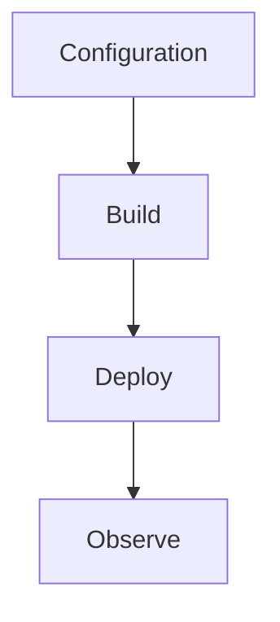

# CLI Cheatsheet

Quick command reference for .NET isolated worker development, deployment, and operations.



## Topic/Command Groups

### Project setup and local run
```bash
func init MyProject --worker-runtime dotnet-isolated
cd MyProject
func new --template "HTTP trigger" --name HttpFunction
dotnet build
func start
```

### Deployment
```bash
dotnet publish --configuration Release --output ./publish
func azure functionapp publish "$APP_NAME"
az functionapp create   --name "$APP_NAME"   --resource-group "$RG"   --storage-account "$STORAGE_NAME"   --runtime dotnet-isolated   --runtime-version 8   --functions-version 4   --os-type Linux
```

### Operations
```bash
az functionapp config appsettings list --name "$APP_NAME" --resource-group "$RG"
az functionapp log tail --name "$APP_NAME" --resource-group "$RG"
az functionapp restart --name "$APP_NAME" --resource-group "$RG"
```

## See Also
- [.NET Language Guide](index.md)
- [.NET Runtime](dotnet-runtime.md)
- [.NET Isolated Worker Model](isolated-worker-model.md)
- [Recipes Index](recipes/index.md)

## Sources
- [Azure Functions .NET isolated worker guide](https://learn.microsoft.com/azure/azure-functions/dotnet-isolated-process-guide)
- [Azure Functions host.json reference](https://learn.microsoft.com/azure/azure-functions/functions-host-json)
