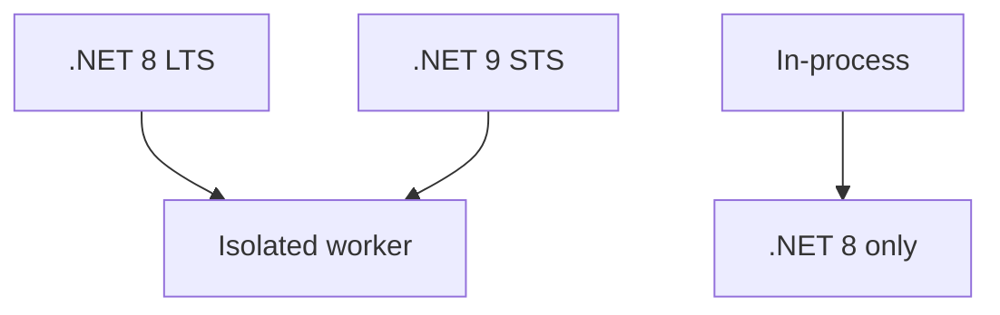

---
content_sources:
- type: mslearn-adapted
  url: https://learn.microsoft.com/azure/azure-functions/supported-languages
- type: mslearn-adapted
  url: https://learn.microsoft.com/azure/azure-functions/dotnet-isolated-process-guide
content_validation:
  status: verified
  last_reviewed: '2026-05-23'
  reviewer: agent
  core_claims:
  - claim: This page uses Microsoft Learn as the primary source basis for its Azure-specific
      guidance.
    source: https://learn.microsoft.com/azure/azure-functions/supported-languages
    verified: true
---
# .NET Runtime

This reference covers runtime versions, worker configuration, target framework choices, and package dependencies for Azure Functions .NET apps.

## Main Content

### Supported runtimes and models

| Model | Supported .NET versions | Recommended for new apps |
|------|--------------------------|--------------------------|
| Isolated worker | .NET 10, .NET 9, .NET 8, .NET Framework 4.8.1 | Yes |
| In-process | .NET 8 only | No |

<!-- diagram-id: supported-runtimes-and-models -->


### Required app settings

| Setting | Value | Purpose |
|--------|-------|---------|
| `FUNCTIONS_WORKER_RUNTIME` | `dotnet-isolated` | Selects isolated worker runtime |
| `FUNCTIONS_EXTENSION_VERSION` | `~4` | Pins Functions runtime major version |
| `AzureWebJobsStorage` | connection string or identity-based settings | Required host storage |

```bash
az functionapp config appsettings set   --name "$APP_NAME"   --resource-group "$RG"   --settings "FUNCTIONS_WORKER_RUNTIME=dotnet-isolated" "FUNCTIONS_EXTENSION_VERSION=~4"
```

| CLI element | Explanation |
|---|---|
| Command(s) | `az functionapp config appsettings set` |
| Key flags | `--name`, `--resource-group`, `--settings` |
| Variables | `$APP_NAME`, `$RG` |
| Expected result | Azure CLI applies the configuration change; confirm the returned JSON or follow-up query shows the expected value. |


### csproj baseline

Use `net8.0` as the default target framework for production workloads:

```xml
<Project Sdk="Microsoft.NET.Sdk">
  <PropertyGroup>
    <TargetFramework>net8.0</TargetFramework>
    <AzureFunctionsVersion>v4</AzureFunctionsVersion>
    <OutputType>Exe</OutputType>
    <ImplicitUsings>enable</ImplicitUsings>
    <Nullable>enable</Nullable>
  </PropertyGroup>

  <ItemGroup>
    <PackageReference Include="Microsoft.Azure.Functions.Worker" Version="1.*" />
    <PackageReference Include="Microsoft.Azure.Functions.Worker.Sdk" Version="1.*" OutputItemType="Analyzer" />
    <PackageReference Include="Microsoft.Azure.Functions.Worker.Extensions.Http" Version="3.*" />
    <PackageReference Include="Microsoft.Azure.Functions.Worker.Extensions.Http.AspNetCore" Version="1.*" />
    <PackageReference Include="Microsoft.Azure.Functions.Worker.Extensions.Storage" Version="6.*" />
    <PackageReference Include="Microsoft.Azure.Functions.Worker.Extensions.Timer" Version="4.*" />
    <PackageReference Include="Microsoft.Azure.Functions.Worker.Extensions.CosmosDB" Version="4.*" />
  </ItemGroup>
</Project>
```

### Build and publish commands

```bash
dotnet build
dotnet publish --configuration Release --output ./publish
func azure functionapp publish "$APP_NAME"
```

Use runtime-safe creation flags when provisioning:

```bash
az functionapp create   --name "$APP_NAME"   --resource-group "$RG"   --storage-account "$STORAGE_NAME"   --runtime dotnet-isolated   --runtime-version 8   --functions-version 4   --os-type Linux
```

| CLI element | Explanation |
|---|---|
| Command(s) | `az functionapp create` |
| Key flags | `--name`, `--resource-group`, `--storage-account`, `--runtime`, `--runtime-version`, `--functions-version`, `--os-type` |
| Variables | `$APP_NAME`, `$RG`, `$STORAGE_NAME` |
| Expected result | Azure CLI returns provisioning details; confirm the resource name and successful provisioning state before continuing. |


### Upgrade guidance

1. Move startup logic into `Program.cs` with `HostBuilder`.
2. Replace in-process HTTP abstractions with `HttpRequestData` and `HttpResponseData`.
3. Replace `context.GetLogger()` with constructor-injected `ILogger<T>`.
4. Update trigger attributes and extension packages to isolated-worker equivalents.

## See Also
- [.NET Language Guide](index.md)
- [.NET Isolated Worker Model](isolated-worker-model.md)
- [Platform Limits](platform-limits.md)
- [Troubleshooting](troubleshooting.md)

## Sources
- [Azure Functions supported languages](https://learn.microsoft.com/azure/azure-functions/supported-languages)
- [Guide for running C# Azure Functions in the isolated worker model](https://learn.microsoft.com/azure/azure-functions/dotnet-isolated-process-guide)
