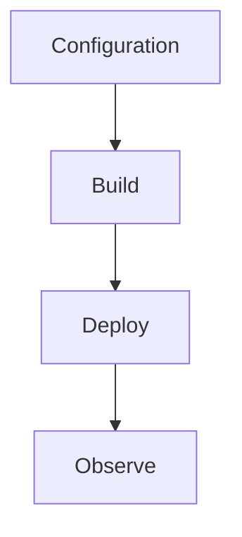

# Environment Variables

Reference of key app settings for .NET isolated worker apps.



## Topic/Command Groups

| Variable | Example | Purpose |
|----------|---------|---------|
| `FUNCTIONS_WORKER_RUNTIME` | `dotnet-isolated` | Select isolated worker runtime |
| `FUNCTIONS_EXTENSION_VERSION` | `~4` | Pin major Functions runtime |
| `AzureWebJobsStorage` | `DefaultEndpointsProtocol=...` | Host storage connection |
| `APPLICATIONINSIGHTS_CONNECTION_STRING` | `InstrumentationKey=...` | Telemetry destination |
| `DOTNET_ENVIRONMENT` | `Production` | .NET environment behavior |

### Local settings example
```json
{
  "IsEncrypted": false,
  "Values": {
    "FUNCTIONS_WORKER_RUNTIME": "dotnet-isolated",
    "FUNCTIONS_EXTENSION_VERSION": "~4",
    "AzureWebJobsStorage": "UseDevelopmentStorage=true"
  }
}
```

## See Also
- [.NET Language Guide](index.md)
- [.NET Runtime](dotnet-runtime.md)
- [.NET Isolated Worker Model](isolated-worker-model.md)
- [Recipes Index](recipes/index.md)

## Sources
- [Azure Functions .NET isolated worker guide](https://learn.microsoft.com/azure/azure-functions/dotnet-isolated-process-guide)
- [Azure Functions host.json reference](https://learn.microsoft.com/azure/azure-functions/functions-host-json)
