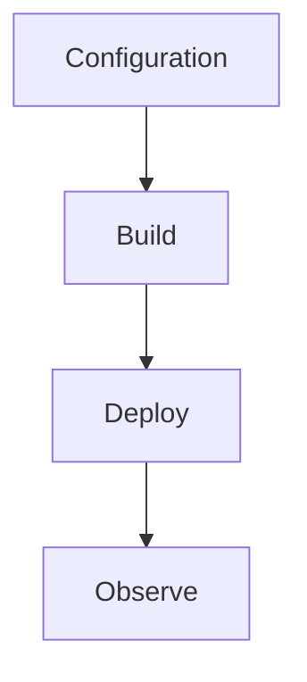

---
content_sources:

- type: mslearn-adapted
  url: https://learn.microsoft.com/azure/azure-functions/dotnet-isolated-process-guide
- type: mslearn-adapted
  url: https://learn.microsoft.com/azure/azure-functions/functions-host-json
content_validation:
  status: verified
  last_reviewed: '2026-05-23'
  reviewer: agent
  core_claims:
  - claim: This page uses Microsoft Learn as the primary source basis for its Azure-specific
      guidance.
    source: https://learn.microsoft.com/azure/azure-functions/dotnet-isolated-process-guide
    verified: true
---
# Environment Variables

Reference of key app settings for .NET isolated worker apps.

<!-- diagram-id: environment-variables -->


## Topic/Command Groups

### Core Settings

| Variable | Example | Purpose |
|----------|---------|---------|
| `FUNCTIONS_WORKER_RUNTIME` | `dotnet-isolated` | Select isolated worker runtime |
| `FUNCTIONS_EXTENSION_VERSION` | `~4` | Pin major Functions runtime |
| `AzureWebJobsStorage` | `DefaultEndpointsProtocol=...` | Host storage connection |
| `APPLICATIONINSIGHTS_CONNECTION_STRING` | `InstrumentationKey=...` | Telemetry destination |

### .NET-Specific Settings

| Variable | Example | Purpose | Notes |
|----------|---------|---------|-------|
| `DOTNET_ENVIRONMENT` | `Production` | .NET environment configuration | Maps to `IHostEnvironment.EnvironmentName` |
| `AZURE_FUNCTIONS_ENVIRONMENT` | `Production` | Functions-specific environment | Overrides `DOTNET_ENVIRONMENT` when both are set |
| `WEBSITE_RUN_FROM_PACKAGE` | `1` | Run from immutable deployment package | Recommended for production |
| `DOTNET_CLI_TELEMETRY_OPTOUT` | `1` | Disable .NET CLI telemetry | Useful in build/CI environments |

### Runtime Selection

| `FUNCTIONS_WORKER_RUNTIME` value | Model | Notes |
|---|---|---|
| `dotnet-isolated` | Isolated worker (recommended) | Runs in a separate .NET process; supports .NET 8+ |
| `dotnet` | In-process (legacy) | Shares process with Functions host; .NET 6 only, reaching end of support |

### Local settings example
```json
{
  "IsEncrypted": false,
  "Values": {
    "FUNCTIONS_WORKER_RUNTIME": "dotnet-isolated",
    "FUNCTIONS_EXTENSION_VERSION": "~4",
    "AzureWebJobsStorage": "UseDevelopmentStorage=true"
  }
}
```

## See Also
- [.NET Language Guide](index.md)
- [.NET Runtime](dotnet-runtime.md)
- [.NET Isolated Worker Model](isolated-worker-model.md)
- [Recipes Index](recipes/index.md)

## Sources
- [Azure Functions .NET isolated worker guide](https://learn.microsoft.com/azure/azure-functions/dotnet-isolated-process-guide)
- [Azure Functions host.json reference](https://learn.microsoft.com/azure/azure-functions/functions-host-json)
