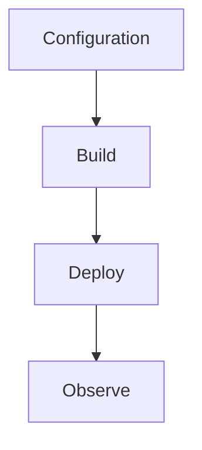

# host.json Reference

Host-level runtime settings for .NET isolated worker function apps.



## Topic/Command Groups

### Baseline host.json
```json
{
  "version": "2.0",
  "functionTimeout": "00:10:00",
  "logging": {
    "applicationInsights": {
      "samplingSettings": {
        "isEnabled": true,
        "maxTelemetryItemsPerSecond": 20
      }
    }
  },
  "extensions": {
    "http": {
      "routePrefix": "api"
    },
    "queues": {
      "batchSize": 16,
      "maxDequeueCount": 5
    }
  }
}
```

### Key settings
- `functionTimeout`: execution limit per invocation
- `extensions.http.routePrefix`: HTTP route prefix
- `extensions.queues.maxDequeueCount`: poison handling threshold

## See Also
- [.NET Language Guide](index.md)
- [.NET Runtime](dotnet-runtime.md)
- [.NET Isolated Worker Model](isolated-worker-model.md)
- [Recipes Index](recipes/index.md)

## Sources
- [Azure Functions .NET isolated worker guide](https://learn.microsoft.com/azure/azure-functions/dotnet-isolated-process-guide)
- [Azure Functions host.json reference](https://learn.microsoft.com/azure/azure-functions/functions-host-json)
