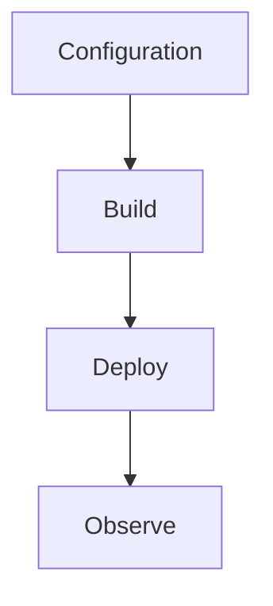

---
content_sources:

  - type: mslearn-adapted
    url: https://learn.microsoft.com/en-us/azure/azure-functions/dotnet-isolated-process-guide
  - type: mslearn-adapted
    url: https://learn.microsoft.com/en-us/azure/azure-functions/functions-host-json
content_validation:
  status: verified
  last_reviewed: '2026-05-23'
  reviewer: agent
  core_claims:
    - claim: This page uses Microsoft Learn as the primary source basis for its Azure-specific guidance.
      source: https://learn.microsoft.com/en-us/azure/azure-functions/dotnet-isolated-process-guide
      verified: true
---
# host.json Reference

Host-level runtime settings for .NET isolated worker function apps.

<!-- diagram-id: host-json-reference -->


## Topic/Command Groups

### Baseline host.json
```json
{
  "version": "2.0",
  "functionTimeout": "00:10:00",
  "logging": {
    "applicationInsights": {
      "samplingSettings": {
        "isEnabled": true,
        "maxTelemetryItemsPerSecond": 20
      }
    }
  },
  "extensions": {
    "http": {
      "routePrefix": "api"
    },
    "queues": {
      "batchSize": 16,
      "maxDequeueCount": 5
    }
  }
}
```

### Key settings
- `functionTimeout`: execution limit per invocation
- `extensions.http.routePrefix`: HTTP route prefix
- `extensions.queues.maxDequeueCount`: poison handling threshold

## Review Matrix

| Review area | Page-specific check |
|---|---|
| Scope | Confirm the guidance applies to host.json Reference. |
| Source basis | Validate the recommendation against the Microsoft Learn sources in this page. |
| Evidence | Capture command output, portal state, metrics, logs, or screenshots before treating the result as proven. |

## See Also
- [.NET Language Guide](index.md)
- [.NET Runtime](dotnet-runtime.md)
- [.NET Isolated Worker Model](isolated-worker-model.md)
- [Recipes Index](recipes/index.md)

## Sources
- [Azure Functions .NET isolated worker guide](https://learn.microsoft.com/en-us/azure/azure-functions/dotnet-isolated-process-guide)
- [Azure Functions host.json reference](https://learn.microsoft.com/en-us/azure/azure-functions/functions-host-json)
