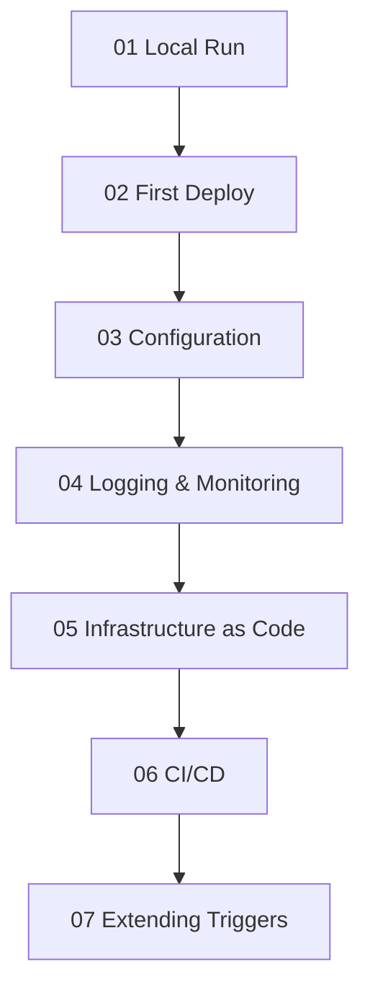

---
content_sources:
  - type: mslearn-adapted
    url: https://learn.microsoft.com/azure/azure-functions/functions-dotnet-class-library
  - type: mslearn-adapted
    url: https://learn.microsoft.com/azure/azure-functions/dotnet-isolated-process-guide
---

# .NET Language Guide

This guide introduces Azure Functions for .NET with emphasis on the **isolated worker model**, which is the recommended default for new projects.

The isolated model gives clearer dependency boundaries, independent .NET versioning, and modern hosting patterns aligned with current platform direction.

!!! warning "Under Development"
    The .NET tutorial track and recipes are under active development. This page provides a programming model overview, quick start, and cross-language comparison. For production architecture decisions, pair this page with [Platform](../../platform/index.md) and [Operations](../../operations/index.md).

## Main Content

<!-- diagram-id: main-content -->


The .NET guide will follow the same 7-step tutorial structure used by the [Python guide](../python/index.md), covering all four hosting plans.

## .NET Worker Model Overview

| Model | Status for New Projects | Characteristics |
|-------|--------------------------|-----------------|
| In-process | Legacy/compatibility path | Functions runtime and app code run in one process |
| Isolated worker | **Recommended** | App code runs in separate worker process with explicit host setup |


.NET 8 (LTS) is the guide baseline for new .NET guidance; validate target framework and extension compatibility in Microsoft Learn before production rollouts.

## In-Process vs Isolated: Practical Differences

| Concern | In-process | Isolated |
|---------|------------|----------|
| Process boundary | Shared with Functions runtime | Separate worker process |
| Startup model | Runtime-managed startup hooks | Standard .NET host builder style |
| Middleware/control | More constrained | More explicit/extensible pipeline control |
| Recommended for net-new | No | Yes |

## Quick Start: HTTP Trigger (.NET Isolated)

```csharp
using Microsoft.Azure.Functions.Worker;
using Microsoft.Azure.Functions.Worker.Http;
using Microsoft.Extensions.Logging;
using System.Net;

public class HelloFunction
{
    private readonly ILogger _logger;

    public HelloFunction(ILoggerFactory loggerFactory)
    {
        _logger = loggerFactory.CreateLogger<HelloFunction>();
    }

    [Function("HelloHttp")]
    public HttpResponseData Run(
        [HttpTrigger(AuthorizationLevel.Function, "get", Route = "hello/{name?}")] HttpRequestData req,
        string? name)
    {
        name ??= "world";
        _logger.LogInformation("Processed .NET isolated request for {Name}", name);

        HttpResponseData response = req.CreateResponse(HttpStatusCode.OK);
        response.WriteString($"Hello, {name}! (Azure Functions .NET isolated)");
        return response;
    }
}
```

### What this example demonstrates

- `[Function]` method registration.
- `[HttpTrigger]` attribute with route and auth level.
- DI-driven logging in isolated worker.
- `HttpRequestData`/`HttpResponseData` primitives.

## Tutorial Roadmap

The following content is planned for the .NET track:

- **Tutorial track**: Local development, first deploy, configuration, monitoring, IaC, CI/CD across all four hosting plans.
- **Recipes**: Storage, Cosmos DB, Key Vault, Managed Identity, durable workflows.
- **Reference docs**: Runtime/version matrix, host settings mapping, and troubleshooting baseline for isolated worker projects.
- **Reference app**: `apps/dotnet/` parity implementation aligned to Python capability set.

## See Also

- [Language Guides Overview](../index.md)
- [Python Guide (reference implementation)](../python/index.md)
- [Node.js Guide](../nodejs/index.md)
- [Java Guide](../java/index.md)
- [Platform: Architecture](../../platform/architecture/index.md)
- [Platform: Hosting](../../platform/hosting.md)
- [Operations: Deployment](../../operations/deployment.md)
- [Operations: Monitoring](../../operations/monitoring.md)

## Sources

- [Azure Functions .NET developer guide](https://learn.microsoft.com/azure/azure-functions/functions-dotnet-class-library)
- [Guide for running C# Azure Functions in the isolated worker model](https://learn.microsoft.com/azure/azure-functions/dotnet-isolated-process-guide)
