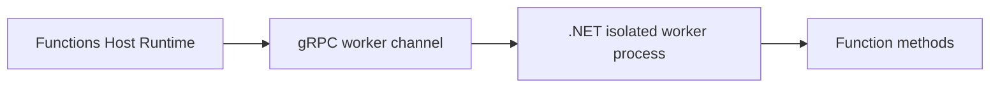

# .NET Isolated Worker Model

This guide explains the .NET isolated worker model for Azure Functions, including host startup, dependency injection, trigger attributes, bindings, and migration-safe coding patterns.

## Main Content

### Why isolated worker is the default

The isolated worker model runs your function code in a separate process from the Functions host. This gives clearer versioning boundaries, modern .NET hosting patterns, and easier dependency control.



### Host startup with Program.cs

Use a standard `HostBuilder` startup:

```csharp
using Microsoft.Extensions.Hosting;

var host = new HostBuilder()
    .ConfigureFunctionsWebApplication()
    .Build();

host.Run();
```

### HTTP trigger pattern

Use `HttpRequestData` and `HttpResponseData` with the trigger attribute:

```csharp
using Microsoft.Azure.Functions.Worker;
using Microsoft.Azure.Functions.Worker.Http;
using Microsoft.Extensions.Logging;
using System.Net;

public class HttpFunctions
{
    private readonly ILogger<HttpFunctions> _logger;

    public HttpFunctions(ILogger<HttpFunctions> logger)
    {
        _logger = logger;
    }

    [Function("GetStatus")]
    public HttpResponseData GetStatus(
        [HttpTrigger(AuthorizationLevel.Function, "get", "post", Route = "status/{id?}")] HttpRequestData req)
    {
        _logger.LogInformation("Status endpoint called.");
        HttpResponseData response = req.CreateResponse(HttpStatusCode.OK);
        response.WriteString("{\"status\":\"ok\"}");
        return response;
    }
}
```

### Trigger and binding examples

- Queue input: `[QueueTrigger("queue-name", Connection = "AzureWebJobsStorage")]`
- Blob input: `[BlobTrigger("container/{name}", Connection = "AzureWebJobsStorage")]`
- Timer trigger: `[TimerTrigger("0 */5 * * * *")]`
- Queue output: `[QueueOutput("queue-name", Connection = "AzureWebJobsStorage")]`
- Blob output: `[BlobOutput("container/{name}", Connection = "AzureWebJobsStorage")]`

```csharp
[Function("QueueCopy")]
[QueueOutput("processed-items", Connection = "AzureWebJobsStorage")]
public string Run(
    [QueueTrigger("incoming-items", Connection = "AzureWebJobsStorage")] string message)
{
    return $"processed: {message}";
}
```

### Dependency injection and logging

Use constructor injection for `ILogger<T>` and services. Do not use in-process patterns such as `context.GetLogger()`.

```csharp
public class TimerFunctions
{
    private readonly ILogger<TimerFunctions> _logger;

    public TimerFunctions(ILogger<TimerFunctions> logger)
    {
        _logger = logger;
    }

    [Function("Heartbeat")]
    public void Heartbeat([TimerTrigger("0 */5 * * * *")] TimerInfo timer)
    {
        _logger.LogInformation("Heartbeat executed at {Timestamp}", DateTime.UtcNow);
    }
}
```

### Recommended project layout

```text
project-root/
├── Functions/
│   ├── HttpFunctions.cs
│   ├── TimerFunctions.cs
│   └── QueueFunctions.cs
├── Program.cs
├── host.json
├── local.settings.json
└── MyProject.csproj
```

## See Also
- [.NET Language Guide](index.md)
- [.NET Runtime](dotnet-runtime.md)
- [Tutorial Overview & Plan Chooser](tutorial/index.md)
- [Platform: Triggers and Bindings](../../platform/triggers-and-bindings.md)

## Sources
- [Guide for running C# Azure Functions in the isolated worker model](https://learn.microsoft.com/azure/azure-functions/dotnet-isolated-process-guide)
- [Azure Functions triggers and bindings](https://learn.microsoft.com/azure/azure-functions/functions-triggers-bindings)
