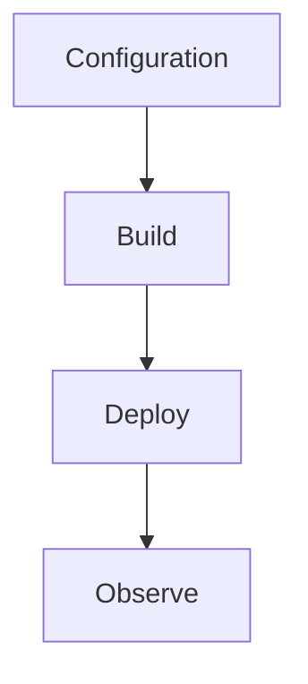

# Platform Limits

Plan-specific limits relevant to .NET isolated worker apps.

## Topic/Command Groups

| Limit | Consumption | Flex Consumption | Premium | Dedicated |
|-------|-------------|------------------|---------|-----------|
| Default timeout | 5 min | 30 min | 30 min | 30 min |
| Max timeout | 10 min | Unlimited | Unlimited | Unlimited |
| Scale out | Up to 200 | Up to 1000 | Up to 100 | Tier based |
| VNet integration | No | Yes | Yes | Yes |
| Deployment slots | Limited | No | Yes | Yes |

### HTTP considerations
- Azure Load Balancer idle timeout is 230 seconds for HTTP clients.
- Use async status patterns for long-running work.
- Prefer Durable orchestration for workflows beyond request/response windows.

## See Also
- [.NET Language Guide](index.md)
- [.NET Runtime](dotnet-runtime.md)
- [.NET Isolated Worker Model](isolated-worker-model.md)
- [Recipes Index](recipes/index.md)

## Sources
- [Azure Functions .NET isolated worker guide](https://learn.microsoft.com/azure/azure-functions/dotnet-isolated-process-guide)
- [Azure Functions host.json reference](https://learn.microsoft.com/azure/azure-functions/functions-host-json)
