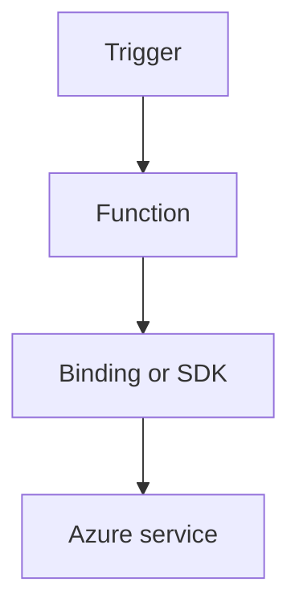

---
content_sources:

- type: mslearn-adapted
  url: https://learn.microsoft.com/azure/azure-functions/dotnet-isolated-process-guide
- type: mslearn-adapted
  url: https://learn.microsoft.com/azure/azure-functions/functions-triggers-bindings
content_validation:
  status: verified
  last_reviewed: '2026-05-23'
  reviewer: agent
  core_claims:
  - claim: This page uses Microsoft Learn as the primary source basis for its Azure-specific
      guidance.
    source: https://learn.microsoft.com/azure/azure-functions/dotnet-isolated-process-guide
    verified: true
---
# Blob Storage

Implement blob trigger and blob output scenarios for ingestion and transformation pipelines.

<!-- diagram-id: blob-storage -->


## Topic/Command Groups

### Blob trigger pattern
```csharp
[Function("BlobIngest")]
public void BlobIngest(
    [BlobTrigger("incoming/{name}", Connection = "AzureWebJobsStorage")] byte[] content,
    string name)
{
}
```

### Blob output binding
```csharp
[Function("BlobTransform")]
[BlobOutput("processed/{name}", Connection = "AzureWebJobsStorage")]
public byte[] BlobTransform(
    [BlobTrigger("incoming/{name}", Connection = "AzureWebJobsStorage")] byte[] input,
    string name)
{
    return input;
}
```

## Review Matrix

| Review area | Page-specific check |
|---|---|
| Scope | Confirm the guidance applies to Blob Storage. |
| Source basis | Validate the recommendation against the Microsoft Learn sources in this page. |
| Evidence | Capture command output, portal state, metrics, logs, or screenshots before treating the result as proven. |

## See Also
- [Recipes Index](index.md)
- [.NET Language Guide](../index.md)
- [Troubleshooting](../troubleshooting.md)

## Sources
- [Azure Functions .NET isolated worker guide](https://learn.microsoft.com/azure/azure-functions/dotnet-isolated-process-guide)
- [Azure Functions triggers and bindings](https://learn.microsoft.com/azure/azure-functions/functions-triggers-bindings)
