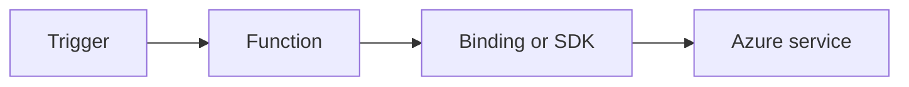

# Cosmos DB

Use Cosmos DB bindings and SDK patterns from isolated worker functions.



## Topic/Command Groups

### Cosmos DB trigger/input bindings
```csharp
[Function("CosmosReader")]
public void CosmosReader(
    [CosmosDBTrigger(
        databaseName: "appdb",
        containerName: "orders",
        Connection = "CosmosConnection",
        LeaseContainerName = "leases")] string[] documents)
{
}
```

### Cosmos DB output binding
```csharp
[Function("WriteOrder")]
[CosmosDBOutput("appdb", "orders", Connection = "CosmosConnection")]
public Order WriteOrder([HttpTrigger(AuthorizationLevel.Function, "post", Route = "orders")] HttpRequestData req)
{
    return new Order { Id = Guid.NewGuid().ToString(), Status = "created" };
}
```

## See Also
- [Recipes Index](index.md)
- [.NET Language Guide](../index.md)
- [Troubleshooting](../troubleshooting.md)

## Sources
- [Azure Functions .NET isolated worker guide](https://learn.microsoft.com/azure/azure-functions/dotnet-isolated-process-guide)
- [Azure Functions triggers and bindings](https://learn.microsoft.com/azure/azure-functions/functions-triggers-bindings)
