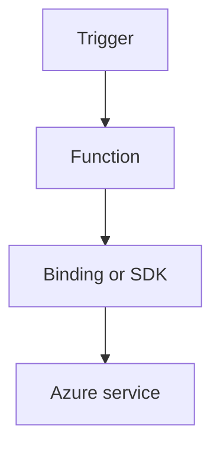

---
content_sources:

- type: mslearn-adapted
  url: https://learn.microsoft.com/azure/azure-functions/dotnet-isolated-process-guide
- type: mslearn-adapted
  url: https://learn.microsoft.com/azure/azure-functions/functions-triggers-bindings
content_validation:
  status: verified
  last_reviewed: '2026-05-23'
  reviewer: agent
  core_claims:
  - claim: This page uses Microsoft Learn as the primary source basis for its Azure-specific
      guidance.
    source: https://learn.microsoft.com/azure/azure-functions/dotnet-isolated-process-guide
    verified: true
---
# Cosmos DB

Use Cosmos DB bindings and SDK patterns from isolated worker functions.

<!-- diagram-id: cosmos-db -->


## Topic/Command Groups

### Cosmos DB trigger/input bindings
```csharp
[Function("CosmosReader")]
public void CosmosReader(
    [CosmosDBTrigger(
        databaseName: "appdb",
        containerName: "orders",
        Connection = "CosmosConnection",
        LeaseContainerName = "leases")] string[] documents)
{
}
```

### Cosmos DB output binding
```csharp
[Function("WriteOrder")]
[CosmosDBOutput("appdb", "orders", Connection = "CosmosConnection")]
public Order WriteOrder([HttpTrigger(AuthorizationLevel.Function, "post", Route = "orders")] HttpRequestData req)
{
    return new Order { Id = Guid.NewGuid().ToString(), Status = "created" };
}
```

## Review Matrix

| Review area | Page-specific check |
|---|---|
| Scope | Confirm the guidance applies to Cosmos DB. |
| Source basis | Validate the recommendation against the Microsoft Learn sources in this page. |
| Evidence | Capture command output, portal state, metrics, logs, or screenshots before treating the result as proven. |

## See Also
- [Recipes Index](index.md)
- [.NET Language Guide](../index.md)
- [Troubleshooting](../troubleshooting.md)

## Sources
- [Azure Functions .NET isolated worker guide](https://learn.microsoft.com/azure/azure-functions/dotnet-isolated-process-guide)
- [Azure Functions triggers and bindings](https://learn.microsoft.com/azure/azure-functions/functions-triggers-bindings)
