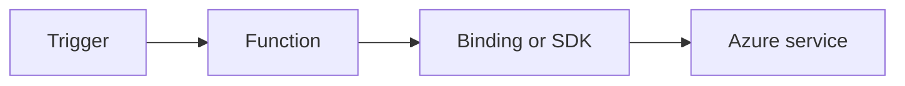

# Custom Domain and Certificates

Configure HTTPS custom domains, managed certificates, and secure endpoint policies.



## Topic/Command Groups

### Add custom hostname
```bash
az functionapp config hostname add --name "$APP_NAME" --resource-group "$RG" --hostname "api.example.com"
```

### Create managed certificate
```bash
az functionapp config ssl create --name "$APP_NAME" --resource-group "$RG" --hostname "api.example.com"
```

### Bind certificate
```bash
az functionapp config ssl bind --name "$APP_NAME" --resource-group "$RG" --certificate-thumbprint "<thumbprint>" --ssl-type SNI
```

### Hosting plan caveat
- Flex Consumption does not support managed/platform certificates.

## See Also
- [Recipes Index](index.md)
- [.NET Language Guide](../index.md)
- [Troubleshooting](../troubleshooting.md)

## Sources
- [Azure Functions .NET isolated worker guide](https://learn.microsoft.com/azure/azure-functions/dotnet-isolated-process-guide)
- [Azure Functions triggers and bindings](https://learn.microsoft.com/azure/azure-functions/functions-triggers-bindings)
