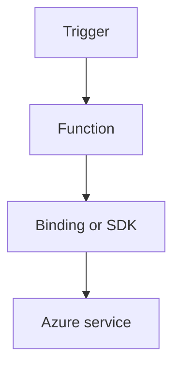

---
content_sources:

  - type: mslearn-adapted
    url: https://learn.microsoft.com/en-us/azure/azure-functions/dotnet-isolated-process-guide
  - type: mslearn-adapted
    url: https://learn.microsoft.com/en-us/azure/azure-functions/functions-triggers-bindings
content_validation:
  status: verified
  last_reviewed: '2026-05-23'
  reviewer: agent
  core_claims:
    - claim: This page uses Microsoft Learn as the primary source basis for its Azure-specific guidance.
      source: https://learn.microsoft.com/en-us/azure/azure-functions/dotnet-isolated-process-guide
      verified: true
---
# Custom Domain and Certificates

Configure HTTPS custom domains, managed certificates, and secure endpoint policies.

<!-- diagram-id: custom-domain-and-certificates -->


## Topic/Command Groups

### Add custom hostname
```bash
az functionapp config hostname add --name "$APP_NAME" --resource-group "$RG" --hostname "api.example.com"
```

| CLI element | Explanation |
|---|---|
| Command(s) | `az functionapp config hostname add` |
| Key flags | `--name`, `--resource-group`, `--hostname` |
| Variables | `$APP_NAME`, `$RG` |
| Expected result | Azure CLI applies the configuration change; confirm the returned JSON or follow-up query shows the expected value. |


### Create managed certificate
```bash
az functionapp config ssl create --name "$APP_NAME" --resource-group "$RG" --hostname "api.example.com"
```

| CLI element | Explanation |
|---|---|
| Command(s) | `az functionapp config ssl create` |
| Key flags | `--name`, `--resource-group`, `--hostname` |
| Variables | `$APP_NAME`, `$RG` |
| Expected result | Azure CLI returns provisioning details; confirm the resource name and successful provisioning state before continuing. |


### Bind certificate
```bash
az functionapp config ssl bind --name "$APP_NAME" --resource-group "$RG" --certificate-thumbprint "<thumbprint>" --ssl-type SNI
```

| CLI element | Explanation |
|---|---|
| Command(s) | `az functionapp config ssl bind` |
| Key flags | `--name`, `--resource-group`, `--certificate-thumbprint`, `--ssl-type` |
| Variables | `$APP_NAME`, `$RG` |
| Expected result | Azure CLI applies the configuration change; confirm the returned JSON or follow-up query shows the expected value. |


### Hosting plan caveat
- Flex Consumption does not support managed/platform certificates.

## See Also
- [Recipes Index](index.md)
- [.NET Language Guide](../index.md)
- [Troubleshooting](../troubleshooting.md)

## Sources
- [Azure Functions .NET isolated worker guide](https://learn.microsoft.com/en-us/azure/azure-functions/dotnet-isolated-process-guide)
- [Azure Functions triggers and bindings](https://learn.microsoft.com/en-us/azure/azure-functions/functions-triggers-bindings)
