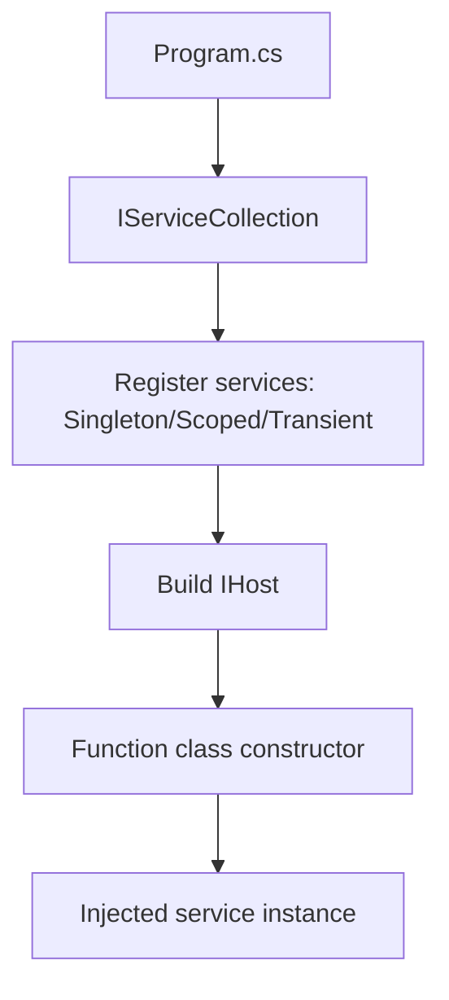

---
content_sources:
  references:
    - type: mslearn-adapted
      url: https://learn.microsoft.com/en-us/azure/azure-functions/dotnet-isolated-process-guide
  diagrams:
    - id: dependency-injection
      type: flowchart
      source: self-generated
      justification: Flow view of architecture, synthesized from Microsoft Learn documentation cited on this page.
      based_on:
        - https://learn.microsoft.com/en-us/azure/azure-functions/dotnet-isolated-process-guide
        - https://learn.microsoft.com/en-us/dotnet/azure/sdk/dependency-injection
---
# Dependency Injection

The .NET isolated worker model uses the standard .NET dependency injection (DI) container. You register services in `Program.cs` and receive them through constructor injection on your function classes. This is the idiomatic way to share clients (HTTP, Azure SDK) across invocations, which is critical for connection reuse in a serverless environment.

## Architecture

<!-- diagram-id: dependency-injection -->


## Registering Services

The isolated worker exposes the full host builder pipeline. Register services before calling `Build()`. Two builder styles are supported.

### IHostApplicationBuilder (core packages 2.x)

```csharp
using Microsoft.Azure.Functions.Worker.Builder;
using Microsoft.Extensions.DependencyInjection;
using Microsoft.Extensions.Hosting;

var builder = FunctionsApplication.CreateBuilder(args);
builder.ConfigureFunctionsWebApplication();

builder.Services.AddSingleton<IOrderService, OrderService>();
builder.Services.AddHttpClient();

builder.Build().Run();
```

### IHostBuilder (core packages 1.x)

```csharp
using Microsoft.Azure.Functions.Worker;
using Microsoft.Extensions.DependencyInjection;
using Microsoft.Extensions.Hosting;

var host = new HostBuilder()
    .ConfigureFunctionsWorkerDefaults()
    .ConfigureServices(services =>
    {
        services.AddSingleton<IOrderService, OrderService>();
        services.AddHttpClient();
    })
    .Build();

host.Run();
```

## Constructor Injection into Functions

Function classes should use instance methods so services are injected through the constructor. The framework also injects `ILogger<T>` automatically.

```csharp
public class OrderFunction
{
    private readonly IOrderService _orders;
    private readonly ILogger<OrderFunction> _logger;

    public OrderFunction(IOrderService orders, ILogger<OrderFunction> logger)
    {
        _orders = orders;
        _logger = logger;
    }

    [Function("SubmitOrder")]
    public async Task<HttpResponseData> Run(
        [HttpTrigger(AuthorizationLevel.Function, "post")] HttpRequestData req)
    {
        await _orders.SubmitAsync(await req.ReadAsStringAsync() ?? string.Empty);
        return req.CreateResponse(HttpStatusCode.Accepted);
    }
}
```

## Service Lifetimes

| Lifetime | Method | Use for |
|----------|--------|---------|
| Singleton | `AddSingleton` | Stateless, thread-safe clients (Azure SDK clients, `HttpClient` factory) |
| Scoped | `AddScoped` | One instance per function invocation |
| Transient | `AddTransient` | Lightweight, stateless helpers created on each request |

!!! tip "Reuse heavy clients as singletons"
    Register Azure SDK clients as singletons so connections and auth tokens are reused across invocations. Use the `Microsoft.Extensions.Azure` package and `AddAzureClients()` to register them with managed-identity credentials.

## Registering Azure SDK Clients

```csharp
builder.Services.AddAzureClients(clients =>
{
    clients.AddBlobServiceClient(builder.Configuration.GetSection("MyStorageConnection"))
        .WithName("outputBlob");
});
```

Inject the client through `IAzureClientFactory<BlobServiceClient>` and call `CreateClient("outputBlob")`.

## See Also

- [Blob Storage Integration](blob-storage.md)
- [Managed Identity](managed-identity.md)
- [Middleware](middleware.md)

## Sources

- [Guide for running C# Azure Functions in an isolated worker process (Microsoft Learn)](https://learn.microsoft.com/en-us/azure/azure-functions/dotnet-isolated-process-guide)
- [Dependency injection with the Azure SDK for .NET (Microsoft Learn)](https://learn.microsoft.com/en-us/dotnet/azure/sdk/dependency-injection)
