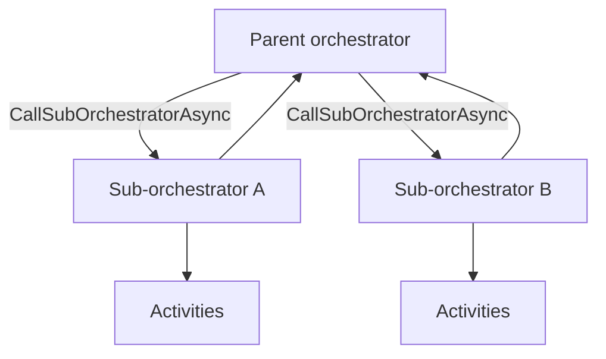

---
content_sources:
  references:
    - type: mslearn-adapted
      url: https://learn.microsoft.com/en-us/azure/azure-functions/durable/durable-functions-sub-orchestrations
    - type: mslearn-adapted
      url: https://learn.microsoft.com/en-us/azure/azure-functions/durable/durable-functions-eternal-orchestrations
    - type: mslearn-adapted
      url: https://learn.microsoft.com/en-us/azure/azure-functions/durable/durable-functions-versioning
  diagrams:
    - id: architecture
      type: flowchart
      source: self-generated
      justification: Flow view of sub-orchestration composition, synthesized from Microsoft Learn documentation cited on this page.
      based_on:
        - https://learn.microsoft.com/en-us/azure/azure-functions/durable/durable-functions-sub-orchestrations
        - https://learn.microsoft.com/en-us/azure/azure-functions/durable/durable-functions-eternal-orchestrations
---
# Durable Functions: Advanced Patterns

This recipe covers advanced Durable Functions patterns for .NET (isolated worker) beyond the basic chaining and fan-out/fan-in flows: sub-orchestrations, eternal orchestrations, activity retries, and safe versioning. For the fundamentals, see [Durable Orchestration](durable-orchestration.md).

## Architecture

<!-- diagram-id: architecture -->


## Sub-Orchestrations

Break a large workflow into reusable orchestrators. A parent calls a sub-orchestrator with `CallSubOrchestratorAsync`, and can fan out over several the same way it fans out over activities.

```csharp
[Function("ParentOrchestrator")]
public static async Task<int> ParentOrchestrator(
    [OrchestrationTrigger] TaskOrchestrationContext context)
{
    string[] regions = context.GetInput<string[]>() ?? Array.Empty<string>();

    // Fan out over sub-orchestrations, one per region.
    var tasks = regions
        .Select(region => context.CallSubOrchestratorAsync<string>("ProcessRegion", region))
        .ToList();

    string[] results = await Task.WhenAll(tasks);
    return results.Length;
}

[Function("ProcessRegion")]
public static async Task<string> ProcessRegion(
    [OrchestrationTrigger] TaskOrchestrationContext context)
{
    string region = context.GetInput<string>()!;
    string validated = await context.CallActivityAsync<string>("ValidateRegion", region);
    return await context.CallActivityAsync<string>("LoadRegion", validated);
}
```

## Eternal Orchestrations

For a workflow that runs indefinitely (aggregators, periodic jobs), do **not** use an unbounded loop — the history would grow forever. Call `context.ContinueAsNew` to restart the orchestration with fresh state and a clean history.

```csharp
[Function("PeriodicCleanup")]
public static async Task PeriodicCleanup(
    [OrchestrationTrigger] TaskOrchestrationContext context)
{
    var state = context.GetInput<CleanupState>() ?? new CleanupState();

    await context.CallActivityAsync("RunCleanup", state);
    state.Runs += 1;

    // Durable sleep, then restart with new state and empty history.
    DateTime nextRun = context.CurrentUtcDateTime.AddHours(1);
    await context.CreateTimer(nextRun, CancellationToken.None);
    context.ContinueAsNew(state);
}
```

## Activity Retries

Wrap flaky activities with a retry policy instead of hand-coding retry loops. The orchestration replays cleanly because retries are recorded in history.

```csharp
[Function("ResilientOrchestrator")]
public static async Task<string> ResilientOrchestrator(
    [OrchestrationTrigger] TaskOrchestrationContext context)
{
    var order = context.GetInput<Order>()!;

    var options = TaskOptions.FromRetryPolicy(new RetryPolicy(
        maxNumberOfAttempts: 3,
        firstRetryInterval: TimeSpan.FromSeconds(5)));

    return await context.CallActivityAsync<string>("ChargeCustomer", order, options);
}
```

| Element | Explanation |
|---|---|
| `CallSubOrchestratorAsync` | Invokes another orchestrator as a child; compose and fan out like activities. |
| `ContinueAsNew` | Restarts the orchestration with new input and a trimmed history for eternal loops. |
| `TaskOptions.FromRetryPolicy` | Declarative retry policy passed to `CallActivityAsync`. |

## Versioning

Orchestrations replay from history, so changing an orchestrator's code while instances are in flight can break replay (non-determinism). Safe strategies:

- **Deploy side by side**: give the changed orchestrator a new name and route new instances to it, letting existing instances drain on the old version.
- **Do not reorder or remove** existing activity calls in a deployed orchestrator.
- **Terminate and restart** in-flight instances if a breaking change is unavoidable.

!!! warning "Determinism still applies"
    Advanced patterns do not relax the determinism rule. Never call `DateTime.Now`, generate random values, or do direct I/O inside an orchestrator — use activities and `context.CurrentUtcDateTime`.

## See Also

- [Durable Orchestration](durable-orchestration.md)
- [Durable Entities](durable-entities.md)
- [Platform: Durable Functions](../../../platform/durable-functions.md)

## Sources

- [Sub-orchestrations (Microsoft Learn)](https://learn.microsoft.com/en-us/azure/azure-functions/durable/durable-functions-sub-orchestrations)
- [Eternal orchestrations (Microsoft Learn)](https://learn.microsoft.com/en-us/azure/azure-functions/durable/durable-functions-eternal-orchestrations)
- [Versioning (Microsoft Learn)](https://learn.microsoft.com/en-us/azure/azure-functions/durable/durable-functions-versioning)
</content>
