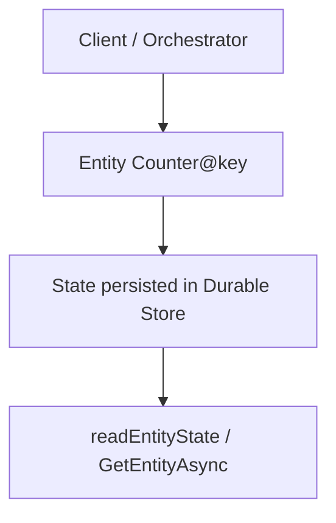

---
content_sources:
  references:
    - type: mslearn-adapted
      url: https://learn.microsoft.com/en-us/azure/azure-functions/durable/durable-functions-entities
  diagrams:
    - id: durable-entities
      type: flowchart
      source: self-generated
      justification: Flow view of durable entities, synthesized from Microsoft Learn documentation cited on this page.
      based_on:
        - https://learn.microsoft.com/en-us/azure/azure-functions/durable/durable-functions-entities
        - https://learn.microsoft.com/en-us/azure/azure-functions/dotnet-isolated-process-guide
---
# Durable Entities

Manage small pieces of explicit, addressable state with Durable Entities in the .NET isolated worker model. Each entity processes its operations serially, so no locks are needed.

<!-- diagram-id: durable-entities -->


## Topic/Command Groups

### Class-based entity

`TaskEntity<TState>` maps class methods to operations. `State` is the persisted value.

```csharp
public class Counter : TaskEntity<int>
{
    public void Add(int amount) => this.State += amount;
    public void Reset() => this.State = 0;
    public int Get() => this.State;

    [Function(nameof(Counter))]
    public Task RunEntityAsync([EntityTrigger] TaskEntityDispatcher dispatcher)
        => dispatcher.DispatchAsync(this);
}
```

### Signal an entity from a client function

Signaling is one-way (fire-and-forget). Client functions can signal and read state, but cannot call for a return value.

```csharp
[Function("AddFromQueue")]
public Task Run(
    [QueueTrigger("counter-ops")] string input,
    [DurableClient] DurableTaskClient client)
{
    var entityId = new EntityInstanceId(nameof(Counter), "myCounter");
    int amount = int.Parse(input);
    return client.Entities.SignalEntityAsync(entityId, nameof(Counter.Add), amount);
}
```

### Read entity state from a client function

```csharp
[Function("QueryCounter")]
public static async Task<HttpResponseData> QueryCounter(
    [HttpTrigger(AuthorizationLevel.Function, "get", Route = "counter/{key}")] HttpRequestData req,
    [DurableClient] DurableTaskClient client,
    string key)
{
    var entityId = new EntityInstanceId(nameof(Counter), key);
    EntityMetadata<int>? entity = await client.Entities.GetEntityAsync<int>(entityId);

    if (entity is null)
    {
        return req.CreateResponse(HttpStatusCode.NotFound);
    }

    var response = req.CreateResponse(HttpStatusCode.OK);
    await response.WriteAsJsonAsync(entity);
    return response;
}
```

### Call and signal from an orchestrator

Orchestrators can both call (two-way) and signal (one-way) entities.

```csharp
[Function("CounterOrchestration")]
public static async Task<int> Run([OrchestrationTrigger] TaskOrchestrationContext context)
{
    var entityId = new EntityInstanceId(nameof(Counter), "myCounter");

    // Two-way call: read the committed value and wait for the response.
    int currentValue = await context.Entities.CallEntityAsync<int>(entityId, nameof(Counter.Get));

    if (currentValue < 10)
    {
        // One-way signal: update the value without waiting.
        await context.Entities.SignalEntityAsync(entityId, nameof(Counter.Add), 1);
    }

    return currentValue;
}
```

## Review Matrix

| Review area | Page-specific check |
|---|---|
| Scope | Confirm the guidance applies to Durable Entities in the isolated worker model. |
| Source basis | Validate the recommendation against the Microsoft Learn sources in this page. |
| Evidence | Capture command output, portal state, metrics, logs, or screenshots before treating the result as proven. |

## See Also
- [Durable Orchestration](durable-orchestration.md)
- [.NET Language Guide](../index.md)
- [Troubleshooting](../troubleshooting.md)

## Sources
- [Durable entities (Microsoft Learn)](https://learn.microsoft.com/en-us/azure/azure-functions/durable/durable-functions-entities)
- [Azure Functions .NET isolated worker guide](https://learn.microsoft.com/en-us/azure/azure-functions/dotnet-isolated-process-guide)
