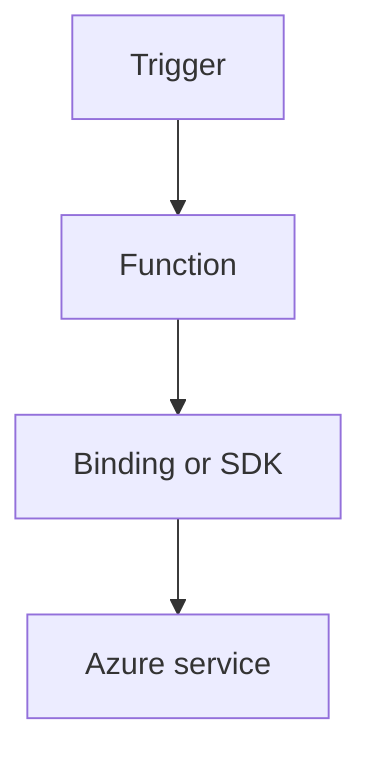

---
content_sources:

  references:
    - type: mslearn-adapted
      url: https://learn.microsoft.com/en-us/azure/azure-functions/dotnet-isolated-process-guide
    - type: mslearn-adapted
      url: https://learn.microsoft.com/en-us/azure/azure-functions/functions-triggers-bindings
  diagrams:
    - id: durable-orchestration
      type: flowchart
      source: self-generated
      justification: Flow view of durable orchestration, synthesized from Microsoft Learn documentation cited on this page.
      based_on:
        - https://learn.microsoft.com/en-us/azure/azure-functions/dotnet-isolated-process-guide
        - https://learn.microsoft.com/en-us/azure/azure-functions/functions-triggers-bindings
---
# Durable Orchestration

Coordinate long-running workflows with Durable Functions in .NET isolated worker.

<!-- diagram-id: durable-orchestration -->


## Topic/Command Groups

### Orchestrator skeleton
```csharp
[Function("OrderOrchestrator")]
public async Task<string> RunOrchestrator(
    [OrchestrationTrigger] TaskOrchestrationContext context)
{
    var id = context.GetInput<string>();
    await context.CallActivityAsync("ReserveInventory", id);
    await context.CallActivityAsync("ChargePayment", id);
    return "completed";
}
```

### HTTP starter
```csharp
[Function("StartOrder")]
public async Task<HttpResponseData> StartOrder(
    [HttpTrigger(AuthorizationLevel.Function, "post", Route = "orders/start")] HttpRequestData req,
    [DurableClient] DurableTaskClient client)
{
    string instanceId = await client.ScheduleNewOrchestrationInstanceAsync("OrderOrchestrator");
    return await client.CreateCheckStatusResponseAsync(req, instanceId);
}
```

## Review Matrix

| Review area | Page-specific check |
|---|---|
| Scope | Confirm the guidance applies to Durable Orchestration. |
| Source basis | Validate the recommendation against the Microsoft Learn sources in this page. |
| Evidence | Capture command output, portal state, metrics, logs, or screenshots before treating the result as proven. |

## See Also
- [Recipes Index](index.md)
- [.NET Language Guide](../index.md)
- [Troubleshooting](../troubleshooting.md)

## Sources
- [Azure Functions .NET isolated worker guide](https://learn.microsoft.com/en-us/azure/azure-functions/dotnet-isolated-process-guide)
- [Azure Functions triggers and bindings](https://learn.microsoft.com/en-us/azure/azure-functions/functions-triggers-bindings)
