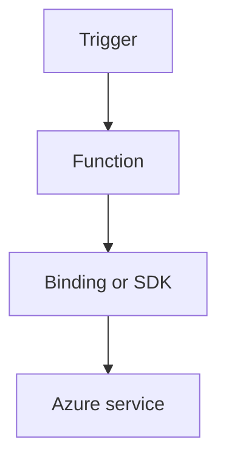

---
content_sources:
- type: mslearn-adapted
  url: https://learn.microsoft.com/azure/azure-functions/dotnet-isolated-process-guide
- type: mslearn-adapted
  url: https://learn.microsoft.com/azure/azure-functions/functions-triggers-bindings
content_validation:
  status: verified
  last_reviewed: '2026-05-23'
  reviewer: agent
  core_claims:
  - claim: This page uses Microsoft Learn as the primary source basis for its Azure-specific
      guidance.
    source: https://learn.microsoft.com/azure/azure-functions/dotnet-isolated-process-guide
    verified: true
---
# Event Grid

Subscribe to Event Grid events and route them into isolated worker handlers.

<!-- diagram-id: event-grid -->


## Topic/Command Groups

### Event Grid trigger
```csharp
[Function("BlobCreatedEvent")]
public void BlobCreatedEvent([EventGridTrigger] BinaryData eventData)
{
}
```

### Subscription setup
```bash
az eventgrid event-subscription create   --name "sub-func-events"   --source-resource-id "<source-resource-id>"   --endpoint-type azurefunction   --endpoint "/subscriptions/<subscription-id>/resourceGroups/$RG/providers/Microsoft.Web/sites/$APP_NAME/functions/BlobCreatedEvent"
```

| CLI element | Explanation |
|---|---|
| Command(s) | `az eventgrid event-subscription create` |
| Key flags | `--name`, `--source-resource-id`, `--endpoint-type`, `--endpoint` |
| Variables | `$RG`, `$APP_NAME` |
| Expected result | Azure CLI returns provisioning details; confirm the resource name and successful provisioning state before continuing. |


## See Also
- [Recipes Index](index.md)
- [.NET Language Guide](../index.md)
- [Troubleshooting](../troubleshooting.md)

## Sources
- [Azure Functions .NET isolated worker guide](https://learn.microsoft.com/azure/azure-functions/dotnet-isolated-process-guide)
- [Azure Functions triggers and bindings](https://learn.microsoft.com/azure/azure-functions/functions-triggers-bindings)
