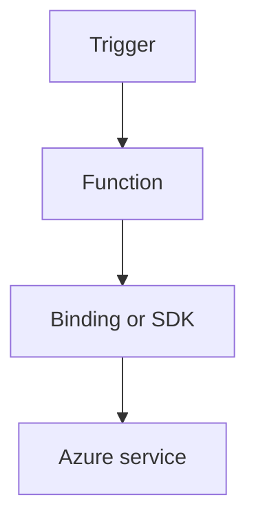

---
content_sources:

  references:
    - type: mslearn-adapted
      url: https://learn.microsoft.com/en-us/azure/azure-functions/dotnet-isolated-process-guide
    - type: mslearn-adapted
      url: https://learn.microsoft.com/en-us/azure/azure-functions/functions-triggers-bindings
  diagrams:
    - id: event-grid
      type: flowchart
      source: self-generated
      justification: Flow view of event grid, synthesized from Microsoft Learn documentation cited on this page.
      based_on:
        - https://learn.microsoft.com/en-us/azure/azure-functions/dotnet-isolated-process-guide
        - https://learn.microsoft.com/en-us/azure/azure-functions/functions-triggers-bindings
---
# Event Grid

Subscribe to Event Grid events and route them into isolated worker handlers.

<!-- diagram-id: event-grid -->


## Topic/Command Groups

### Event Grid trigger
```csharp
[Function("BlobCreatedEvent")]
public void BlobCreatedEvent([EventGridTrigger] BinaryData eventData)
{
}
```

### Subscription setup
```bash
az eventgrid event-subscription create   --name "sub-func-events"   --source-resource-id "<source-resource-id>"   --endpoint-type azurefunction   --endpoint "/subscriptions/<subscription-id>/resourceGroups/$RG/providers/Microsoft.Web/sites/$APP_NAME/functions/BlobCreatedEvent"
```

| CLI element | Explanation |
|---|---|
| Command(s) | `az eventgrid event-subscription create` |
| Key flags | `--name`, `--source-resource-id`, `--endpoint-type`, `--endpoint` |
| Variables | `$RG`, `$APP_NAME` |
| Expected result | Azure CLI returns provisioning details; confirm the resource name and successful provisioning state before continuing. |

### Event Grid output (publish to a custom topic)

Use the `EventGridOutput` attribute to publish events to a custom topic. The attribute reads the topic endpoint and access key from app settings; never hard-code the topic URI. For a single event, return a JSON-serializable type:

```csharp
public class PublishFunction
{
    [Function(nameof(PublishFunction))]
    [EventGridOutput(TopicEndpointUri = "MyEventGridTopicUriSetting", TopicKeySetting = "MyEventGridTopicKeySetting")]
    public MyEvent Run([TimerTrigger("0 */5 * * * *")] TimerInfo timer)
    {
        return new MyEvent
        {
            Id = "unique-id",
            Subject = "orders/created",
            EventType = "Contoso.Order.Created",
            EventTime = DateTime.UtcNow,
            Data = new Dictionary<string, object> { { "orderId", 12345 } },
        };
    }
}
```

To publish multiple events, return an array of the event type. For CloudEvents 1.0 output or advanced scenarios (batching, custom schema), register an `EventGridPublisherClient` from `Azure.Messaging.EventGrid` via dependency injection instead of the output binding.

```bash
az functionapp config appsettings set \
  --name $APP_NAME \
  --resource-group $RG \
  --settings "MyEventGridTopicUriSetting=$TOPIC_ENDPOINT" "MyEventGridTopicKeySetting=$TOPIC_KEY"
```

| CLI element | Explanation |
|---|---|
| Command(s) | `az functionapp config appsettings set` |
| Key flags | `--name`, `--resource-group`, `--settings` |
| Variables | `$APP_NAME`, `$RG`, `$TOPIC_ENDPOINT`, `$TOPIC_KEY` |
| Expected result | Azure CLI returns the updated app settings as JSON; confirm both settings are present before continuing. |

## See Also
- [Recipes Index](index.md)
- [.NET Language Guide](../index.md)
- [Troubleshooting](../troubleshooting.md)

## Sources
- [Azure Functions .NET isolated worker guide](https://learn.microsoft.com/en-us/azure/azure-functions/dotnet-isolated-process-guide)
- [Azure Functions triggers and bindings](https://learn.microsoft.com/en-us/azure/azure-functions/functions-triggers-bindings)
- [Event Grid output binding for Azure Functions (Microsoft Learn)](https://learn.microsoft.com/en-us/azure/azure-functions/functions-bindings-event-grid-output)
