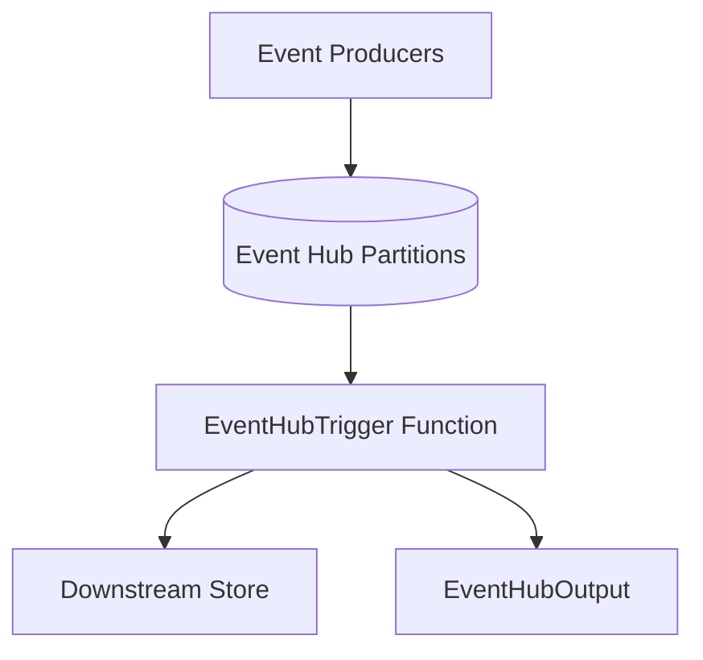

---
content_sources:
  references:
    - type: mslearn-adapted
      url: https://learn.microsoft.com/en-us/azure/azure-functions/functions-bindings-event-hubs
  diagrams:
    - id: event-hub
      type: flowchart
      source: self-generated
      justification: Flow view of event-hub, synthesized from Microsoft Learn documentation cited on this page.
      based_on:
        - https://learn.microsoft.com/en-us/azure/azure-functions/functions-bindings-event-hubs
        - https://learn.microsoft.com/en-us/azure/azure-functions/functions-bindings-event-hubs-trigger
---
# Event Hubs

Consume high-throughput event streams with the Event Hubs trigger and publish events with the output binding in the .NET isolated worker model.

<!-- diagram-id: event-hub -->


## Topic/Command Groups

### Batch trigger + output binding

Delivering an array of events per invocation maximizes throughput. Keep the handler idempotent because delivery is at-least-once.

```csharp
[Function("ProcessTelemetry")]
[EventHubOutput("downstream", Connection = "EventHubConnection")]
public string[] ProcessTelemetry(
    [EventHubTrigger("telemetry", Connection = "EventHubConnection",
        ConsumerGroup = "$Default")] string[] events,
    FunctionContext context)
{
    var logger = context.GetLogger("ProcessTelemetry");
    logger.LogInformation("Batch size: {Count}", events.Length);

    foreach (var evt in events)
    {
        // Keep processing idempotent.
        logger.LogInformation("Processing event: {Event}", evt);
    }

    return events;
}
```

### Identity-based connection

Use a setting prefix with `__fullyQualifiedNamespace` and grant the managed identity the **Azure Event Hubs Data Receiver** (and **Data Sender** for output) role:

```bash
az functionapp config appsettings set \
  --name $APP_NAME \
  --resource-group $RG \
  --settings "EventHubConnection__fullyQualifiedNamespace=$NAMESPACE.servicebus.windows.net"
```

### Host settings and checkpointing

```json
{
  "version": "2.0",
  "extensions": {
    "eventHubs": {
      "maxEventBatchSize": 100,
      "batchCheckpointFrequency": 1,
      "prefetchCount": 300
    }
  }
}
```

## Review Matrix

| Review area | Page-specific check |
|---|---|
| Scope | Confirm the guidance applies to Event Hubs trigger and output bindings. |
| Source basis | Validate the recommendation against the Microsoft Learn sources in this page. |
| Evidence | Capture command output, portal state, metrics, logs, or screenshots before treating the result as proven. |

## See Also
- [Recipes Index](index.md)
- [.NET Language Guide](../index.md)
- [Troubleshooting](../troubleshooting.md)

## Sources
- [Azure Event Hubs bindings for Azure Functions (Microsoft Learn)](https://learn.microsoft.com/en-us/azure/azure-functions/functions-bindings-event-hubs)
- [Azure Event Hubs trigger for Azure Functions (Microsoft Learn)](https://learn.microsoft.com/en-us/azure/azure-functions/functions-bindings-event-hubs-trigger)
- [Azure Event Hubs output binding for Azure Functions (Microsoft Learn)](https://learn.microsoft.com/en-us/azure/azure-functions/functions-bindings-event-hubs-output)
