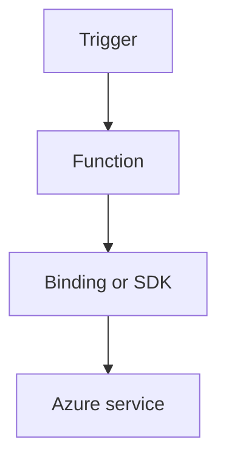

---
content_sources:

  references:
    - type: mslearn-adapted
      url: https://learn.microsoft.com/en-us/azure/azure-functions/dotnet-isolated-process-guide
    - type: mslearn-adapted
      url: https://learn.microsoft.com/en-us/azure/azure-functions/functions-triggers-bindings
  diagrams:
    - id: http-api-patterns
      type: flowchart
      source: self-generated
      justification: Flow view of http api patterns, synthesized from Microsoft Learn documentation cited on this page.
      based_on:
        - https://learn.microsoft.com/en-us/azure/azure-functions/dotnet-isolated-process-guide
        - https://learn.microsoft.com/en-us/azure/azure-functions/functions-triggers-bindings
---
# HTTP API Patterns

Build robust HTTP APIs with `HttpRequestData` and `HttpResponseData` in .NET isolated worker.

<!-- diagram-id: http-api-patterns -->


## Topic/Command Groups

### Route templates and verbs
```csharp
[Function("GetOrder")]
public async Task<HttpResponseData> GetOrder(
    [HttpTrigger(AuthorizationLevel.Function, "get", Route = "orders/{id}")] HttpRequestData req,
    string id)
{
    var response = req.CreateResponse(HttpStatusCode.OK);
    await response.WriteAsJsonAsync(new { id });
    return response;
}
```

### Request body handling
```csharp
using System.Text.Json;

var payload = await JsonSerializer.DeserializeAsync<CreateOrderRequest>(req.Body);
```

### Response envelope pattern
```csharp
var response = req.CreateResponse(HttpStatusCode.Created);
await response.WriteAsJsonAsync(new { orderId = "ord-1001", status = "created" });
return response;
```

## Review Matrix

| Review area | Page-specific check |
|---|---|
| Scope | Confirm the guidance applies to HTTP API Patterns. |
| Source basis | Validate the recommendation against the Microsoft Learn sources in this page. |
| Evidence | Capture command output, portal state, metrics, logs, or screenshots before treating the result as proven. |

## See Also
- [Recipes Index](index.md)
- [.NET Language Guide](../index.md)
- [Troubleshooting](../troubleshooting.md)

## Sources
- [Azure Functions .NET isolated worker guide](https://learn.microsoft.com/en-us/azure/azure-functions/dotnet-isolated-process-guide)
- [Azure Functions triggers and bindings](https://learn.microsoft.com/en-us/azure/azure-functions/functions-triggers-bindings)
