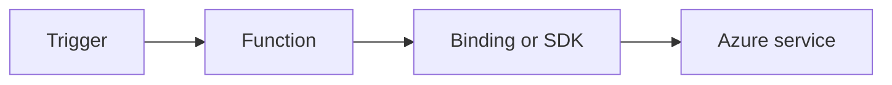

# HTTP API Patterns

Build robust HTTP APIs with `HttpRequestData` and `HttpResponseData` in .NET isolated worker.



## Topic/Command Groups

### Route templates and verbs
```csharp
[Function("GetOrder")]
public HttpResponseData GetOrder(
    [HttpTrigger(AuthorizationLevel.Function, "get", Route = "orders/{id}")] HttpRequestData req,
    string id)
{
    var response = req.CreateResponse(HttpStatusCode.OK);
    response.WriteString($"{"id":"{id}"}");
    return response;
}
```

### Request body handling
```csharp
using System.Text.Json;

var payload = await JsonSerializer.DeserializeAsync<CreateOrderRequest>(req.Body);
```

### Response envelope pattern
```csharp
var response = req.CreateResponse(HttpStatusCode.Created);
await response.WriteAsJsonAsync(new { orderId = "ord-1001", status = "created" });
return response;
```

## See Also
- [Recipes Index](index.md)
- [.NET Language Guide](../index.md)
- [Troubleshooting](../troubleshooting.md)

## Sources
- [Azure Functions .NET isolated worker guide](https://learn.microsoft.com/azure/azure-functions/dotnet-isolated-process-guide)
- [Azure Functions triggers and bindings](https://learn.microsoft.com/azure/azure-functions/functions-triggers-bindings)
