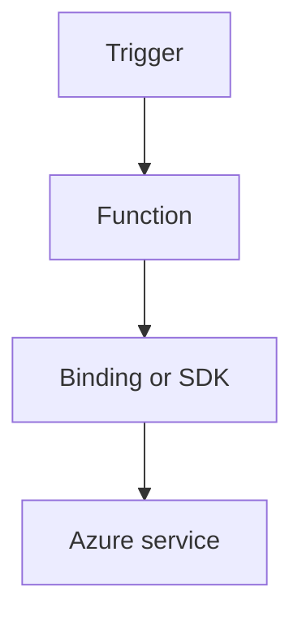

---
content_sources:

- type: mslearn-adapted
  url: https://learn.microsoft.com/azure/azure-functions/dotnet-isolated-process-guide
- type: mslearn-adapted
  url: https://learn.microsoft.com/azure/azure-functions/functions-triggers-bindings
content_validation:
  status: verified
  last_reviewed: '2026-05-23'
  reviewer: agent
  core_claims:
  - claim: This page uses Microsoft Learn as the primary source basis for its Azure-specific
      guidance.
    source: https://learn.microsoft.com/azure/azure-functions/dotnet-isolated-process-guide
    verified: true
---
# HTTP Authentication

Apply API auth patterns for .NET isolated worker with function keys, Easy Auth, and token validation.

<!-- diagram-id: http-authentication -->


## Topic/Command Groups

### Function-level auth
```csharp
[Function("SecureEndpoint")]
public HttpResponseData SecureEndpoint(
    [HttpTrigger(AuthorizationLevel.Function, "get", Route = "secure")] HttpRequestData req)
{
    var response = req.CreateResponse(HttpStatusCode.OK);
    response.WriteString("authorized");
    return response;
}
```

### Enable app-level authentication
```bash
az webapp auth config-version upgrade --name "$APP_NAME" --resource-group "$RG"
az webapp auth update --name "$APP_NAME" --resource-group "$RG" --enabled true
```

| CLI element | Explanation |
|---|---|
| Command(s) | `az webapp auth config-version upgrade`, `az webapp auth update` |
| Key flags | `--name`, `--resource-group`, `--enabled` |
| Variables | `$APP_NAME`, `$RG` |
| Expected result | Azure CLI applies the configuration change; confirm the returned JSON or follow-up query shows the expected value. |


### Validate JWT claims in code (ASP.NET Core integration)
```csharp
var principal = HttpContext.User;
```

### Validate JWT claims in code (basic isolated worker)
```csharp
using System.Text;
using System.Text.Json;

if (req.Headers.TryGetValues("x-ms-client-principal", out var values))
{
    var encoded = string.Join(string.Empty, values);
    if (!string.IsNullOrEmpty(encoded))
    {
        var json = Encoding.UTF8.GetString(Convert.FromBase64String(encoded));
        var principal = JsonSerializer.Deserialize<ClientPrincipal>(json);
    }
}
```

## See Also
- [Recipes Index](index.md)
- [.NET Language Guide](../index.md)
- [Troubleshooting](../troubleshooting.md)

## Sources
- [Azure Functions .NET isolated worker guide](https://learn.microsoft.com/azure/azure-functions/dotnet-isolated-process-guide)
- [Azure Functions triggers and bindings](https://learn.microsoft.com/azure/azure-functions/functions-triggers-bindings)
