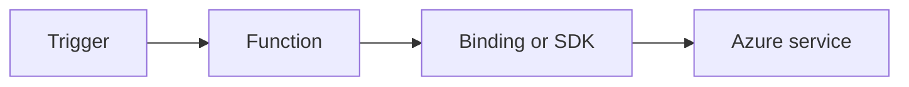

# HTTP Authentication

Apply API auth patterns for .NET isolated worker with function keys, Easy Auth, and token validation.



## Topic/Command Groups

### Function-level auth
```csharp
[Function("SecureEndpoint")]
public HttpResponseData SecureEndpoint(
    [HttpTrigger(AuthorizationLevel.Function, "get", Route = "secure")] HttpRequestData req)
{
    var response = req.CreateResponse(HttpStatusCode.OK);
    response.WriteString("authorized");
    return response;
}
```

### Enable app-level authentication
```bash
az functionapp auth set   --name "$APP_NAME"   --resource-group "$RG"   --enabled true
```

### Validate JWT claims in code
```csharp
var principal = req.FunctionContext.Features.Get<System.Security.Claims.ClaimsPrincipal>();
```

## See Also
- [Recipes Index](index.md)
- [.NET Language Guide](../index.md)
- [Troubleshooting](../troubleshooting.md)

## Sources
- [Azure Functions .NET isolated worker guide](https://learn.microsoft.com/azure/azure-functions/dotnet-isolated-process-guide)
- [Azure Functions triggers and bindings](https://learn.microsoft.com/azure/azure-functions/functions-triggers-bindings)
