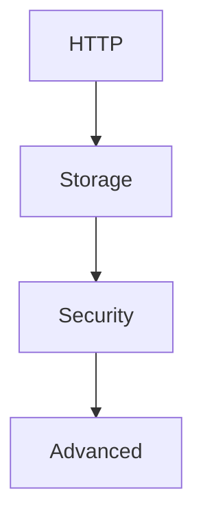

---
content_sources:

  references:
    - type: mslearn-adapted
      url: https://learn.microsoft.com/en-us/azure/azure-functions/functions-dotnet-class-library
  diagrams:
    - id: recipe-categories
      type: flowchart
      source: self-generated
      justification: Flow view of recipe categories, synthesized from Microsoft Learn documentation cited on this page.
      based_on:
        - https://learn.microsoft.com/en-us/azure/azure-functions/functions-dotnet-class-library
---
# .NET Recipes

Implementation-focused patterns for .NET isolated worker Azure Functions.

## Recipe Categories

<!-- diagram-id: recipe-categories -->

### HTTP
| Recipe | Description |
|--------|-------------|
| [HTTP API Patterns](http-api.md) | Route, request, response, and validation patterns. |
| [HTTP Authentication](http-auth.md) | Function keys, platform auth, and token validation. |
| [OpenAPI and Swagger](openapi.md) | Auto-generating OpenAPI docs and Swagger UI with the isolated worker OpenAPI extension. |

### Storage
| Recipe | Description |
|--------|-------------|
| [Cosmos DB](cosmosdb.md) | Input and output binding usage in isolated worker. |
| [Blob Storage](blob-storage.md) | Blob trigger and blob output handling. |
| [Queue](queue.md) | Queue trigger, poison message, and output binding pattern. |
| [Table Storage](table-storage.md) | Table input and output binding usage in isolated worker. |

### Security
| Recipe | Description |
|--------|-------------|
| [Key Vault](key-vault.md) | Secrets retrieval with managed identity. |
| [Managed Identity](managed-identity.md) | Passwordless access patterns to Azure services. |
| [Custom Domain and Certificates](custom-domain-certificates.md) | HTTPS endpoint hardening for function apps. |

### Advanced
| Recipe | Description |
|--------|-------------|
| [Timer](timer.md) | Cron schedules and idempotent scheduled jobs. |
| [Durable Orchestration](durable-orchestration.md) | Stateful workflows and fan-out/fan-in. |
| [Durable Entities](durable-entities.md) | Stateful, addressable per-key state (actor-style) with serialized operations. |
| [Durable Advanced](durable-advanced.md) | Sub-orchestrations, eternal orchestrations, activity retries, and versioning. |
| [Event Grid](event-grid.md) | Event-driven integration patterns. |
| [Event Hubs](event-hub.md) | High-throughput event stream consumption with batch trigger and output binding. |
| [Service Bus](service-bus.md) | Enterprise messaging with queue/topic triggers, dead-lettering, and output binding. |
| [SignalR Service](signalr.md) | Real-time messaging via the negotiate endpoint and output binding. |
| [Dependency Injection](dependency-injection.md) | Registering services and constructor injection in the isolated worker container. |
| [Retry Policies](retry.md) | Runtime retry policies (fixed delay, exponential backoff) for Timer, Event Hubs, and Cosmos DB triggers. |
| [Middleware](middleware.md) | Cross-cutting behavior with the isolated worker `IFunctionsWorkerMiddleware` pipeline. |
| [Unit Testing](testing.md) | Host-free unit testing with xUnit, constructor injection, and Moq. |
| [Migrate to Isolated](migrate-to-isolated.md) | Migrating a .NET in-process app to the isolated worker model before the in-process retirement. |

## See Also
- [.NET Language Guide](../index.md)
- [Tutorial Overview](../tutorial/index.md)
- [Troubleshooting](../troubleshooting.md)

## Sources
- [Azure Functions .NET developer guide](https://learn.microsoft.com/en-us/azure/azure-functions/functions-dotnet-class-library)
