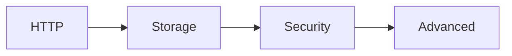

# .NET Recipes

Implementation-focused patterns for .NET isolated worker Azure Functions.

## Recipe Categories

### HTTP
| Recipe | Description |
|--------|-------------|
| [HTTP API Patterns](http-api.md) | Route, request, response, and validation patterns. |
| [HTTP Authentication](http-auth.md) | Function keys, platform auth, and token validation. |

### Storage
| Recipe | Description |
|--------|-------------|
| [Cosmos DB](cosmosdb.md) | Input and output binding usage in isolated worker. |
| [Blob Storage](blob-storage.md) | Blob trigger and blob output handling. |
| [Queue](queue.md) | Queue trigger, poison message, and output binding pattern. |

### Security
| Recipe | Description |
|--------|-------------|
| [Key Vault](key-vault.md) | Secrets retrieval with managed identity. |
| [Managed Identity](managed-identity.md) | Passwordless access patterns to Azure services. |
| [Custom Domain and Certificates](custom-domain-certificates.md) | HTTPS endpoint hardening for function apps. |

### Advanced
| Recipe | Description |
|--------|-------------|
| [Timer](timer.md) | Cron schedules and idempotent scheduled jobs. |
| [Durable Orchestration](durable-orchestration.md) | Stateful workflows and fan-out/fan-in. |
| [Event Grid](event-grid.md) | Event-driven integration patterns. |

## See Also
- [.NET Language Guide](../index.md)
- [Tutorial Overview](../tutorial/index.md)
- [Troubleshooting](../troubleshooting.md)

## Sources
- [Azure Functions .NET developer guide](https://learn.microsoft.com/azure/azure-functions/functions-dotnet-class-library)
