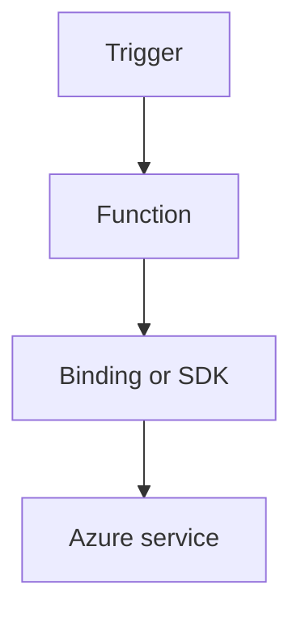

---
content_sources:
- type: mslearn-adapted
  url: https://learn.microsoft.com/azure/azure-functions/dotnet-isolated-process-guide
- type: mslearn-adapted
  url: https://learn.microsoft.com/azure/azure-functions/functions-triggers-bindings
content_validation:
  status: verified
  last_reviewed: '2026-05-23'
  reviewer: agent
  core_claims:
  - claim: This page uses Microsoft Learn as the primary source basis for its Azure-specific
      guidance.
    source: https://learn.microsoft.com/azure/azure-functions/dotnet-isolated-process-guide
    verified: true
---
# Key Vault

Access Key Vault secrets from functions with managed identity and least-privilege role assignments.

<!-- diagram-id: key-vault -->


## Topic/Command Groups

### Assign identity and role
```bash
az functionapp identity assign --name "$APP_NAME" --resource-group "$RG"
az role assignment create   --assignee-object-id "<object-id>"   --role "Key Vault Secrets User"   --scope "/subscriptions/<subscription-id>/resourceGroups/$RG/providers/Microsoft.KeyVault/vaults/$KEYVAULT_NAME"
```

| CLI element | Explanation |
|---|---|
| Command(s) | `az functionapp identity assign`, `az role assignment create` |
| Key flags | `--name`, `--resource-group`, `--assignee-object-id`, `--role`, `--scope` |
| Variables | `$APP_NAME`, `$RG`, `$KEYVAULT_NAME` |
| Expected result | Azure CLI returns provisioning details; confirm the resource name and successful provisioning state before continuing. |


### Read secret from function
```csharp
var client = new SecretClient(new Uri(keyVaultUrl), new DefaultAzureCredential());
var response = await client.GetSecretAsync("DbPassword");
var secretValue = response.Value.Value;
```

## See Also
- [Recipes Index](index.md)
- [.NET Language Guide](../index.md)
- [Troubleshooting](../troubleshooting.md)

## Sources
- [Azure Functions .NET isolated worker guide](https://learn.microsoft.com/azure/azure-functions/dotnet-isolated-process-guide)
- [Azure Functions triggers and bindings](https://learn.microsoft.com/azure/azure-functions/functions-triggers-bindings)
