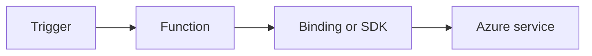

# Key Vault

Access Key Vault secrets from functions with managed identity and least-privilege role assignments.



## Topic/Command Groups

### Assign identity and role
```bash
az functionapp identity assign --name "$APP_NAME" --resource-group "$RG"
az role assignment create   --assignee-object-id "<object-id>"   --role "Key Vault Secrets User"   --scope "/subscriptions/<subscription-id>/resourceGroups/$RG/providers/Microsoft.KeyVault/vaults/$KEYVAULT_NAME"
```

### Read secret from function
```csharp
var client = new SecretClient(new Uri(keyVaultUrl), new DefaultAzureCredential());
KeyVaultSecret secret = await client.GetSecretAsync("DbPassword");
```

## See Also
- [Recipes Index](index.md)
- [.NET Language Guide](../index.md)
- [Troubleshooting](../troubleshooting.md)

## Sources
- [Azure Functions .NET isolated worker guide](https://learn.microsoft.com/azure/azure-functions/dotnet-isolated-process-guide)
- [Azure Functions triggers and bindings](https://learn.microsoft.com/azure/azure-functions/functions-triggers-bindings)
