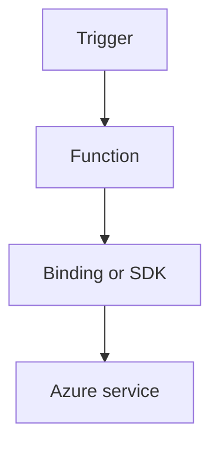
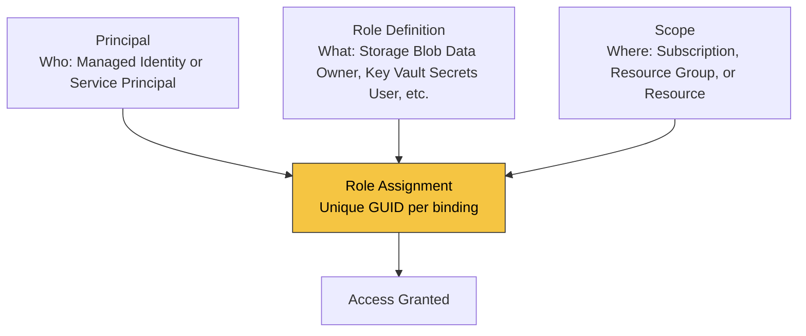

---
content_sources:
  - type: mslearn-adapted
    url: https://learn.microsoft.com/azure/azure-functions/dotnet-isolated-process-guide
  - type: mslearn-adapted
    url: https://learn.microsoft.com/azure/azure-functions/functions-triggers-bindings
---

# Managed Identity

Use system-assigned managed identity for passwordless access to Azure resources from functions.

<!-- diagram-id: managed-identity -->


## How RBAC Connects Identity to Resources

A managed identity alone does not grant access. Azure RBAC binds three elements into a **role assignment**:

<!-- diagram-id: rbac-structure -->


| Element | Question it answers | Example |
|---|---|---|
| **Principal** | Who needs access? | Function app's managed identity |
| **Role Definition** | What permission? | `Storage Blob Data Owner`, `Key Vault Secrets User` |
| **Scope** | On which resource? | A specific Storage account, Key Vault, or resource group |
| **Role Assignment** | The binding itself | Unique GUID — one per (principal + role + scope) combination |

Azure RBAC enforces a uniqueness constraint: only one role assignment can exist for the same `(principal, role definition, scope)` triple. Attempting to create a duplicate with a different assignment GUID results in a `RoleAssignmentExists` conflict.

## Topic/Command Groups

### Enable identity
```bash
az functionapp identity assign   --name "$APP_NAME"   --resource-group "$RG"
```

### Access Storage SDK with DefaultAzureCredential
```csharp
var credential = new DefaultAzureCredential();
var blobService = new BlobServiceClient(new Uri($"https://{storageName}.blob.core.windows.net"), credential);
```

## See Also
- [Recipes Index](index.md)
- [.NET Language Guide](../index.md)
- [Troubleshooting](../troubleshooting.md)

## Sources
- [Azure Functions .NET isolated worker guide](https://learn.microsoft.com/azure/azure-functions/dotnet-isolated-process-guide)
- [Azure Functions triggers and bindings](https://learn.microsoft.com/azure/azure-functions/functions-triggers-bindings)
