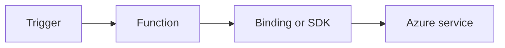

# Managed Identity

Use system-assigned managed identity for passwordless access to Azure resources from functions.



## Topic/Command Groups

### Enable identity
```bash
az functionapp identity assign   --name "$APP_NAME"   --resource-group "$RG"
```

### Access Storage SDK with DefaultAzureCredential
```csharp
var credential = new DefaultAzureCredential();
var blobService = new BlobServiceClient(new Uri($"https://{storageName}.blob.core.windows.net"), credential);
```

## See Also
- [Recipes Index](index.md)
- [.NET Language Guide](../index.md)
- [Troubleshooting](../troubleshooting.md)

## Sources
- [Azure Functions .NET isolated worker guide](https://learn.microsoft.com/azure/azure-functions/dotnet-isolated-process-guide)
- [Azure Functions triggers and bindings](https://learn.microsoft.com/azure/azure-functions/functions-triggers-bindings)
