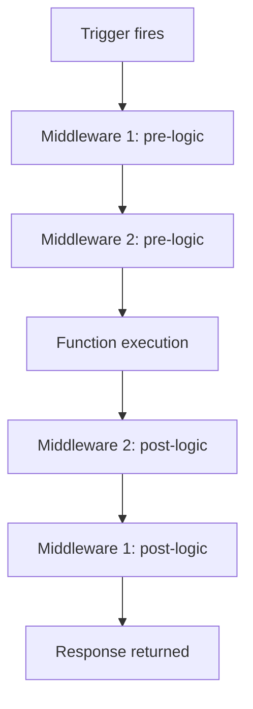

---
content_sources:
  references:
    - type: mslearn-adapted
      url: https://learn.microsoft.com/en-us/azure/azure-functions/dotnet-isolated-process-guide
  diagrams:
    - id: architecture
      type: flowchart
      source: self-generated
      justification: Flow view of architecture, synthesized from Microsoft Learn documentation cited on this page.
      based_on:
        - https://learn.microsoft.com/en-us/azure/azure-functions/dotnet-isolated-process-guide
---
# Middleware

The .NET isolated worker model has a first-class middleware pipeline. Middleware runs on every function invocation, wrapping the execution so you can add cross-cutting behavior — logging, authentication, exception handling, or response header stamping — in one place instead of repeating it in every function.

## Prerequisites

- A .NET isolated worker Function App (`Microsoft.Azure.Functions.Worker.Sdk` 1.9.0 or later).
- The app configured with `FunctionsApplication.CreateBuilder` or `HostBuilder` in `Program.cs`.

## Architecture

<!-- diagram-id: architecture -->


## Implement a Middleware

Middleware implements `IFunctionsWorkerMiddleware` from the `Microsoft.Azure.Functions.Worker.Middleware` namespace. Call `next` to continue the pipeline; code before `next` runs on the way in, code after `next` runs on the way out.

```csharp
using Microsoft.Azure.Functions.Worker;
using Microsoft.Azure.Functions.Worker.Middleware;
using Microsoft.Extensions.Logging;

public sealed class ExceptionLoggingMiddleware : IFunctionsWorkerMiddleware
{
    private readonly ILogger<ExceptionLoggingMiddleware> _logger;

    public ExceptionLoggingMiddleware(ILogger<ExceptionLoggingMiddleware> logger)
    {
        _logger = logger;
    }

    public async Task Invoke(FunctionContext context, FunctionExecutionDelegate next)
    {
        _logger.LogInformation("Executing {Function}", context.FunctionDefinition.Name);
        try
        {
            await next(context);
        }
        catch (Exception ex)
        {
            _logger.LogError(ex, "Unhandled error in {Function}", context.FunctionDefinition.Name);
            throw;
        }
    }
}
```

Constructor injection works because middleware is resolved from the DI container. See [Dependency Injection](dependency-injection.md).

## Register the Pipeline

Register middleware in `Program.cs`. Order matters — the first registered runs outermost.

```csharp
using Microsoft.Azure.Functions.Worker;
using Microsoft.Extensions.Hosting;

var host = new HostBuilder()
    .ConfigureFunctionsWorkerDefaults(builder =>
    {
        builder.UseMiddleware<ExceptionLoggingMiddleware>();
        builder.UseMiddleware<StampHeadersMiddleware>();
    })
    .Build();

host.Run();
```

## Conditional Middleware

Use `UseWhen` to run middleware only when a predicate over the `FunctionContext` is true — for example, only for HTTP-triggered functions.

```csharp
builder.UseWhen<StampHeadersMiddleware>((context) =>
{
    // Run only when the function has an HTTP trigger.
    return context.FunctionDefinition.InputBindings.Values
        .Any(b => b.Type == "httpTrigger");
});
```

## Access the HTTP Request and Response

Inside middleware you can read the HTTP request and write to the response through the invocation context.

```csharp
public async Task Invoke(FunctionContext context, FunctionExecutionDelegate next)
{
    await next(context);

    var httpResponse = context.GetHttpResponseData();
    httpResponse?.Headers.Add("x-processed-by", "functions-middleware");
}
```

| Element | Explanation |
|---|---|
| `IFunctionsWorkerMiddleware` | Interface with a single `Invoke(FunctionContext, FunctionExecutionDelegate)` method. |
| `next(context)` | Advances the pipeline; awaiting it runs the remaining middleware and the function. |
| `UseMiddleware<T>()` | Registers middleware unconditionally, outermost-first. |
| `UseWhen<T>(predicate)` | Registers middleware that runs only when the predicate is true. |
| `GetHttpResponseData()` | Retrieves the HTTP response after `next` for header/status manipulation. |

## See Also

- [Dependency Injection](dependency-injection.md)
- [HTTP API](http-api.md)

## Sources

- [Guide for running C# Azure Functions in the isolated worker model (Microsoft Learn)](https://learn.microsoft.com/en-us/azure/azure-functions/dotnet-isolated-process-guide)
