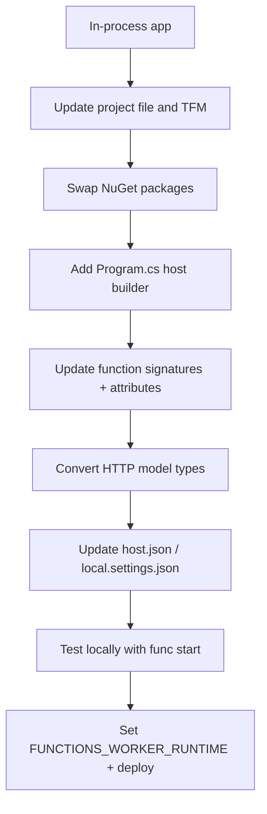

---
content_sources:
  references:
    - type: mslearn-adapted
      url: https://learn.microsoft.com/en-us/azure/azure-functions/migrate-dotnet-to-isolated-model
  diagrams:
    - id: architecture
      type: flowchart
      source: self-generated
      justification: Flow view of the migration decision path, synthesized from Microsoft Learn documentation cited on this page.
      based_on:
        - https://learn.microsoft.com/en-us/azure/azure-functions/migrate-dotnet-to-isolated-model
        - https://learn.microsoft.com/en-us/azure/azure-functions/dotnet-isolated-process-guide
---
# Migrate .NET In-Process to Isolated Worker

The .NET in-process model is retired: support for the in-process model ends on 10 November 2026, and all new development targets the **isolated worker model**. This recipe walks through migrating an existing in-process (`Microsoft.NET.Sdk.Functions`) app to the isolated worker model, where your functions run in a separate process from the Functions host.

## Prerequisites

- An existing .NET in-process Function App targeting an LTS .NET version.
- .NET SDK and Azure Functions Core Tools 4.x installed.

## Why Migrate

| Aspect | In-process (retiring) | Isolated worker |
|---|---|---|
| Process | Runs inside the host process | Runs in a separate process |
| .NET versions | Tied to the host's .NET version | Decoupled; run any supported .NET, including non-LTS |
| Dependency conflicts | Shares assemblies with the host | Full control of dependencies |
| Middleware / DI | Limited | First-class middleware pipeline and DI |
| Support | Ends 10 November 2026 | Current and future model |

## Migration Path

<!-- diagram-id: architecture -->


## Step 1: Update the Project File

Change the SDK references and target framework. Replace the in-process SDK package with the isolated worker SDK.

```xml
<PropertyGroup>
  <TargetFramework>net8.0</TargetFramework>
  <AzureFunctionsVersion>v4</AzureFunctionsVersion>
  <OutputType>Exe</OutputType>
</PropertyGroup>
<ItemGroup>
  <PackageReference Include="Microsoft.Azure.Functions.Worker" Version="1.22.0" />
  <PackageReference Include="Microsoft.Azure.Functions.Worker.Sdk" Version="1.17.2" />
</ItemGroup>
```

Remove `Microsoft.NET.Sdk.Functions`. Add the isolated-worker extension packages for each binding you use (for example `Microsoft.Azure.Functions.Worker.Extensions.Http`, `...Extensions.Timer`).

| Element | Explanation |
|---|---|
| `OutputType` = `Exe` | The isolated worker runs as its own executable process. |
| `Microsoft.Azure.Functions.Worker.Sdk` | Replaces `Microsoft.NET.Sdk.Functions`. |
| Extension packages | Each trigger/binding needs its `Worker.Extensions.*` package; confirm all bindings are covered before deploying. |

## Step 2: Add Program.cs

The isolated model requires an explicit host entry point. This replaces the implicit host startup and any `Startup.cs` (`FunctionsStartup`) you had.

```csharp
using Microsoft.Extensions.Hosting;

var host = new HostBuilder()
    .ConfigureFunctionsWorkerDefaults()
    .Build();

host.Run();
```

Move any `IFunctionsHostBuilder` service registrations into `ConfigureServices` here. See [Dependency Injection](dependency-injection.md).

## Step 3: Update Function Signatures

Attributes and types change. The `[FunctionName]` attribute becomes `[Function]`, and `ILogger` is obtained from `FunctionContext` (or injected).

```csharp
// In-process (before)
[FunctionName("Greet")]
public static IActionResult Run(
    [HttpTrigger(AuthorizationLevel.Function, "get")] HttpRequest req,
    ILogger log) { ... }

// Isolated (after)
[Function("Greet")]
public HttpResponseData Run(
    [HttpTrigger(AuthorizationLevel.Function, "get")] HttpRequestData req,
    FunctionContext context)
{
    var logger = context.GetLogger("Greet");
    var response = req.CreateResponse(System.Net.HttpStatusCode.OK);
    response.WriteString("hello");
    return response;
}
```

Key type changes:

| In-process | Isolated worker |
|---|---|
| `[FunctionName]` | `[Function]` |
| `HttpRequest` / `IActionResult` | `HttpRequestData` / `HttpResponseData` |
| `ILogger` parameter | `context.GetLogger(...)` or injected `ILogger<T>` |
| `FunctionsStartup` (`Startup.cs`) | `HostBuilder` in `Program.cs` |
| Static methods common | Instance methods with constructor injection |

## Step 4: Update Configuration

- In `local.settings.json`, set `"FUNCTIONS_WORKER_RUNTIME": "dotnet-isolated"`.
- Review `host.json` — most settings carry over, but verify extension bundle references are removed (isolated apps reference extensions as NuGet packages, not bundles).

## Step 5: Test and Deploy

```bash
func start
```

After local verification, update the deployed app's runtime setting and redeploy:

```bash
az functionapp config appsettings set --resource-group $RG --name $APP_NAME --settings FUNCTIONS_WORKER_RUNTIME=dotnet-isolated
```

| Element | Explanation |
|---|---|
| `func start` | Runs the isolated worker locally; confirm every function loads and responds before deploying. |
| `FUNCTIONS_WORKER_RUNTIME=dotnet-isolated` | Tells the platform to host the isolated worker; must be set before deploying isolated code. |
| Expected result | All functions appear in `func start` output and respond as before migration. |

!!! warning "Deploy runtime and code together"
    Deploying isolated code to an app still configured for the in-process runtime will fail to start. Update `FUNCTIONS_WORKER_RUNTIME` as part of the same release.

## See Also

- [Dependency Injection](dependency-injection.md)
- [Middleware](middleware.md)
- [Unit Testing](testing.md)

## Sources

- [Migrate .NET apps from the in-process model to the isolated worker model (Microsoft Learn)](https://learn.microsoft.com/en-us/azure/azure-functions/migrate-dotnet-to-isolated-model)
- [Guide for running C# Azure Functions in the isolated worker model (Microsoft Learn)](https://learn.microsoft.com/en-us/azure/azure-functions/dotnet-isolated-process-guide)
