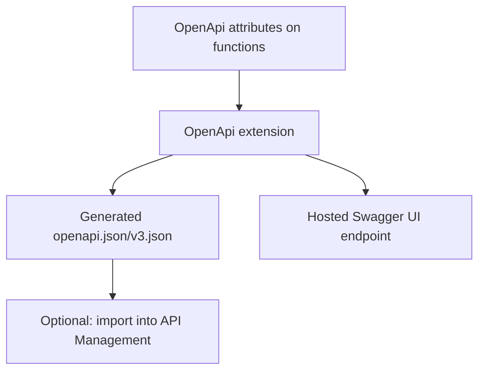

---
content_sources:
  references:
    - type: mslearn-adapted
      url: https://learn.microsoft.com/en-us/azure/azure-functions/functions-openapi-definition
  diagrams:
    - id: architecture
      type: flowchart
      source: self-generated
      justification: Flow view of architecture, synthesized from Microsoft Learn documentation cited on this page.
      based_on:
        - https://learn.microsoft.com/en-us/azure/azure-functions/functions-openapi-definition
---
# OpenAPI and Swagger

The .NET isolated worker model has a mature, first-class OpenAPI story through the `Microsoft.Azure.Functions.Worker.Extensions.OpenApi` extension. You annotate HTTP trigger functions with attributes, and the extension generates the OpenAPI (Swagger) document and hosts a Swagger UI automatically — no separate build step or hand-authored spec.

## Architecture

<!-- diagram-id: architecture -->


## Install the Extension

Add the isolated-worker OpenAPI package to your project.

```bash
dotnet add package Microsoft.Azure.Functions.Worker.Extensions.OpenApi
```

| CLI element | Explanation |
|---|---|
| Command(s) | `dotnet add package` |
| Key flags | package id `Microsoft.Azure.Functions.Worker.Extensions.OpenApi` |
| Variables | None |
| Expected result | The package reference is added to the `.csproj`; restore succeeds before continuing. |

## Annotate a Function

The attributes describe the operation, parameters, request body, and each response. The extension reads these to build the OpenAPI document.

```csharp
public class OrderApi
{
    [Function(nameof(GetOrder))]
    [OpenApiOperation(operationId: "getOrder", tags: new[] { "orders" },
        Summary = "Get an order", Description = "Returns a single order by id.")]
    [OpenApiParameter(name: "id", In = ParameterLocation.Path, Required = true,
        Type = typeof(string), Description = "The order id")]
    [OpenApiResponseWithBody(statusCode: HttpStatusCode.OK, contentType: "application/json",
        bodyType: typeof(Order), Description = "The requested order")]
    [OpenApiResponseWithoutBody(statusCode: HttpStatusCode.NotFound,
        Description = "Order not found")]
    public async Task<HttpResponseData> GetOrder(
        [HttpTrigger(AuthorizationLevel.Function, "get", Route = "orders/{id}")] HttpRequestData req,
        string id)
    {
        var response = req.CreateResponse(HttpStatusCode.OK);
        await response.WriteAsJsonAsync(new Order { Id = id });
        return response;
    }
}
```

Use `[OpenApiRequestBody(contentType: "application/json", bodyType: typeof(Order), Required = true)]` for `POST`/`PUT` operations, and `[OpenApiSecurity(...)]` to document authentication schemes.

## Access the Generated Document and UI

Once the extension is installed and the app is running, these endpoints are served automatically:

| Endpoint | Purpose |
|---|---|
| `/api/swagger/ui` | Interactive Swagger UI |
| `/api/openapi/v3.json` | OpenAPI 3.0 document (JSON) |
| `/api/swagger.json` | Swagger 2.0 document (JSON) |

## Publish to API Management

For a production API gateway, import the generated definition into Azure API Management. In the portal, open your function app, select **API Management**, create or link an instance, then **Link API** to import the HTTP-triggered endpoints. API Management can also generate an OpenAPI definition for function apps in any supported language.

!!! tip "Keep the document in source control"
    Export `openapi/v3.json` during CI so API changes are reviewable in pull requests, and use it to drive contract tests against your endpoints.

## See Also

- [HTTP API Patterns](http-api.md)
- [Managed Identity](managed-identity.md)

## Sources

- [Expose serverless APIs from HTTP endpoints using Azure API Management (Microsoft Learn)](https://learn.microsoft.com/en-us/azure/azure-functions/functions-openapi-definition)
